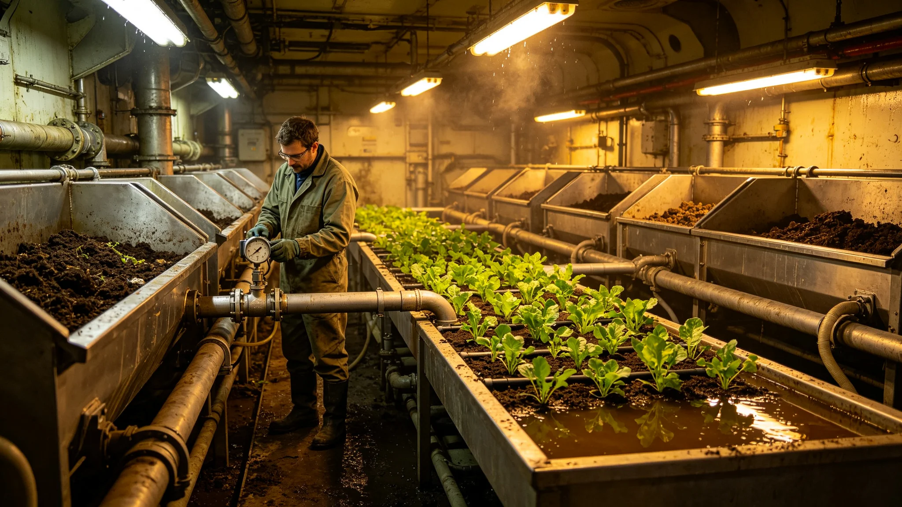

# 废物循环生态链报告

## 一、生态链构成

废物全循环系统以生物链为核心：粪便与厨余入堆肥槽，堆肥产菌液，菌液入水培，水培产菜，菜叶回堆肥。闭环。

## 二、链上环节

| 环节 | 输入 | 输出 |
|---|---|---|
| 堆肥 | 粪便厨余 | 菌液 |
| 水培 | 菌液 | 菜 |
| 菜叶 | 菜 | 回堆肥 |

## 三、堵塞事件后修复

3803年堵塞事件后，分道施工废料，链恢复。

## 四、监测

链上各环节连续监测，无外溢。

## 五、附则

本报告自3845年五月十一日起存档。解释权归环能署。

## 六、堆肥槽

堆肥槽接粪便与厨余，温度六十度，周期七日。产菌液。

## 七、水培槽

水培槽接菌液，种菜。周期三十日。产菜与菜叶。

## 八、菜叶回堆肥

菜叶不入生活垃圾，回堆肥槽。闭环。

## 九、堵塞后修复

3803年堵塞事件后，分道施工废料，链恢复。修复后连续监测三十日，无外溢。

## 十、链上人员

链上人员含环能署工艺师四人、操作工六人。

## 十一、链与监督

监督处派员在场。

## 十二、链上长期跟踪

链上长期跟踪六个月，无外溢。

## 十三、本报告所附材料

本报告所附：链流程图、堵塞修复记录、监测表、人员名单，共四份。齐全。

## 十四、链与水质

水质连续监测，无异常。

## 十五、链后归档

链记录归档于环能署。

## 十六、本报告生效

本报告自颁行日起生效。

## 十七、链与下一艘船

链经验供下一艘船参考。

## 十八、链与改造法

本报告为改造法在废物循环上的执行细则。

## 十九、链与温度

堆肥槽温度六十度。

## 二十、链与湿度

堆肥槽湿度按配方。

## 二十一、链与时间

堆肥七日，水培三十日。

## 二十二、链与监测

监测菌液与水质。

## 二十三、链与人员排班

堆肥白班，水培白班。每班八时辰。

## 二十四、链与工具

堆肥槽、水培槽、菌液泵、菜叶收集器。共四类。

## 二十五、链与安全

链运行期间不发生外溢。

## 二十六、链与应急

如外溢，停链清理。本次无外溢。

## 二十七、链与副本

副本送监督处。

## 二十八、链与异议

居民有异议，向监督处提出。

## 二十九、链与堆肥参数

堆肥参数：温度六十度、周期七日。

## 三十、链与水培参数

水培参数：菌液浓度按配方、周期三十日。

## 三十一、链与菜叶

菜叶全部回堆肥，不入生活垃圾。

## 三十二、链与粪便

粪便入堆肥槽，不另处理。

## 三十三、链与厨余

厨余入堆肥槽，不另处理。

## 三十四、链与菌液

菌液入水培槽，不另加药。

## 三十五、链与菜

菜产公共区，分配给居民。

## 三十六、链与堆肥记录

堆肥记录归档于环能署。

## 三十七、链与总工程师

总工程师签认链运行结果。

## 三十八、链与监督处

监督处复核链记录。

## 三十九、链与船务署

船务署公布链运行结果。
