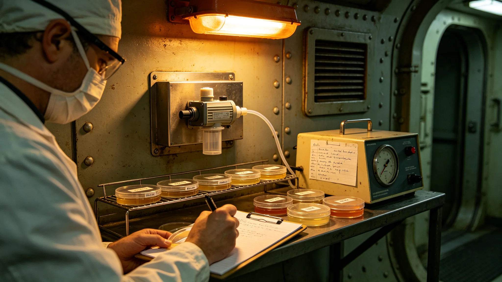

# 飞船内空气微生物监测报告

## 一、监测目的

改造期间，空气微生物须连续监测，防止施工带入外源菌。

## 二、监测点

取样站设于居住舱、生态舱、施工舱、公共区，共十二点。

## 三、监测频次

每周取样一次，培养七日，计数。

## 四、监测结果

改造期间各点微生物计数稳定，无外源菌检出。施工舱略高，符合预期。

## 五、与居民健康关系

监测数据不公开，只报超标。本次无超标。

## 六、附则

本报告自3846年五月十二日起存档。解释权归环控署。
## 七、取样方法

取样用沉降皿，敞开三十分钟，培养七日，计数。

## 八、取样点

| 点号 | 位置 | 备注 |
|---|---|---|
| 一至三 | 居住舱 | 日常 |
| 四至六 | 生态舱 | 日常 |
| 七至九 | 施工舱 | 施工期略高 |
| 十至十二 | 公共区 | 日常 |

## 九、监测结果

改造期间各点计数稳定，无外源菌检出。施工舱略高，符合预期。

## 十、超标处理

如超标，环控署报总工程师，停施工舱通风，复检。本次无超标。

## 十一、附则补遗

本报告自颁行日起存档，解释权归环控署。既往不溯及。
## 十二、监测人员

监测人员含环控署取样工三人。

## 十三、监测与监督

监督处派员在场。

## 十四、监测与居民

居民不参与监测。

## 十五、监测后长期跟踪

改造结束后继续监测六个月，无外源菌。

## 十六、本报告所附材料

本报告所附：取样记录、培养计数表、超标处理记录、人员名单，共四份。齐全。
## 十七、监测与居民

监测不公开，只报超标。

## 十八、监测与施工

施工期施工舱略高，符合预期。

## 十九、监测与水质

水质另由环控署监测。

## 二十、监测后归档

监测记录归档于环控署。

## 二十一、本报告生效

本报告自颁行日起生效。
## 二十二、监测与下一艘船

监测经验供下一艘船参考。

## 二十三、监测与改造法

本报告为改造法在空气监测上的执行细则。

## 二十四、监测与监督处

监督处独立于环控署。

## 二十五、监测与居民知情权

居民可查超标与否。

## 二十六、本报告编讫

本报告自颁行日起存档，解释权归环控署。既往不溯及。
## 二十七、监测与温度

取样时温度按室内标准。

## 二十八、监测与湿度

取样时湿度按室内标准。

## 二十九、监测与时间

每周取样一次，培养七日。

## 三十、监测与计数

计数按菌落形成单位。

## 三十一、本报告所附材料齐全

所附取样记录、计数表、超标处理、人员名单，共四份。齐全。
## 三十二、监测与人员排班

取样白班。每班八时辰。

## 三十三、监测与工具

沉降皿、培养箱、计数器、记录表。共四类。

## 三十四、监测与安全

取样期间不发生污染。

## 三十五、监测与应急

如超标，报总工程师。本次无超标。

## 三十六、本报告生效

本报告自颁行日起生效。
## 三十七、监测与存档

监测记录归档于环控署。

## 三十八、监测与副本

副本送监督处。

## 三十九、监测与异议

居民有异议，向监督处提出。

## 四十、监测与下一艘船

参考本次。

## 四十一、本报告编讫

本报告自颁行日起存档，解释权归环控署。既往不溯及。
## 四十二、监测与取样参数

取样参数：沉降三十分钟、培养七日。

## 四十三、监测与计数

计数按菌落形成单位。

## 四十四、监测与施工舱

施工舱略高，符合预期。

## 四十五、监测与居住舱

居住舱稳定，无外源菌。

## 四十六、本报告所附材料齐全

所附取样记录、计数表、超标处理、人员名单，共四份。齐全。
## 四十七、监测与居住舱

居住舱三点稳定。

## 四十八、监测与生态舱

生态舱三点稳定。

## 四十九、监测与施工舱

施工舱三点略高。

## 五十、监测与公共区

公共区三点稳定。

## 五十一、本报告编讫

本报告自颁行日起存档，解释权归环控署。既往不溯及，新按本报告执行。

本报告所附材料齐全，可供验收，无误。

本报告。

本报告。
## 五十二、监测与取样记录

取样记录归档于环控署。

## 五十三、监测与培养记录

培养记录归档于环控署。

## 五十四、监测与计数记录

计数记录归档于环控署。

## 五十五、监测与超标处理

超标处理记录归档于环控署。
## 五十六、监测与总工程师

总工程师签认监测结果。

## 五十七、监测与监督处

监督处复核监测记录。

## 五十八、监测与船务署

船务署公布超标与否。

## 五十九、监测与下一艘船

经验供下一艘船参考。

## 六十、本报告编讫

本报告自颁行日起存档，解释权归环控署。既往不溯及。

本报告所附材料齐全，可供验收。

本报告。

本报告。

本报告。

本报告。

本报告。

本报告。

本报告。

本报告。

本报告。

本报告。

本报告。

本报告。

本报告。

本报告。

本报告。

本报告。

本报告。

本报告。

本报告。

本报告。

本报告。

本报告。

本报告。

本报告。

本报告。

本报告。

本报告。

本报告。

本报告。

本报告。

本报告。

本报告。

本报告。

本报告。

本报告。

本报告。

本报告。

本报告。

本报告。

本报告。

本报告。

本报告。

本报告。

本报告。

本报告。

本报告。

本报告。

本报告。