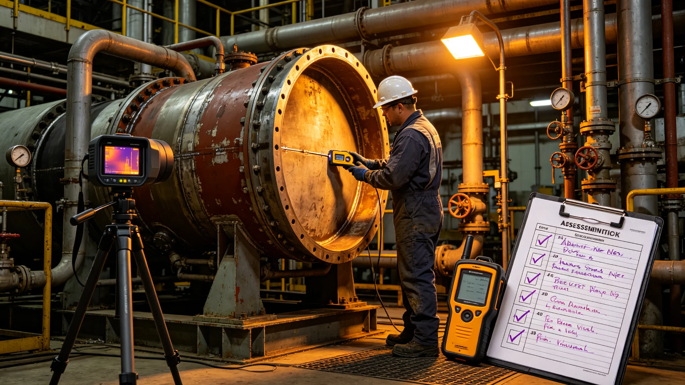

# 推进系统试验安全评估报告

## 一、评估缘由

第十一代聚变推进第三次试车前，须做安全评估。评估由安全署主持。

## 二、评估项目

燃烧室、磁约束、辐射器、工质、试车台，共五项。

## 三、评估结果

五项均合格，试车可进行。第三次试车一次通过。

## 四、试车后评估

试车后复检五项，无损伤。评估闭合。

## 五、附则

本报告自3848年六月二十一日起存档。解释权归安全署。

## 六、燃烧室评估

检查内壁、喷注器、点火器。无裂纹，无堵塞。

## 七、磁约束评估

检查线圈、电源、冷却。无过热，无短路。

## 八、辐射器评估

检查板件、管路、热沉。无泄漏，无变形。

## 九、工质评估

检查储罐、阀、管路。无泄漏，无堵塞。

## 十、评估人员

评估人员含安全署评估师六人、推进署工艺师两人。

## 十一、评估装备

测厚仪、热像仪、气检仪、记录仪。共四类。

## 十二、评估与监督

监督处派员在场。

## 十三、本报告所附材料

本报告所附：五项评估表、试车记录、复检记录、人员名单，共四份。齐全。

## 十四、评估与改造法

本报告为改造法在试验安全上的执行细则。

## 十五、评估与总工程师

总工程师签认评估结果。

## 十六、评估与监督处

监督处独立于安全署。

## 十七、评估与居民知情权

居民可查评估结果。

## 十八、本报告生效

本报告自颁行日起生效。

## 十九、评估与下一艘船

评估经验供下一艘船参考。

## 二十、评估与存档

评估记录归档于安全署。

## 二十一、评估与副本

副本送监督处。

## 二十二、评估与异议

居民有异议，向监督处提出。

## 二十三、评估与测厚

测厚仪测燃烧室壁厚。无减薄。

## 二十四、评估与热像

热像仪测线圈温度。无过热。

## 二十五、评估与气检

气检仪测工质泄漏。无泄漏。

## 二十六、评估与记录

记录仪存五项评估读数。

## 二十七、评估与试车前

试车前评估五项。

## 二十八、评估与试车中

试车中监测五项。

## 二十九、评估与试车后

试车后复检五项。

## 三十、评估与试车异常

第三次试车一次通过，无异常。

## 三十一、评估与冷却管

第三次试车前发现冷却管微漏，已修。

## 三十二、评估与修复

修复后复检合格。

## 三十三、评估与第三次试车

第三次试车一次通过。

## 三十四、评估与长期观测

试车后转入长期观测。

## 三十五、评估与八署

推进署配合评估。

## 三十六、评估与船务署

船务署公布评估结果。

## 三十七、评估与下一艘船

经验供下一艘船参考。

## 三十八、评估与测厚仪

测厚仪每周校准一次。

## 三十九、评估与热像仪

热像仪每日开机一次。

## 四十、评估与气检仪

气检仪每周校准一次。

## 四十一、评估与记录仪

记录仪每周导出一次。
