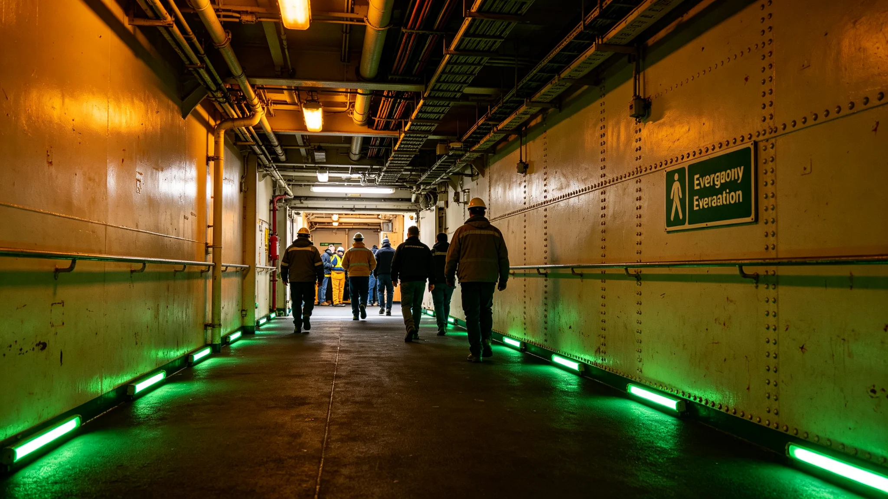

# 大修期间应急疏散预案

## 一、预案缘由

大修期间开腹，须有应急疏散预案，防泄漏与停电后居民无法撤离。

## 二、疏散路线

疏散路线分主路与备路。主路经公共通道，备路经服务通道。

## 三、疏散集合点

集合点设公共区第三环。各段居民按路线集合。

## 四、疏散演练

大修期间每月演练一次。演练不通知居民，只通知岗哨。

## 五、附则

本预案自3849年六月二十二日起执行。解释权归安全署。

## 六、疏散路线主路

主路经公共通道，宽三米，可容百人并行。

## 七、疏散路线备路

备路经服务通道，宽一米五，容三十人并行。

## 八、集合点

集合点设公共区第三环，容千人。

## 九、疏散演练

每月演练一次，演练后记录用时与漏点。

## 十、预案人员

预案人员含安全署岗哨四十人、引导员二十人。

## 十一、预案装备

警报器、引导灯、记录仪、通讯器。共四类。

## 十二、预案与监督

监督处派员在场。

## 十三、本预案所附材料

本预案所附：疏散图、集合点图、演练记录、人员名单，共四份。齐全。

## 十四、预案与改造法

本预案为改造法在应急疏散上的执行细则。

## 十五、预案与总工程师

总工程师签认预案。

## 十六、预案与监督处

监督处独立于安全署。

## 十七、预案与居民知情权

居民参与演练，知道路线。

## 十八、本预案生效

本预案自颁行日起执行。

## 十九、预案与下一艘船

预案经验供下一艘船参考。

## 二十、预案与存档

演练记录归档于安全署。

## 二十一、预案与副本

副本送监督处。

## 二十二、预案与异议

居民有异议，向监督处提出。

## 二十三、预案与警报

警报器设于公共区与各段。声响可闻。

## 二十四、预案与引导灯

引导灯沿主路与备路。绿色常亮。

## 二十五、预案与记录

记录仪存每次演练用时。

## 二十六、预案与通讯

通讯器连监测站。

## 二十七、预案与泄漏

如泄漏，按预案疏散。

## 二十八、预案与停电

如停电，备用灯亮，按预案疏散。

## 二十九、预案与火灾

如火灾，按预案疏散。

## 三十、预案与演练

每月演练一次。

## 三十一、预案与微泄漏

微泄漏按预案疏散相邻段。

## 三十二、预案与演练结果

每月演练，用时逐次缩短。

## 三十三、预案与居民反馈

居民对预案无异议。

## 三十四、预案与八署

大修署配合预案。

## 三十五、预案与船务署

船务署公布预案。

## 三十六、预案与下一艘船

经验供下一艘船参考。

## 三十七、预案与警报器

警报器每周试响一次。

## 三十八、预案与引导灯

引导灯每日检查一次。

## 三十九、预案与记录仪

记录仪每周导出一次。

## 四十、预案与通讯器

通讯器每日试呼一次。
