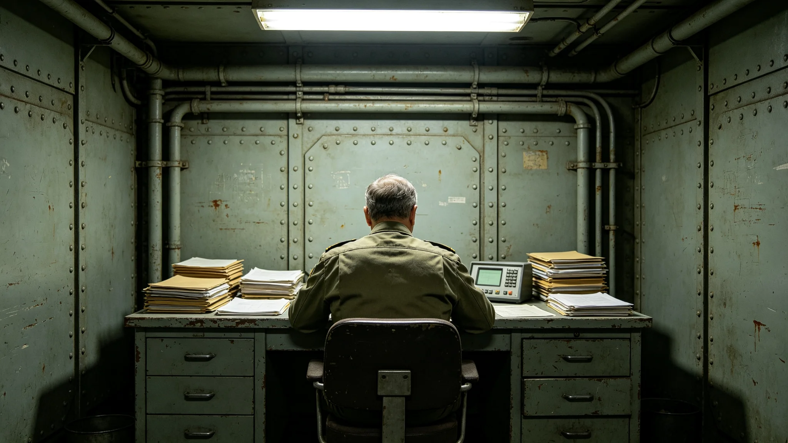

# 闻秉钧任职十二年考勤体检与签认人事档案袋

本档案袋封卷于3851年第三季度，收录闻秉钧自3839年受命担任最高治理会首席以来连续十二个年度的考勤、体检、签认与处分记录。袋内材料均为各办公室原始抄件，未作文学润色。闻秉钧本人未对本档作任何改写授权。

## 一、基本登记

闻秉钧，出身第一星区内环第七居委会，3812年生，就任时年二十七岁。登记照附于袋首，面部有长期伏案留下的左侧肩颈僵硬痕迹。档案编号WG-4th-01。其前任交班时签字笔迹略抖，本档未收录交班场景描述。

## 二、年度考勤摘录

| 年度 | 应到工作日 | 实到 | 迟到 | 旷工 | 备注 |
|---|---|---|---|---|---|
| 3839 | 246 | 241 | 3 | 0 | 首年，两次迟到因跨星区往返 |
| 3840 | 248 | 246 | 1 | 0 | 无 |
| 3841 | 248 | 248 | 0 | 0 | 全年满勤 |
| 3842 | 247 | 247 | 0 | 0 | 全年满勤 |
| 3843 | 248 | 240 | 2 | 1 | 病休一日，因胃部不适 |
| 3844 | 248 | 248 | 0 | 0 | 全年满勤 |
| 3845 | 247 | 245 | 1 | 0 | 迟到一次，因通道拥堵 |
| 3846 | 248 | 243 | 0 | 1 | 病休一日，体检提示心律不齐复查 |
| 3847 | 248 | 248 | 0 | 0 | 全年满勤 |
| 3848 | 247 | 247 | 0 | 0 | 全年满勤 |
| 3849 | 248 | 248 | 0 | 0 | 全年满勤 |
| 3850 | 248 | 244 | 2 | 0 | 两次迟到，均因跨星区视频会议延后 |

十二年累计应到二千九百七十六个工作日，实到二千九百五十九日，旷工两日，均为病休。考勤由各段打卡终端自动汇总，人工未干预。

## 三、体检通报摘录

3843年秋季体检，胃幽门螺旋杆菌指标偏高，医嘱戒浓茶三个月。闻秉钧其后在例会中改饮温水，会务组于次年起撤去其席前茶具。3846年体检，静息心率偏快，建议减少夜间加班。自3847年起，其办公室夜间照明于二十三点自动断电，此为制度性安排，非其个人要求。3850年体检，视力较3840年下降四百度，更换为可调节度数办公镜。

体检报告中无任何"卓越""杰出"字样，仅有指标、区间与医嘱。档案医生签注："该对象长期处于轻度睡眠不足状态，建议下一任期考虑轮换。"

## 四、签认与涂改

闻秉钧历年签认文书共一千一百余件。其中涂改三处：3841年一份预算批件中，其将"三亿"划改为"两亿七千万"，旁注"留足应急"；3844年一份跨星区调拨单，签名尾部"钧"字收笔迟疑，笔迹与平日不同，事后由其本人补签确认；3849年一份任命书，其将落款日期由"初五"划改为"初六"，因初五为休整日。三处涂改均有监印人旁签，无一处系事后补改。

## 五、处分与告诫

3842年，闻秉钧因在未完成跨星区协调专员会签的情况下签发一份临时指令，被程序监督处书面告诫一次，记入档案。该次告诫未影响其续任。3848年，其一份对外函件未按行政程序法抄送审计署，被口头提醒，未形成处分单。两次记录均在本档原样留存，未作淡化。

## 六、与岗位的关系

闻秉钧任内不主持任何公开庆典，仅按规程出席就职、纪念日与表彰三类既定仪式。其办公室与普通处长办公室面积相同，未扩建。历年报销单中，公务差旅均按标准舱位，无超支。3850年其提交的轮换申请附于袋尾，申请于下一任期结束后退出最高治理会，理由为"心律复查需稳定作息"。

## 七、例会出勤与表决记录

最高治理会例会每周两次，闻秉钧十二年累计应出席一千二百四十八次，缺席十一次，其中六次为病休，五次为赴第三星区协调。例会表决中，闻秉钧投弃权票共十四次，主要集中在跨星区预算分配与跨系资源调拨两类议题。按规程，首席表决权与普通委员相同，弃权无须说明理由，但闻秉钧每一次弃权均附一行手写理由，如"待协调专员会签后再决""数据未复核，暂不表态"。十四张附条均附于本袋。

其在例会中极少发言，年均发言记录不超过九次，每次发言以宣读批件数字为主。会议记录员签注："该对象不擅长即席陈词，遇追问常要求次日书面答复。"

## 八、跨星区差旅记录

闻秉钧十二年共跨星区往返四十三次，其中赴第二星区十九次、第三星区十四次、两星区联程十次。每次往返单程依航线不同约需十一至十九日。差旅均乘公务班列，未包机。四十三次差旅的食宿报销单均在标准线内，无一次超标。唯一一次超标为3845年第三星区，因当地接待方安排了超出标准的会议餐，闻秉钧事后自付差额二十八元，并在报销单背面注明"退补"。

## 九、居委会评议摘录

闻秉钧每年须回原籍第七居委会接受一次评议。评议记录为居委会邻里匿名填写，共十二条。评议中提及较多的是"年节仍回家，认得出邻里""说话慢，不急"。有两条批评：一为3846年"任期内未回乡办一次公开宣讲"；一为3849年"对居委会加装绿化系统的申请批复偏慢"。两条批评均原样留存，闻秉钧未要求删改。

## 十、物品与报销登记

闻秉钧任内领用公物清单固定：办公桌一张、椅一把、终端一台、台灯一盏、文件柜两只。十二年中仅更换过一次台灯灯泡、两次座椅靠垫。其个人物品中，档案登记的有一支旧钢笔（其父遗留）、一个计时怀表。无任何私受礼品登记。年度报销明细见经济产业类各档，本袋不重复。

## 十一、末任交接清单摘录

3850年末，闻秉钧按换届法启动交接准备。交接清单列十四项，包括印章三枚、未结批件七件、跨星区在途协调事项四项、保密密钥两副。清单由审计署现场清点，逐项打勾。其中第七项"未结第三星区供水配额争议"标注"建议移交跨星区协调专员续办"。交接清单原件封存，副本随本档。

本档止于3851年封卷，后续是否续任以换届法程序为准，本档不作预测。
