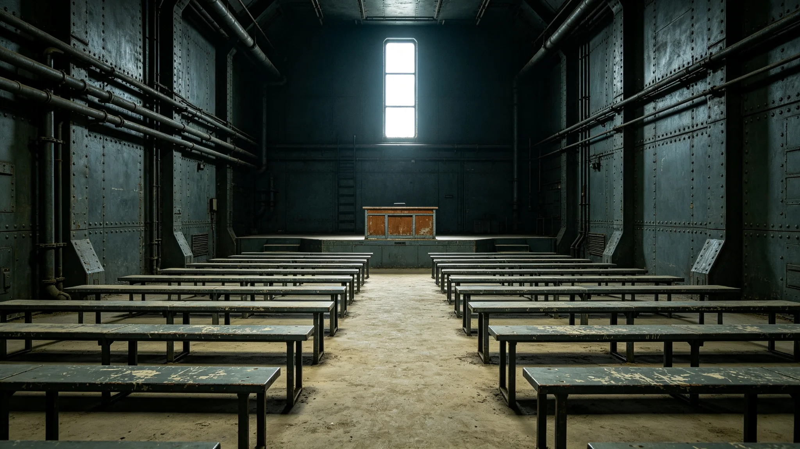

# 郑维纲担任公民大会议长九年主持记录与表决统计档案

本档案整理于3851年春季，收录郑维纲自3842年当选公民大会议长以来九年间的主持议事记录、表决统计、动议处置与个人发言摘录。议会秘书处仅作抄录，未作评价。

## 一、任职登记

郑维纲，第二星区外环第五居委会出身，3809年生，当选议长时年三十三岁，为联合体史上第四年轻议长。登记照附卷首，着议会标准深灰制服，未佩额外饰物。议长任期按换届法为九年，可连任一任，郑维纲于3851年届满，未再参选。

## 二、主持议事场次统计

| 年度 | 全会场次 | 委员会联席 | 临时质询 | 休会打断 | 备注 |
|---|---|---|---|---|---|
| 3842 | 41 | 9 | 6 | 1 | 首年 |
| 3843 | 43 | 11 | 8 | 0 | 无 |
| 3844 | 42 | 10 | 5 | 2 | 两度因争议打断 |
| 3845 | 44 | 12 | 9 | 1 | 无 |
| 3846 | 43 | 11 | 7 | 0 | 无 |
| 3847 | 42 | 10 | 6 | 1 | 无 |
| 3848 | 44 | 13 | 10 | 0 | 公投年 |
| 3849 | 43 | 12 | 8 | 1 | 无 |
| 3850 | 43 | 11 | 7 | 0 | 届满年 |

九年主持全会三百八十五场，临时质询六十五场。郑维纲每场均按规程宣读议程，不脱稿。会议记录显示其维持议程的手法为"限时发言、按时表决"，九年中仅两度因议题争议而宣布休会十五分钟再议。

## 三、表决统计

九年中，议会共表决议案一千零四件，通过七百零三件，未通过二百零一件，搁置一百件。按议长规程，郑维纲不参与议案实质表决，仅在平局时投决定性票。九年中其投决定性票共十七次，其中十一次用于跨星区预算分配，六次用于机构设立。十七次决定性票的票后说明均存档，措辞简短，如"依规程打破平局，非本人主张"。

## 四、动议处置

议员联名动议九年共收一百八十六件。郑维纲按议事规则排期，平均排期周期为三十一日。有十二件动议因"与会前已决事项重复"被退回，退回理由均附书面说明。有三件动议因超逾议会权限被移送司法审查，移送函由其签发。

## 五、个人发言摘录

郑维纲在全会上的发言多为程序性宣告，九年累计陈词不过四十段。留存较完整的一段为3848年宪政修订公投表决前的主持语："今日所决非一时一事，乃后世百年据以行事之框。请各位议员依本区选民意，依规程投票，毋须顾我。"该段由速记员当场录下，未作文学加工。

## 六、处分与提醒

3844年，郑维纲在一场争议中未等反对议员发言完毕即宣布休会，被议事监督委员会书面提醒一次。提醒函存档，其在函后签注"已知错，下次改"。3849年，其主持表决时漏计一名候补议员票，计票后发现并当场重计，未影响结果，形成一次工作记录，未构成处分。

## 七、健康与考勤

3846年体检提示声带小结，医嘱少用高声。其后郑维纲主持改用会场扩音，不勉强提高音量。九年全勤，仅3847年因病休会三日。

## 八、届满交接

3851年届满，郑维纲将议长槌、议程卡、未结动议十四项移交新任议长。交接记录附卷尾。其离任后回第二星区原籍，议会未为其举行任何欢送仪式，仅按规程发出一封致谢函。

## 九、与议员的日常往来

议会四百余席议员来自三系各段。郑维纲任内每日早到一刻钟，站在议事厅侧廊与早到议员寒暄，内容限于问候与上周行程，不涉及议题。会议记录员认为此举有助于缓和气氛，但未计入议程。九年中他认识几乎所有连任议员的姓名与所属区段，仅新人上任首月需助手提醒一次。他不与任何议员私下结盟，亦不参加议员间的聚餐。

## 十、对议事规则的小幅修订

郑维纲任内提出过两项议事规则修订建议。一为"候补议员票漏计防范"，源于3849年其本人漏计一事，建议表决前由两名职员分别点票；二为"跨星区远程议员发言延迟补偿"，因跨星区单程往返十余日，远程议员常在发言时对方已切题，建议为其预留发言时段。两项建议均获议会通过，写入议事规则附则。

## 十一、议会大楼工作环境

郑维纲的议长办公室在议会大楼三层，与普通议员办公室同层，未单独占用顶层。窗外为议会中庭绿化系统，冬季有自然光。其办公室内无任何私人物品装饰，仅一台终端、一张桌、一把椅。每年议会大楼绿化系统轮换时（见生态类各档），其窗外植物更换，他未表示好恶。

## 十二、离任未结事项

3851年移交时，未结动议十四项中，有三项涉及跨星区预算分配，两项涉及选举程序，其余为普通市政。郑维纲对每一项均附"个人看法"一行，仅供下任参考，不具约束力。其离任后议会未为其立传，仅在登记簿记一行。

## 十三、九年主持的总体评价

议会秘书处对郑维纲九年主持作过一次内部小结，未公开，摘录于此：其长处为守时、中立、不偏袒；短处为不善于在僵局中斡旋，遇尖锐争议往往依赖程序本身降温而非主动调和。3844年两度休会即为例证。小结认为，议长一职本不应以个人魅力左右议程，郑维纲"以程序代人"的做法恰合议会本意。该小结未送达郑维纲本人，仅存档。

本档止于3851年移交日，不涉及其后续去向。
