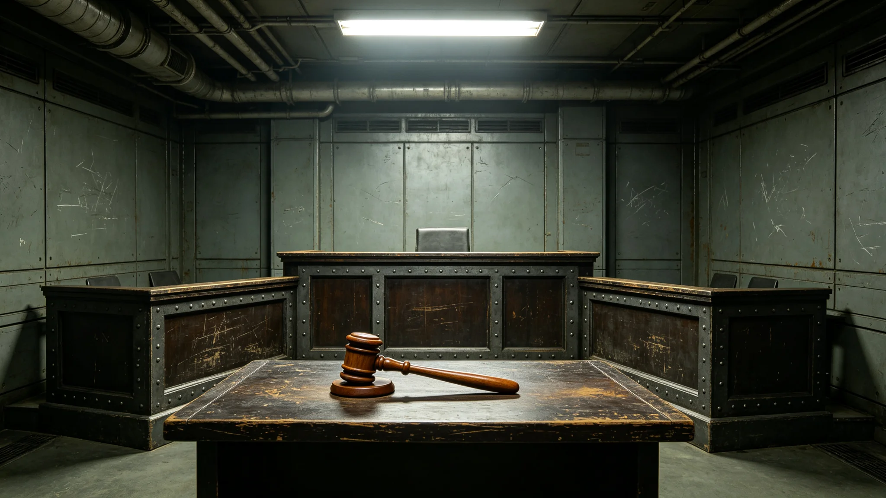

# 苏明慎出任首席大法官十年裁判意见与回避签认档案

本档案整理于3851年夏季，收录苏明慎自3841年就任首席大法官以来十年间的裁判意见摘要、回避声明、异议记录与考核评语。司法行政署仅作归档，不评价其立场。

## 一、任职登记

苏明慎，第三星区内环第二居委会出身，3804年生，就任首席大法官时年三十七岁。其任职须经公民大会任命听证，听证记录另卷。登记照着法官黑袍，免冠，面容清瘦。首席大法官任期按司法独立规程为十年，本档整理时其任期临近届满。

## 二、参审案件统计

| 年度 | 参审合议庭 | 主笔意见 | 附议意见 | 异议意见 | 主动回避 |
|---|---|---|---|---|---|
| 3841 | 38 | 9 | 22 | 7 | 2 |
| 3842 | 41 | 11 | 24 | 6 | 1 |
| 3843 | 40 | 10 | 25 | 5 | 3 |
| 3844 | 42 | 12 | 24 | 6 | 1 |
| 3845 | 39 | 10 | 23 | 6 | 2 |
| 3846 | 41 | 11 | 25 | 5 | 1 |
| 3847 | 40 | 10 | 24 | 6 | 2 |
| 3848 | 43 | 12 | 26 | 5 | 1 |
| 3849 | 41 | 11 | 24 | 6 | 2 |
| 3850 | 40 | 10 | 25 | 5 | 1 |

十年参审合议庭四百零五件，主笔裁判意见一百零六件。其主笔意见中，涉及跨星区管辖争议的三十一件，涉及公民权利扩展法适用的二十四件，涉及行政程序的十九件，其余为普通民事与劳动争议。

## 三、回避签认

十年中苏明慎主动回避二十一次。回避事由均书面记录，其中七次为"当事人为本人原籍居委会旧识"，五次为"涉本人曾任法官时期经手案件之再审"，九次为"无具体理由，依审慎原则回避"。二十一份回避声明均由其亲笔签署，未受任何一方劝说撤回。

## 四、异议意见摘要

十年中苏明慎提出异议意见五十九次。异议多集中于对跨星区行政命令的司法审查范围。其3846年一份异议意见中写道："本院若以行政效率为由不审此类命令，则公民权利扩展法所定之审查权将徒具条文。"该段为其少数较长意见，其余异议多为两段以内。异议意见不影响判决主文，仅存档。

## 五、考核评语

司法年度考核由同级法官互评与案件复核组评分组成。苏明慎十年考核均为"称职"，无一次"优秀"，亦无一次"不称职"。复核组评语摘录："该法官主笔意见论证严密，引用条文准确，偶有过于冗长之弊。"其审理周期年均每案四十六日，略长于全院平均四十二日，长在其要求逐案复核证人笔录。

## 六、健康与考勤

3848年体检提示腰椎间盘突出，医嘱减少久坐。其后其每日午后起身行走一刻钟，此为个人安排，非制度要求。十年全勤，无旷工。仅3843年因病休假五日。

## 七、与外界的距离

苏明慎任内不接受任何媒体专访，不出席非司法类公开活动。其唯一一次公开露面为3849年司法独立纪念日按规程致辞三分钟，内容为宣读旧规，未作发挥。任内无家属经商登记，无利益冲突申报事项。

## 八、届满安排

3851年任期将满，苏明慎按司法规程不谋求连任，已开始移交未结案件十二件。移交清单附卷尾。其离任后拟回第三星区任普通法官，非首席。

## 九、司法数字化对其工作的影响

3840年代中期起，司法数字化系统逐步上线（见技术类各档）。苏明慎初期不习惯电子卷宗，坚持先看纸质再看屏。3846年其主动要求试用数字化系统，三个月后改为以电子卷宗为主、纸质备查。其主笔意见中引用数字化卷宗的比例逐年上升，3850年已达八成五。他认为数字化使检索更快，但不改变论证本身。

## 十、与下级法官的关系

苏明慎任内每年主持一次全院法官业务例会，议题为统一裁判尺度。他不指定结论，只列争议案例请众法官讨论。例会记录显示其发言多为"此案与彼案区别何在"，不替人下判断。年轻法官评价其"严而不苛"。十年中经其签署晋升的法官十一人，均经考核，无一人因与他私交而晋升。

## 十一、对公开旁听的态度

最高司法中心裁判均公开旁听。苏明慎任内不反对任何公民旁听，亦不接受旁听者事后与其交流。他认为法官与公众的交流应止于判决文书本身。3849年司法独立纪念日，他按规程到场，未与旁听人群握手。

## 十二、离任时的未结案件

移交未结案件十二件中，有四件涉及跨星区管辖争议，三件涉及公民权利扩展法新条款适用。苏明慎为每一件写了一页"待决要点"，供继任法官参考，不附结论。继任法官未被约束必须采纳。

## 十三、十年裁判的总体倾向

司法行政署对苏明慎十年主笔意见作过一次内部统计：其在涉及行政机关的案件中，支持行政机关与支持公民申诉的比例约为六比四，接近随机，未见明显偏科。其在跨星区管辖争议中倾向于"有疑则归法院审"，此点与其异议意见一致。统计仅供研究，不构成对其立场的定性。苏明慎本人未看过此统计。

## 十四、档案封存

本档经司法行政署复核后封存。苏明慎对本档所载事实未提异议。其十年裁判文书另卷存于司法中心文书库，本档仅为其个人履职侧写，不代替裁判文书本身。任何引用本档者，须同时查阅对应裁判文书原文，不得以本档代替个案事实。

本档止于3851年移交准备日，不作预测。
