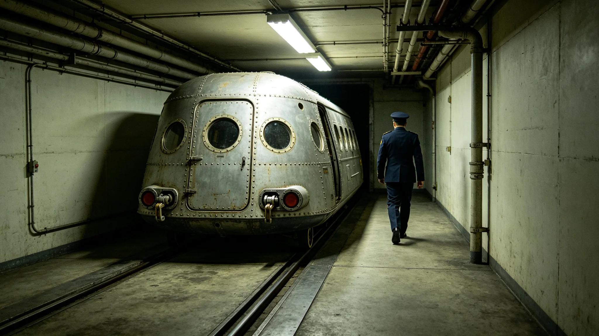

# 程联衡任跨星区协调专员六年往返班次与备忘录签认档案

本档案整理于3851年初秋，收录程联衡自3845年出任跨星区协调专员以来六年间的往返班次、备忘录签认、争议调解记录与考勤。协调专员公署仅作归档。

## 一、任职登记

程联衡，第二星区外环第一居委会出身，3815年生，出任专员时年三十岁。跨星区协调专员为跨星区协调法所设职位，负责三系间政策衔接与资源调剂。登记照着专员公署银灰制服。任期按协调法为六年。

## 二、往返班次统计

| 年度 | 跨星区往返 | 单程平均日 | 远程会议 | 现场调解 | 备注 |
|---|---|---|---|---|---|
| 3845 | 18 | 14 | 61 | 9 | 首年 |
| 3846 | 21 | 14 | 74 | 12 | 无 |
| 3847 | 19 | 15 | 68 | 10 | 航线调整 |
| 3848 | 24 | 14 | 82 | 15 | 公投年协调量增 |
| 3849 | 22 | 14 | 77 | 13 | 无 |
| 3850 | 20 | 15 | 71 | 11 | 无 |

六年跨星区往返一百二十四次，远程会议四百三十三次，现场调解七十次。因往返耗时，程联衡约有全年三分之一时间在途，不在中央公署。其在途期间由副手代行日常事务，重大事项仍须其本人签认。

## 三、备忘录签认

跨星区协调以备忘录为主要文书形式。程联衡六年签认备忘录四百一十七件，其中资源调剂类一百八十九件，政策衔接类一百四十四件，争议调解类八十四件。备忘录均须三系对口单位会签后方生效。程联衡签认中涂改二十一处，多为数字与日期更正，旁有会签人旁注。

## 四、调解失败记录

七年中七十次现场调解，成功五十九次，未达成协议十一次。十一次失败中，六起为跨星区预算分配争议，三起为资源配额争议，两起为管辖权争议。未达成协议者，按协调法移交公民大会议决。程联衡对失败案件不掩盖，逐案附"未达成原因"一页，如"第三星区坚持优先供水，第一星区认为配额已足，双方数据口径不一，未能当场弥合"。

## 五、健康与差旅负担

频繁跨星区往返对程联衡身体影响明显。3848年体检提示前庭功能紊乱，跨星区往返后恢复期延长。医嘱将年往返控制在二十次以内，3849年、3850年其往返次数确有下调，部分现场调解改由副手前往。其体重较3845年下降四公斤，体检记录归因于长途班列作息不规律。

## 六、处分与提醒

3846年，程联衡在一份未完成第三系会签的备忘录上先行签发，被程序监督处书面告诫一次，记入档案。其后其严格执行"三会签方签发"。3849年，一份备忘录因他在途延误七天才签回，致某资源调剂推迟，被口头提醒一次。

## 七、与公民的接触

程联衡任内每年须在三系各接待一次公民来访日，六年共十八次。来访多反映跨星区待遇不均、班列时刻不便等。其每次来访记录均转行政署办理，六年共转出事项一百零三件，办结情况另卷。

## 八、届满交接

3851年任期将满，程联衡移交在途备忘录三十一件、未结调解七项、跨星区联系人名册三册。交接由审计署监交。其离任后拟回第二星区。

## 九、跨星区通信会议系统使用

程联衡任内大量使用跨星区通信会议系统（见技术类各档）。他不主张事事亲赴现场，能远程解决的均远程。但涉及资源配额的实质谈判，他坚持现场，认为屏幕上难以体察对方让步的分寸。六年现场调解七十次中，他亲赴四十六次，余由副手。其远程会议年均七十二次，常因单程往返延迟而改在夜间值守。

## 十、三系对接人的评价

三系对口单位对接人对程联衡的评价，散见于往来备忘录附注。第一星区评其"守规矩，不肯多让"；第二星区评其"本乡人，念旧但不徇私"；第三星区评其"来一趟不易，来了就把事办了"。三条评价均非正式，由公署访谈记录摘出，程联衡本人未看到。

## 十一、协调失败后的善后

十一次调解失败后，程联衡不与失败方结怨。他每季度与三系对接人例行会晤一次，即使上次失败亦照常。其认为协调是长期关系，一事不成不代表下次不成。3847年一起预算争议移交议会后，次年程联衡仍赴该区走访，未被冷遇。

## 十二、离任时的未结调解

移交未结调解七项中，最复杂的一项为第三星区供水与第二星区发电用水的年度配额争议，已往返三年未决。程联衡为继任者整理了一份"争议数据口径对照表"，把双方历年来引用的不同统计口径并列，注明分歧所在。他不附自己的倾向。

## 十三、六年协调的总体记录

公署对程联衡六年作过一次小结：备忘录签认四百一十七件，成功率约九成七，十一次失败均按程序移交。小结认为，其长处为三系都能接受他居中，短处为身体受长途往返所累，后期已减少亲赴。公署建议下一任专员更多依赖远程会议与冗余通道。程联衡对此建议无异议。

## 十四、档案封存

本档经协调专员公署复核后封存。程联衡对本档所载往返班次与备忘录统计未提异议。其六年备忘录原件另存于公署文书库，本档仅为履职侧写，不代替任何一份具体备忘录。任何引用本档者，须同时查阅对应备忘录原文，不得以本档代替个案事实。

本档止于3851年移交准备日。
