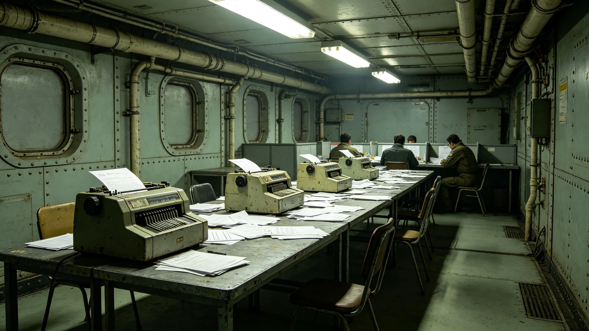

# 卫公允主持选举委员会五年计票复核与回避档案

本档案整理于3851年初秋，收录卫公允自3846年出任选举委员会主席以来五年间的选举组织、计票复核、异议处置与回避声明。选举委员会仅作台账，不偏袒任何候选人。

## 一、任职登记

卫公允，第三星区外环第三居委会出身，3817年生，出任主席时年二十九岁。选举委员会按换届法独立于行政与立法，主席须经公民大会任命听证。登记照着委员会白底蓝边制服。任期五年。

## 二、主持选举统计

| 年度 | 选举类型 | 投票站 | 计票复核 | 异议受理 | 重计票 | 备注 |
|---|---|---|---|---|---|---|
| 3846 | 区段议员补选 | 4120 | 全复核 | 37 | 2 | 首年 |
| 3847 | 例行区段选举 | 4860 | 全复核 | 52 | 4 | 无 |
| 3848 | 宪政修订公投 | 6120 | 全复核 | 89 | 6 | 公投年 |
| 3849 | 跨星区联选 | 5340 | 全复核 | 45 | 3 | 无 |
| 3850 | 换届总选举 | 5980 | 全复核 | 61 | 5 | 换届年 |

五年主持各类选举十次，投票站累计二万六千四百二十站，每票均经双人复核计票。五年受理异议二百八十四件，重计票二十次。重计票中，有三次与原计票结果相差超过千分之五，启动全段重计；其余十七次差异在千分之五以内，维持原结果。

## 三、回避声明

卫公允本人不参选任何职务，但其五年中仍主动回避七次。回避事由：三次为"某候选人为本人同乡同届"，两次为"某候选人曾资助本人就读"，两次为"无具体理由，依审慎原则回避"。回避期间由副主席主持相关计票。七份声明均亲笔签署。

## 四、异议处置

五年受理异议二百八十四件，其中成立四十六件，驳回二百三十八件。成立的异议中，十九件系投票站登记疏漏，二十一件系计票机器偏差，六件系工作人员误操作。每一件成立异议均附整改清单，并在下一次选举前整改完毕。3848年公投期间，第一星区某投票站电子投票系统延迟事件（见GS-3873-01），卫公允主持的复核确认延迟未影响结果，相关处置另卷。

## 五、技术与安保

卫公允任内推动电子投票系统双人复核加密，见技术类各档。其本人不涉密码学细节，只签认复核流程。五年中选举系统无一次被证实篡改记录。3850年政治极端主义监测发现的零星干扰，见军事安全类各档。

## 六、考勤与健康

五年全勤，选举期间连续值守。3848年公投结束后，卫公允连续工作十四日，体检提示急性疲劳，强制休养七日。其后委员会规定选举期间轮班制，不得单人连续值守超过五日。

## 七、届满安排

3851年任期将满，卫公允不谋求连任，已移交未结异议四件、投票站设备台账三册。其离任后拟回第三星区。

## 八、投票站工作人员的轮训

五年选举中，投票站工作人员累计投入约九万人次。卫公允任内要求每站工作人员上岗前须经半日培训，内容为登记流程与异常处置。3848年公投前，其发现部分新培训员对电子投票终端不熟悉，临时增设一次实操演练。其后委员会把培训改为全日，成本略增，但3849年、3850年登记疏漏明显下降。

## 九、与选举安全保障体系的配合

选举期间，警安署按选举安全保障体系（见军事安全类各档）在外围值守，不进入计票室。卫公允任内坚持"警安只保秩序，不碰票"。五年中无一次警安人员进入计票区的记录。3850年政治极端主义监测发现零星干扰，由警安在外围处置，未影响计票。

## 十、对候选人的中立

卫公允任内不公开支持任何候选人，亦不与任何候选人私下会面。选举期间，所有候选人在委员会面前均为同等身份。他拒绝过一次某候选人赠送的纪念册，原物退回。五年中委员会不发布任何"选情预测"，只发布按规程应公布的时间与程序信息。

## 十一、届满交接细节

移交未结异议四件，均为3850年换届选举遗留，复核仍在进行。投票站设备台账三册，记录五年间设备更换与维修。卫公允另附一页"五年教训"，列出十条，首条为"跨星区投票通道必须有冗余"，源于3848年延迟事件。继任者未被约束。

## 十二、五年选举的总体记录

委员会对五年作过一次小结：十次选举，重计票二十次，仅三次与原结果相差显著，且均经全段重计更正。无一次选举被证实存在篡改。小结认为，选举公信力来自可复核而非来自零异议；有异议并依法重计，恰恰证明制度在运转。卫公允认可此说，但不对外宣传。

## 十三、与公民的沟通

选举委员会每年印发一份简明的选举须知，用通俗文字说明投票流程与异议渠道，不使用法律术语。须知印发三百万份，投放各居委会。卫公允任内坚持须知每年修订一次，把上年选举中暴露的新问题写进去。3849年须知新增"跨星区选民如何远程投票"一节，因3848年延迟事件后此类询问增多。

本档经选举委员会复核后封存。卫公允对本档所载计票与异议统计未提异议。其五年选举原始计票记录另存于选举计票中心库房，本档仅为履职侧写，不代替任何一次具体选举的原始记录。任何引用本档者，须同时查阅对应选举的原始计票文书，不得以本档代替个案事实。

本档止于3851年移交准备日。
