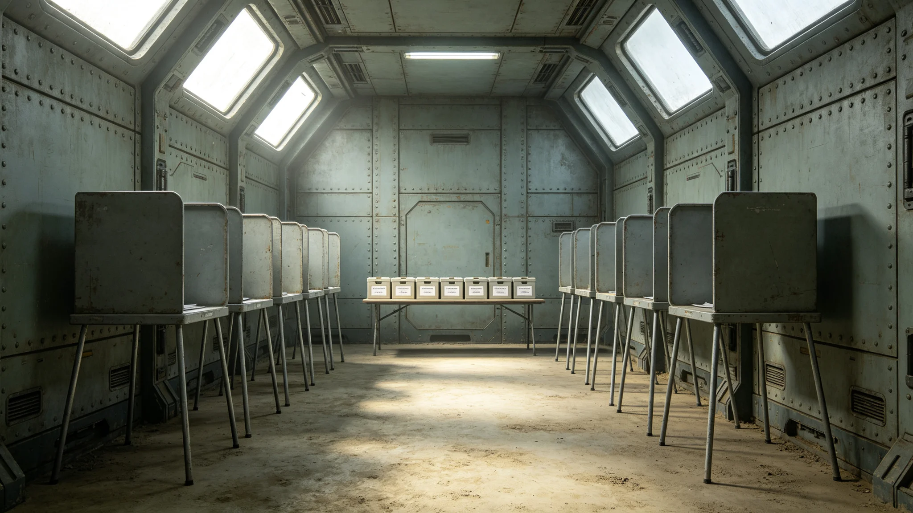

# 三恒星系文明联合体第三十次宪政修订案要点公报

兹公布《第三十次宪政修订案》要点。本案经公民大会三读通过，并于3860年宪政修订公投日交付全体公民表决，获通过后施行。原宪章相应条文同步修订。

## 一、修订缘由

自上一次宪政修订以来，跨星区治理已运行数十年，三系往来频繁，公民跨系居住、投票、申诉日益普遍。旧宪章对跨星区公民权利的规定零散，对跨星区协调机构的宪法地位未明，对司法审查跨星区行政命令的范围亦模糊。本案即为把数十年惯例写入宪章而立。

## 二、修订要点

本案共修订宪章十二条，新增四条。要点如下：其一，明确跨星区协调专员公署为宪法级机构，其权限以协调法为准。其二，明确公民跨星区居住、投票、申诉之权利，不因跨系而减损。其三，明确最高司法中心对跨星区行政命令有审查权，回应3846年苏明慎大法官所提异议。其四，明确选举委员会独立于行政与立法。其五，增设公民请愿权之成文规定，详见子事件类各档。

## 三、与公民权利扩展法的关系

本案为宪法级修订，公民权利扩展法为其下位法。本案修订之公民跨系权利，由扩展法细化为可操作条款。两者不矛盾，扩展法不得违反本案。若扩展法与本案抵触，以本案为准，由司法审查裁定。

## 四、公投程序

本案于3860年宪政修订公投日交付公投。公投适用电子投票系统，跨星区选民远程投票。公投设两道冗余通道，以防3848年延迟事件重演。公投结果由选举委员会公布，异议由司法审查。本次公投出席率与结果见文化仪式类各档。

## 五、各方意见

公投前，公民大会内有两派意见。一派认为修订应一步到位，主张增设跨星区直选议会；一派认为修订应稳，仅把现行惯例成文化。立法组折中，采纳后者。三系媒体对本案讨论持续半年，未发生暴力冲突。公投结果显示，三系均多数支持，第一星区支持率最高，第三星区略低，差异在合理范围。

## 六、修订前的过渡

本案通过后，设一年过渡期。过渡期内，各主管公署按新法调整内部规程，已在任者任期不变。过渡期满，新法全面施行。过渡期内的争议，按旧法加新法并行处理，由司法裁定适用何者。

## 七、修订后的稳定性

本案为第三十次宪政修订。立法组强调，宪政修订不宜频繁，本案通过后十年内不再提议同类修订。宪章稳定性本身即治理稳定性。立法组建议，未来如有修订需要，须先经公民大会三读，再公投，不得以行政命令变通。

## 八、与旧宪章的衔接

本案修订之十二条，均在旧宪章基础上增补，未推翻旧宪章框架。旧宪章中关于存续、民主、司法独立的基本原则均保留。本案仅把跨星区治理这一新现实写入，不改旧根本。

## 十、修订条文对照

修订前，宪章仅规定"公民在联合体境内享有平等权利"，未区分跨系与否。修订后新增"跨系公民不因居住星区差异而减损权利"一句。修订前，跨星区协调专员公署依行政命令设立，无宪法地位；修订后写入宪章。修订前，司法审查范围限于本系内行政命令；修订后扩至跨系。修订前，公民请愿仅为惯例；修订后成文。逐条对照另表，附于正本之后。

## 十一、反对意见摘要

公投前，少数意见反对本案，理由有三：一为担心跨星区直选议会终将被要求，本案虽未采纳，但已开跨系权利成文化之端；二为担心司法审查扩至跨系后，行政效率受损；三为担心公民请愿权成文后，请愿将泛滥。立法组对三条反对意见逐一回应：跨系直选非本案内容；司法审查以不违效率为限；请愿权早有惯例，成文不致泛滥。反对意见者亦有资格投公投票。

## 十二、过渡安排细节

过渡期一年中，已在任八职不受影响。跨星区协调专员公署在过渡期内补做宪法地位确认，与各署换文确认。司法审查跨系案件的程序，由最高司法中心在过渡期内制定细则。公民请愿权的受理窗口，由人权专员公署在过渡期内增设。过渡期满，新宪章全面适用。

## 十三、公投后的宣示

公投通过当日，最高治理会首席发布简短宣示，全文如下："今日公民所决，非一时一事，乃后世百年据以行事之框。跨星区既已共居，权利便当共守。"宣示未作长篇，未设庆典。次日各署按新法开始调整。

## 十四、后续修订限制

立法组在本案通过后明确：自3860年起十年内，不再向议会提交同类宪政修订案。理由是宪政修订需要稳定期，频繁修订反而损害宪法权威。此限制非宪法条文，仅为立法组自律，后续议会不受约束。但若后续议会欲提前修订，须再走三读公投程序，不得捷径。

本案正本存入中央议事厅宪法库，副本分发三系各居委会。公投记录另存于选举计票中心。任何引用本案者，以正本为准。
