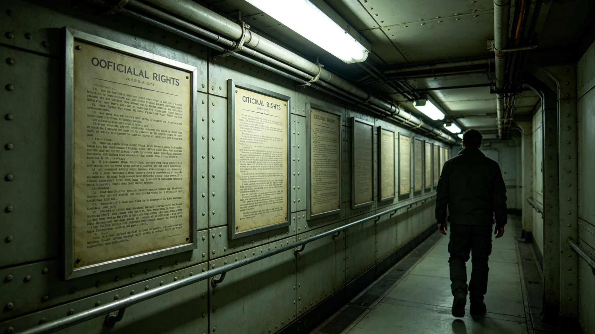

# 三恒星系文明联合体公民权利扩展法颁布公报

兹公布《公民权利扩展法》要点。本法依第三十次宪政修订案制定，为其下位法，自3862年起施行。本法细化跨星区公民之权利及其救济渠道。

## 一、立法目的

本法目的为把宪政修订案所定之跨系权利，细化为公民可主张、公署可执行之具体条款。长期以来，公民权利虽在宪章中有原则规定，但跨系行使时缺乏操作细则，公民不知如何主张。本法即为消除这一"纸面权利"与"实际权利"之落差而立。

## 二、适用范围

本法适用于三系全体居民，尤其针对跨系居住、跨系工作、跨系投票、跨系申诉之公民。本法不改变本系内公民已有权利，仅补充跨系部分。本法与跨星系治理宪章第二章配套。

## 三、权利清单

本法列举跨系公民权利十一项：跨系居住权、跨系工作权、跨系投票权、跨系结社权、跨系请愿权、跨系申诉权、跨系受司法保护权、跨系受教育权、跨系医疗权、跨系迁徙权、跨系任公职权。每项权利均附行使条件与救济渠道。十一项权利中，前六项为旧宪章已有，后五项为本次扩展新增。

## 四、跨系投票权细则

跨系选民可在任居系登记投票，亦可申请回本系投票，二者不得重复。跨系投票通道须有两道冗余，故障时切换备用通道，详见技术类各档。跨系投票登记自投票日三十日前截止，逾期不补。3848年延迟事件后，本法明确通道故障致公民未能投票者，须另开投票窗口。

## 五、跨系请愿权

本法新增公民跨系请愿权。一千名以上公民联名，可向议会提交请愿书，议会须在六十日内答复。请愿内容不限，但不得违反存续根本。请愿权行使不收费，公署不拒绝接收。大规模请愿事件见子事件类各档。

## 六、跨系申诉权

公民受跨系行政损害者，可向人权专员公署申诉，亦可直接向司法起诉。公署不推诿，跨系转办不驳回。公署建议行政机关改正，行政机关不采纳者，公署可诉请司法裁决。此条与3847年以来人权专员工作实践一致，本次成文化。

## 七、救济与赔偿

本法规定，公民因跨系行政错误受损害者，可获赔偿。赔偿标准由行政署另定，不与本系标准歧视。赔偿不影响公民另行起诉。赔偿申请由人权专员公署受理，三十日内决定是否建议赔偿。

## 八、与旧权利法的关系

旧权利法仅规定本系内权利。本法不废止旧法，仅补充跨系部分。旧法未规定者，依本法；本法未规定者，依旧法；二者抵触者，以新法为准。立法组建议未来把旧法与本法合并为统一权利法，非本次内容。

## 九、施行与过渡

本法3862年施行，设半年过渡。过渡期内，人权专员公署增设跨系申诉窗口，选举委员会修订跨系投票登记流程。过渡期满，本法全面适用。本法不溯及既往。

## 十、公开征求意见摘要

立法期间收到公民意见两千八百余条。集中意见有二：一为请愿权门槛过高（千人联名），主张降低；立法组认为过低会泛滥，维持千人。二为担心跨系投票通道仍不可靠；立法组承诺冗余改造，见技术类各档。两条意见均公开答复。

## 十二、权利的限制

本法所列权利非无限制。跨系权利之行使不得危害存续根本，不得妨碍他系公民之同等权利。请愿内容不得煽动暴力，跨系结社不得反联合体。限制由司法裁定，不由行政机关自定。立法组强调，权利与限制须由中立机关判断，以防行政机关借口限制而侵权利。

## 十五、与公民权利日的关系

本法通过后，每年设公民权利日，纪念本法通过，见文化仪式类各档。公民权利日当天，公署开放咨询，不放假，不搞庆典。立法组认为，权利之纪念重在日常行使，不在仪式。人权专员公署每年此日发布上一年申诉工作简况。

## 十七、权利行使的年度统计

本法施行后，跨系权利行使逐年统计。首年跨系投票人数较上年增一成二，跨系申诉增两成，跨系请愿受理十二件。统计见经济产业类公共咨询产业决算。立法组认为，权利是否真正行使，须看数据，不看宣言。

3862年施行首日，人权专员公署开放跨系申诉咨询窗口，接待约六百人。当日无冲突。施行一年后，由人权专员公署发布首份跨系权利行使年度报告，见经济产业类公共咨询产业决算。

## 十八、与大规模请愿事件的关系

本法新增跨系请愿权后，3878年发生一次公民大规模请愿事件（见子事件类各档）。该事件依本法受理，议会六十日内答复。立法组认为，请愿权成文后，有诉求者不必再聚众于议会门外，可依法提交。事件处理过程见子事件类各档。

本法正本存宪法库下位法柜，副本分发三系各居委会。本法由人权专员公署、选举委员会、最高司法中心分别负责解释各章。本法自3862年施行日起生效，不溯及既往。
