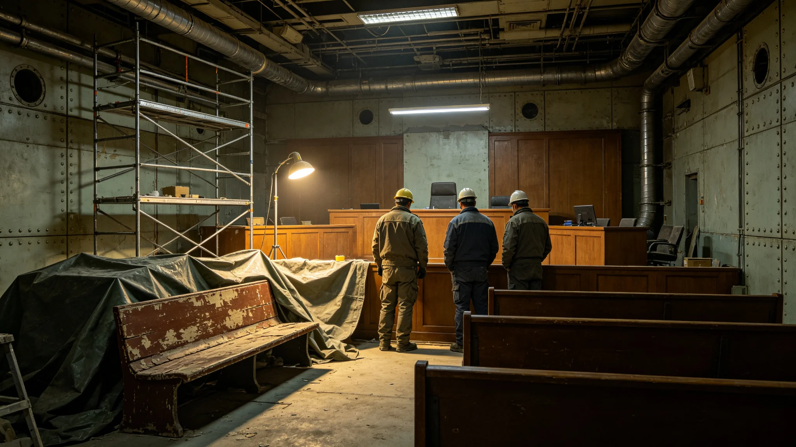

# 三恒星系文明联合体司法体系改革法颁布公报

兹公布《司法体系改革法》要点。本法依第三十次宪政修订案制定，自3863年起施行。本法改革跨系司法管辖、数字化、公开与独立四方面。

## 一、立法缘由

旧司法体系下，跨系案件管辖模糊，常出现"此系不审、彼系不管"的空档；司法文书纸质为主，检索慢；旁听与判决公开不足；法官待遇与考核受行政影响。第四代领导期宪政改革，遂立本法。立法历时两年，公开征求意见一轮。

## 二、跨系管辖改革

本法明确：跨系行政命令受最高司法中心审查；跨系民事案件由任居系法院初审，上诉至最高司法中心；跨系刑事案件由犯罪地或被告居地法院初审。管辖争议由最高司法中心裁定，不得推诿。此条针对3846年苏明慎大法官所提异议，把审查权成文化。

## 三、司法数字化

本法要求司法文书逐步数字化，接入司法数字化系统（见技术类各档）。判决文书除涉密外公开上网，可检索。案卷保管期延长。数字化不替代纸质，纸质仍存。此条针对旧体系检索慢之弊。

## 四、公开与旁听

本法规定，除涉及未成年与秘密者外，裁判一律公开旁听。判决文书公开，附法官异议意见。公众可凭编号查判决。公开不收费。此条针对旧体系公开不足之弊。

## 五、法官独立与待遇

本法明确，法官待遇独立核定，不受行政预算左右。法官考核由同级法官互评与案件复核组评分组成，行政机关不得干预。首席大法官任期十年不可连任，详见换届法。此条针对旧体系法官受行政影响之弊。

## 六、审理周期

本法规定一审审理周期一般不超过六十日，二审不超过九十日，跨系案件可延长三十日。审理周期延长须书面说明。此条针对旧体系久拖不审之弊。3849年一起跨系判决执行争议事件，见子事件类各档。

## 七、判决执行

本法明确，生效判决必须执行，行政机关不得拒绝。行政机关不执行者，由司法中心强制。3849年执行争议事件后，本法增设"判决执行监督"一章，由司法中心专人跟踪执行。此条针对旧体系"判了不执行"之弊。

## 八、与旧司法法的关系

本法不废止旧司法法，仅改革跨系部分与数字化部分。旧法未规定者依本法，抵触者以新法为准。立法组建议未来合并新旧为统一司法法，非本次内容。

## 九、施行与过渡

本法3863年施行，设一年过渡。过渡期内，最高司法中心制定数字化细则，各级法院培训工作人员。过渡期满，本法全面适用。

## 十、公开征求意见摘要

立法期间收到意见一千九百余条。集中意见为担心审理周期缩短影响质量；立法组回应，周期为上限非目标，复杂案件可延长。另一意见为要求判决公开全文；立法组采纳，仅删涉密部分。

## 十二、与司法数字化系统的衔接

本法要求各级法院接入司法数字化系统。系统上线后，立案、分案、审理、文书归档全流程线上进行，纸质副本仍存。当事人可凭编号查案件进度。数字化初期，部分老年法官不适应，本法不强制立即全数字化，设两年过渡期，纸质与电子并行。3846年苏明慎大法官由纸质转电子的经历，见人物传记类各档。

## 十三、法官回避的细化

本法细化法官回避。法官与当事人有同乡、同学、资助、亲属关系者，须主动回避。回避须书面声明，存档。法官不回避而被发现者，所作判决无效。此条针对旧体系回避仅口头之弊。3846年苏明慎主动回避七次，即为旧例，本次成文化。

## 十四、与公民权利扩展法的关系

本法为司法程序法，公民权利扩展法为实体权利法。公民依扩展法主张权利，依本法寻求司法救济。两法配合，不矛盾。公民受跨系行政损害者，先向人权专员公署申诉，不采纳者依本法起诉。两法由同一宪政修订案派生。

## 十八、与其他法的衔接总览

本法与换届法、宪政修订案、跨星系治理宪章、公民权利扩展法、行政程序法、跨星区协调法同属第四代宪政改革一揽子立法。七法相互衔接，不矛盾。本法生效后，旧司法法中与跨系管辖、数字化、公开、独立相关者，以本法为准。其余仍依旧法。

本法通过后，每年设司法独立纪念日，纪念司法独立原则，见文化仪式类各档。纪念日当天，各级法院开放旁听，不放假，不搞庆典。首席大法官按规程致辞三分钟。立法组认为，司法独立之纪念重在日常坚守，不在仪式。

## 十七、施行首日

3863年施行首日，最高司法中心开放咨询，解答公民对管辖与数字化之疑问。当日无冲突。施行一年后，由审计署评估改革成效，见经济产业类决算报告。

本法正本存宪法库，副本分发三系各级法院。本法由最高司法中心负责解释，行政署、人权专员公署配合执行。本法自3863年施行日起生效。
