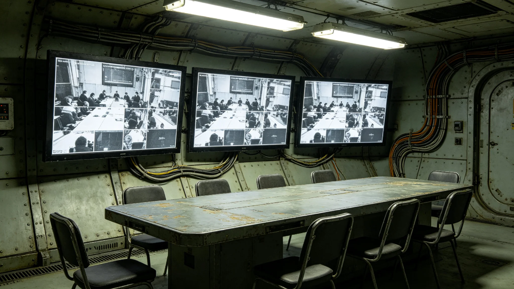

# 三恒星系文明联合体跨星区协调法颁布公报

兹公布《跨星区协调法》要点。本法依跨星系治理宪章第三章制定，自3865年起施行。本法规范跨星区协调专员公署之组织、权限与程序。

## 一、立法缘由

跨星区协调专员公署依行政命令设立数十年，组织与权限无成文法。3850年一次跨星区政策协调失败事件（见子事件类各档），暴露协调无程序之弊。第四代领导期宪政改革，遂立本法，把协调公署成文化。立法历时两年。

## 二、公署组织

本法规定，跨星区协调专员公署设专员一人，任期六年，可连任一次。专员之下设三系对口联络员各一人，副手一人。专员由公民大会选任，详见换届法。公署编制固定，不随事务扩张。3845年程联衡首任专员，见人物传记类各档。

## 三、权限范围

公署权限为三系政策衔接、资源调剂、争议调解。公署无行政命令权，仅以备忘录形式协调。备忘录须三系对口单位会签方生效。协调不成者，移交公民大会议决。公署不涉立法、司法、选举。

## 四、协调程序

本法规定协调程序：一、受理争议或调剂请求；二、召集三系对口单位磋商；三、拟备忘录草案；四、三会签；五、生效存档。全程序一般不超过六十日，跨星区往返耗时者可延长。3846年程联衡漏签事件后，本法要求每步登记。

## 五、与行政程序法的关系

公署行文按行政程序法，但其协调决议按本法。两法配合：行政程序法定如何行文，本法定协调何事。跨系会签不超过三日之限，两法一致。

## 六、与跨星系治理宪章的关系

本法为宪章第三章之下位法。宪章定原则，本法定程序。本法不得与宪章抵触。3861年宪章修订后，本法同步调整。

## 七、争议移交

协调不成者，移交公民大会议决。移交时公署附"未达成原因"一页，不附倾向。3847年程联衡十一次失败中，六起移交议会，见人物传记类各档。移交后公署不旁观，继续与三系保持沟通，以备议会决策后执行。

## 八、公开与监督

公署备忘录除涉密外摘要公开。公署每年向议会作协调工作报告。审计署对公署经费审计。人权专员公署监督公署是否推诿。公署受多方监督，非独立王国。

## 九、施行与过渡

本法3865年施行，设半年过渡。过渡期内，公署修订内部流程，与三系对口单位换文确认。过渡期满，本法全面适用。

## 十、公开征求意见摘要

立法期间收到意见一千五百余条。集中意见为担心公署权限过大；立法组回应，公署无命令权，仅协调。另一意见为要求公署公开备忘录全文；立法组采纳摘要公开，涉密部分除外。

## 十二、与跨星区政策协调失败事件的关系

3850年一次跨星区政策协调失败事件，直接促成本法立法。该事件中，因无成文协调程序，三系对一项资源调拨各执一词，拖延月余。本法针对此事，把协调程序成文化，明确每步时限。事件详情见子事件类各档。立法组认为，把失败事件教训写入法律，比纪念事件本身更重要。

## 十三、与跨星区通信会议系统的关系

公署协调多通过跨星区通信会议系统（见技术类各档）进行。本法规定，远程协调与现场协调效力相同，备忘录同样须三会签。3845年程联衡任内，远程会议年均七十二次，见人物传记类各档。本法不强制现场，但重大资源调剂建议现场。

## 十四、与经济产业的关系

公署协调事项多涉资源调剂，与跨星区协调服务产业决算（见经济产业类各档）直接相关。本法规定公署经费由联合体财政按受益比例分摊，不向被协调单位收费。此条防止公署借协调牟利。

## 十五、与其他法的衔接总览

本法与换届法、宪政修订案、跨星系治理宪章、公民权利扩展法、司法体系改革法、行政程序法同属第四代宪政改革一揽子立法。七法相互衔接。本法生效后，旧协调惯例中与程序相关者以本法为准。

## 十七、协调工作的年度统计

本法施行后，协调工作逐年统计。首年公署受理协调事项三百余件，成功率约九成六，移交议会十一件。统计见经济产业类跨星区协调服务产业决算。立法组认为，协调之成败须看数据，不看宣言。

## 二十、与跨星区会议生态足迹的关系

公署跨星区往返与通信会议均有生态代价。本法施行后，公署配合跨星区会议生态足迹监测（见生态生物类各档），逐年报告往返班次与远程会议比例。3848年程联衡任内远程会议比例已升至六成，见人物传记类各档。本法鼓励远程，以降生态足迹。

本法正本存宪法库，副本分发三系对口单位。本法由跨星区协调专员公署负责解释，公民大会、审计署监督。本法自3865年施行日起生效，不溯及既往。施行过程中如有未尽事项，由公民大会解释，行政署与审计署监督执行。
