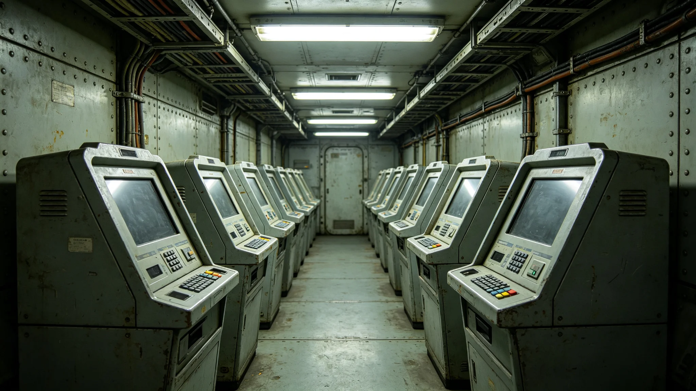

# 跨星系电子投票系统第七代技术鉴定报告

本报告为跨星系电子投票系统第七代技术鉴定。系统由选举委员会主持，数字政务设备产业承建，3866年通过鉴定，自3868年宪政修订公投起投入使用。

## 一、系统定位

跨星系电子投票系统服务于三系公民跨星区投票。公民可在任居系投票终端或远程终端投票，系统记录、加密、汇总、计票。系统与选举安全加密技术（见GS-3870-01）、政务区块链存证（见GS-3871-01）、公民身份数字认证（见GS-3872-01）配合。

## 二、跨星区冗余设计

3848年公投期间，第一星区投票通道延迟事件（见GS-3873-01）暴露单通道之弊。第七代系统设两道冗余：主通道为跨星区通信会议系统（见GS-3869-01），备用通道为延迟投递投票箱。主通道故障时，自动切备用，投票窗口延长。冗余切换耗时不超过一刻钟。

## 三、投票终端

投票终端分布于三系各投票站，3848年公投时为六千一百二十站，第七代扩至七千二百站。终端为封闭金属壳体，无外接接口，投票时无网络上行，仅计票时联网。终端双人复核：一选民一终端一操作员，操作员不看票。

## 四、远程投票

跨系选民可经远程终端投票。远程投票须经公民身份数字认证（见GS-3872-01），一人一票。远程投票与现场投票效力相同。3848年延迟事件后，远程投票增设两道冗余。

## 五、计票流程

投票结束后，终端数据上链（见GS-3871-01），由选举委员会双人复核计票。计票过程公开旁听，计票结果附原始数据哈希。异议者可凭哈希复核。第七代系统计票较第六代快约三成，但仍坚持双人复核，不图快而省复核。

## 六、安全与篡改防护

系统不联公共网，仅联选举专网。终端物理封闭，拆开即自毁记录。传输加密见选举安全加密技术档。3850年政治极端主义监测发现的零星干扰，见军事安全类各档，系统未被证实篡改。

## 七、鉴定结论

鉴定组认为，第七代系统冗余充分、计票可核、篡改防护到位，通过鉴定。遗留问题：远程投票在跨星区高延迟时偶有排队，建议下一版优化调度。鉴定组不认为此问题影响使用。

## 八、承建与运维

系统由数字政务设备产业承建，见经济产业类决算。运维由选举委员会与承建方共同负责。运维记录另卷。

## 九、与旧系统对照

第六代系统无跨星区冗余，为3848年延迟事件之因。第七代冗余设计针对此事。两计票算法一致，仅冗余与终端扩展不同。

## 十一、终端物理设计

投票终端为铸铝封闭壳体，重约十八公斤，固定于投票站桌面。壳体无任何外露按键，仅投票旋钮与确认钮。旋钮转动时屏幕显示候选名单，确认钮按下即记录。壳体拆开即触发自毁电路，记录不可读出。此设计针对3850年政治极端主义监测发现的破坏企图。

## 十二、与公民身份数字认证的接口

系统与公民身份数字认证（见GS-3872-01）接口。选民投票前，终端读取认证芯片，核对身份与投票资格。一人一票，重复投票即拒。认证芯片不记名，仅确认"有资格"，不确认"是谁"，以保秘密。3872-01档详述认证原理。

## 十三、与区块链存证的接口

计票数据上链（见GS-3871-01）。投票结束后，每站计票结果附哈希上链，不可篡改。异议者可凭哈希复核。链上数据仅选举委员会与审计署可查，公众可验哈希但不见明细，以保秘密。

## 十四、培训与试运行

第七代系统3866年通过鉴定后，3867年在三个投票站试运行一年。试运行中发现远程投票在高延迟时排队，鉴定组记录在案。3868年宪政修订公投前全面铺开，见文化仪式类各档。

## 十六、系统故障延迟事件的教训

3848年公投第一星区投票通道延迟事件（见GS-3873-01），是第七代系统冗余设计的直接动因。事件中，主通道拥堵，无备用通道，致部分选民无法投票。第七代吸取教训，设两道冗余。鉴定组认为，第七代冗余若早用十年，3848年事件可不发生。事件处理经过见GS-3873-01。

## 十八、计票结果的公开与可核

计票结果公布时，附原始数据哈希。公民可验哈希是否一致，但不见具体明细，以保秘密。异议者可向选举委员会申请复核，复核由双人进行。3848年公投重计票六次，见人物传记类各档。第七代系统使复核更快，但不省复核。

## 十九、系统的退役与更换

投票终端设计寿命十年。第七代终端3868年铺开，预计3878年更换。更换时旧终端记录封存，新终端沿用同一算法。更换不影响历史数据。

## 二十一、与选举安全保障体系的关系

选举期间，警安署按选举安全保障体系（见军事安全类各档）在外围值守，不进入计票室。系统本身不联网，物理隔离。3850年政治极端主义监测发现的零星干扰，见军事安全类各档，系统未被证实篡改。

本报告为技术鉴定件，不代替选举规程。使用时以选举委员会规程为准。系统运维记录另卷，每年由审计署审计一次。
