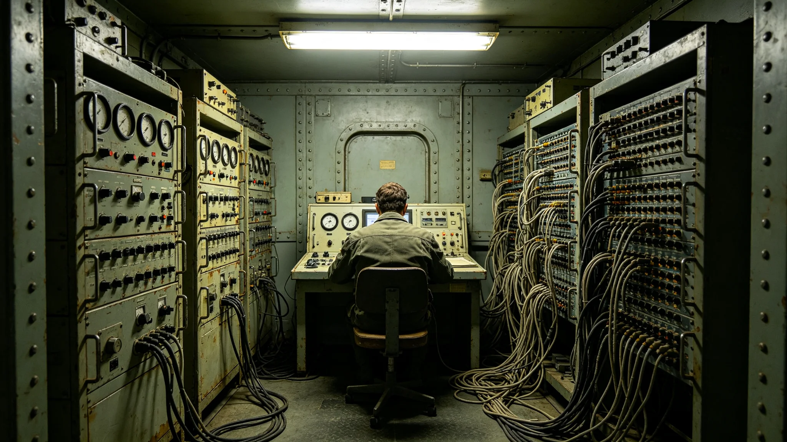

# 跨星区通信会议系统第五代技术鉴定报告

本报告为跨星区通信会议系统第五代技术鉴定。系统由跨星区协调专员公署主持，数字政务设备产业承建，3869年通过鉴定。

## 一、系统定位

跨星区通信会议系统供三系机关远程开会。系统传视频与数据，与跨星区通信干线配合。系统与跨星区协调法（见GS-3865-01）、政务数据共享平台（见GS-3867-01）配合。

## 二、第五代改进

第四代系统延迟高、画质差，跨系会议常卡顿。第五代提升带宽，延迟降低一半。3845年程联衡任内远程会议年均七十二次，见人物传记类各档。第五代使远程协调更可用。

## 三、会议舱

跨星区会议舱设于三系各中枢。舱内封闭加压金属壳体，多小舷窗，无大圆形观察窗。舱内设会议桌、终端、录存设备。会议录像存档，供未出席者补看。

## 四、冗余设计

与电子投票系统（见GS-3866-01）共用冗余通道。主通道故障时切备用，会议不中断。3848年延迟事件后，会议系统亦设冗余。

## 五、与跨星区协调的关系

公署协调多经本系统。3845年程联衡任内，远程会议年均七十二次。第五代后，远程比例升至六成，现场往返减少，见人物传记类各档。

## 六、生态足迹

跨星区往返与通信会议均有生态代价。第五代提升远程比例，减少现场往返，生态足迹下降。监测见生态生物类各档跨星区会议生态足迹档。

## 七、鉴定结论

鉴定组认为，第五代系统延迟低、冗余足、画质清，通过鉴定。遗留问题：跨系高延迟时仍有排队，下一版优化调度。

## 八、承建与运维

系统由数字政务设备产业承建，见经济产业类决算。运维由公署与承建方共同负责。

## 九、与旧系统对照

第四代延迟高。第五代延迟降一半。两代可互用。

## 十、培训与试运行

第五代3869年通过鉴定后，3870年在公署试运行。试运行中发现跨系会议记录转写有误，下一版优化转写。

## 十一、与3874年跨星区政策协调失败事件的关系

3874年跨星区政策协调失败事件（见GS-3874-01）中，三系对一项资源调拨各执一词，会议系统卡顿致磋商不畅。事件后，公署增设现场磋商日。事件处理见GS-3874-01。

## 十三、3874年协调失败事件的详细教训

3874年跨星区政策协调失败事件（见GS-3874-01）中，三系对一项跨星区供水配额各执一词。会议系统在磋商后半段卡顿，致第三星区代表发言未被完整记录，第二星区误以为第三星区让步。事件后，公署增设现场磋商日：凡重大资源调剂，必须现场，不以远程代替。事件处理经过见GS-3874-01。

## 十四、会议录像的保存

跨星区会议录像保存三年，供未出席者补看与争议时调阅。录像不公开，仅公署与议会可调阅。3874年事件中，录像即证明第二星区误读，为移交议会提供依据。

## 十五、会议舱的物理设计

跨星区会议舱设于三系各中枢，为封闭加压金属壳体，多小方形舷窗，无大圆形观察窗。舱内设会议桌、终端、录存设备、应急冗余线路。舱壁有铸造接缝、外露管线、磨损痕迹，非光滑塑料。此设计依视觉规范。

## 十六、与生态足迹监测的关系

公署跨星区往返与通信会议均有生态代价。第五代提升远程比例，减少现场往返，生态足迹下降约三成。监测见生态生物类各档跨星区会议生态足迹档。公署每年报告往返班次与远程比例。

## 十八、与跨星区危机响应机制的关系

跨星区危机时（见军事安全类各档），会议系统切换至危机频道，三系指挥端直接连通。日常会议与危机会议物理隔离，互不干扰。3850年一次跨星区危机响应演练中，系统切换耗时不到一刻钟。

## 二十二、附则

本报告为技术鉴定件，不代替会议规程。使用时以公署规程为准。系统运维记录另卷，每年由审计署审计一次，审计报告见经济产业类跨星区协调服务产业决算。系统上线后，公署远程会议比例由四成升至六成，现场往返减少，程联衡之后任专员体健负担亦随之减轻。

会议系统每年统计跨星区往返班次与远程会议比例，见生态生物类各档跨星区会议生态足迹档。第五代后远程比例升至六成，现场往返减少，生态足迹下降。公署每年公开此统计。

会议系统设计寿命八年。第五代3869年铺开，预计3877年更换。更换时旧系统录像封存，新系统沿用同一传输干线。更换不影响历史会议记录。

鉴定组指出，远程会议不能完全替代现场磋商。重大资源调剂、争议调解，仍须现场，因屏幕上难察让步分寸。3845年程联衡任内即持此见，见人物传记类各档。系统仅作辅助。

本报告为技术鉴定件，不代替会议规程。使用时以公署规程为准。系统运维记录另卷，每年由审计署审计一次。系统不设奖金，不评优，不评人，不排行，不公开点名。系统仅提效率，不论短长。
