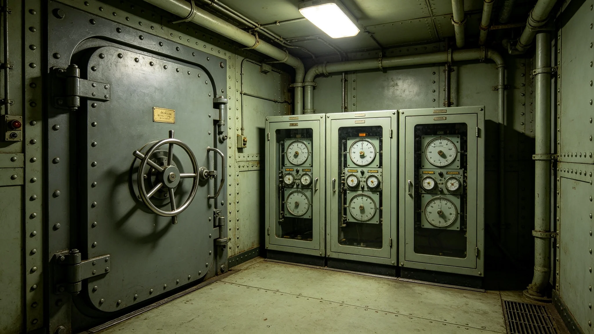

# 选举安全加密技术第八代技术规范报告

本报告为选举安全加密技术第八代技术规范。技术由选举委员会主持，数字政务设备产业承建，3870年发布。

## 一、技术定位

选举安全加密技术保障电子投票（见GS-3866-01）之传输与存储安全。技术不投票，仅加密。技术与选举安全保障体系（见军事安全类各档）配合，体系保外围秩序，技术保内部数据。

## 二、第八代改进

第七代加密算法经数十年运行，理论上已可被逐步破解。第八代更换为新算法，密钥长度加倍。3850年政治极端主义监测（见军事安全类各档）发现的零星干扰，促成立即升级。

## 三、密钥分存

密钥分存于三处：选举委员会、审计署、公民大会秘书处。三处各持一片，须三片合一方可解密。任一处被盗，不能单独解密。此设计针对单点失守。

## 四、传输加密

投票数据传输经跨星区通信干线，全程加密。传输中断即重试，不重复投票。3848年延迟事件后，传输冗余升级，见GS-3866-01。

## 五、存储加密

计票结果存储于选举专网，加密。专网不联公共网。终端物理封闭，拆开即自毁。此设计见GS-3866-01。

## 六、与区块链存证的关系

计票数据上链（见GS-3871-01）。加密保传输，区块链保不可篡改。两技术配合，一保机密，一保全。

## 七、与公民身份数字认证的关系

选民身份经公民身份数字认证（见GS-3872-01）核对。认证确认"有资格"，不确认"是谁"，保秘密。加密保数据，认证保资格。

## 八、技术规范要点

本报告规定：算法参数、密钥长度、分存规则、轮换周期。密钥每年轮换一次，旧密钥封存不销毁。轮换由选举委员会、审计署、议会秘书处三方共同执行。

## 九、鉴定与审核

第八代技术经独立密码学组审核，确认无可被短期破解。审核组不参与日常运维，以保独立。3870年发布后，3871年选举首次使用。

## 十、与旧算法对照

第七代算法理论上可被逐步破解。第八代更换新算法。两代算法并行一年，旧算法数据逐步迁移。

## 十一、技术局限

加密非万能。物理破坏终端仍可能。故终端置于选举安全保障体系（见军事安全类各档）内，外围有警安。技术与安保配合。

## 十三、3850年政治极端主义监测的教训

3850年政治极端主义监测（见军事安全类各档）发现，有人试图接近投票站终端，试图读取传输信号。未得逞，但促成立即升级加密。第八代加密即为此事件之直接回应。事件中，监测系统在外围发现可疑人员，警安及时驱离，未触及终端。

## 十四、密钥轮换的现场记录

3871年首次密钥轮换，由三方共同执行。轮换当日，选举暂停半日。三方代表各持密钥片，现场合并，解锁旧系统，切换新系统。全过程公开旁听，议会派员监看。轮换记录存档。

## 十五、密码学组的独立审核

第八代技术发布前，由独立密码学组审核。审核组不参与选举日常，与承建方无利益关系。审核组报告认为新算法无可被短期破解，通过。报告公开摘要，细节涉密不公开。

## 十六、技术与人类的配合

加密技术不能代替人。密钥分存依赖三方诚信，计票复核依赖双人。技术使篡改难，人使篡改可被发现。3848年公投重计票六次，见人物传记类各档，即人在起作用。

## 十九、与政务设施安保的关系

加密系统服务器设于政务设施安保（见军事安全类各档）内。服务器室封闭加压，双锁双人进入。密钥分存柜组设于安保范围内，非三人同时到场不能开启。技术与安保配合，技术保数据，安保保物理。

## 二十三、附则

本报告为技术规范件，不代替选举规程。使用时以选举委员会规程为准。技术运维记录另卷，每年由审计署审计一次。第八代技术与第七代并行一年，旧算法数据逐步迁移，迁移全程双人复核。技术升级不中断选举，均在非选举期进行。

选举期间，政治极端主义监测（见军事安全类各档）在外围发现可疑人员，警安驱离。第八代加密使外围即使突破，内部数据仍不可解。监测报告每年交选举委员会。3850年监测发现的零星干扰，见军事安全类各档。

本报告为技术规范件，不代替选举规程。使用时以选举委员会规程为准。技术运维记录另卷，每年由审计署审计一次。第八代技术与第七代并行一年，旧算法数据逐步迁移，迁移全程双人复核。

第八代技术预计用至3880年，届时再评估是否需第九代升级。技术升级不中断选举，均在非选举期进行。3870年发布后，3871年首次用于补缺选举，运行平稳，未发生解密失败。

本报告为技术规范件，不代替选举规程。使用时以选举委员会规程为准。技术运维记录另卷，每年由审计署审计一次。第八代技术3871年首次用于补缺选举，运行平稳，未发生解密失败。本技术为联合体选举安全之基石，各任主席均须重新签署确认。
