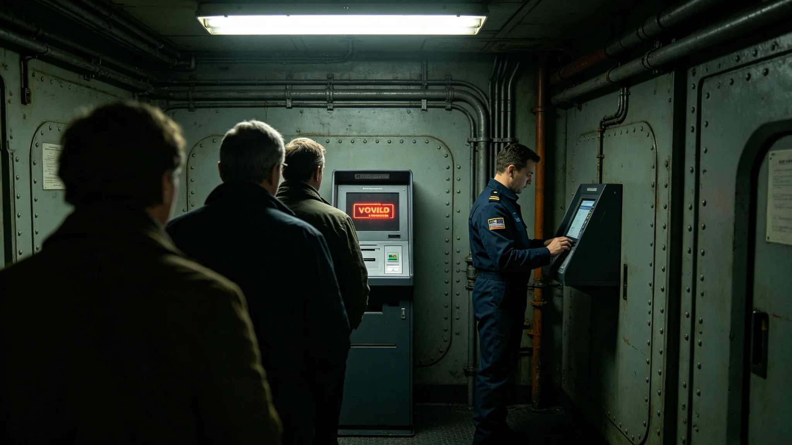

# 3848年公投第一星区投票通道延迟四小时事件通报

本通报为3848年宪政修订公投期间，第一星区投票通道延迟事件之正式记录。事件由选举委员会调查，3873年整理成册。

## 一、事件经过

3848年宪政修订公投日，第一星区投票站自早九时开放。上午十一时二十分，主投票通道因跨星区通信干线拥堵，投票终端无法联网核对身份。现场工作人员按规程启用备用通道，延迟约四小时后恢复。期间约一千二百名选民排队等待，无一人未投票。

## 二、延迟原因

经调查，延迟原因为：公投日三系同时投票，跨星区干线带宽不足，第一星区主通道被数据拥堵阻塞。备用通道设计存在，但启用不熟练，耽搁约半小时。事件非人为破坏，非系统篡改。

## 三、处置过程

十一时二十分，现场工作人员发现终端无法联网，即报选举委员会。十一时四十分，委员会指示启用备用通道。十二时，备用通道开始接收，但速度慢。十五时三十分，主通道恢复。委员会为受影响选民延长投票窗口两小时。

## 四、对结果的影响

选举委员会复核确认，延迟未影响公投结果。所有受影响选民均在延长窗口投完票。公投结果经双人复核，异议者复核对无差异。3848年公投出席率与结果，见文化仪式类宪政修订公投日档。

## 五、责任认定

事件为技术冗余不足，非个人失职。现场工作人员按规程处置，无处分。选举委员会主席卫公允（见人物传记类各档）事后承担领导责任，作书面检讨，未再犯。

## 六、整改措施

事件后，选举委员会推动第七代电子投票系统（见GS-3866-01）增设两道冗余，备用通道启用改为自动，不必人工判断。跨星区干线带宽扩容。公民权利扩展法（见GS-3862-01）新增"通道故障致未能投票者另开窗口"一条。

## 七、后续

3849年例行选举、3850年换届选举均无类似延迟。3868年宪政修订公投使用第七代系统，未再发生。事件成为冗余设计之反面教材，写进选举须知。

## 九、现场记录摘录

现场记录显示，延迟期间排队选民情绪平稳，无冲突。有老年选民站立过久，工作人员搬来座椅。选民无人抱怨，少数人在排队时讨论公投内容。记录员签注："现场秩序良好，工作人员处置得当。"

## 十、与3848年公投结果的关系

3848年公投结果为通过。延迟发生在第一星区，而第一星区支持率本就最高。选举委员会复核认为，延迟未改变结果方向。但若延迟发生在支持率胶着的区段，后果可能不同。此为事件最值得警惕之处。

## 十一、与第七代系统的因果

事件直接催生第七代电子投票系统。第七代增设两道冗余，备用通道自动启用，跨星区干线扩容。见GS-3866-01。若早有第七代，3848年事件可不发生。事件成为技术迭代之直接动因。

## 十二、与公民权利扩展法的因果

事件后，公民权利扩展法新增"通道故障致未能投票者另开窗口"一条。此条保障跨系投票权不因技术故障而被剥夺。见GS-3862-01。任持正首任人权专员（见人物传记类各档）据此受理了公民申诉。

## 十三、后续选举的检验

3849年例行选举、3850年换届选举、3868年宪政修订公投，均使用改进后系统，无类似延迟。事件整改成效经多次检验。3868年公投使用第七代系统，第一星区投票顺利。

## 十五、与选举安全保障体系的关系

延迟事件中，警安署按选举安全保障体系（见军事安全类各档）在外围值守，维持排队秩序。警安未进入计票区，未碰票。事件无外部干扰，纯技术问题。警安在事件中仅维持现场，未参与处置。

## 十七、事件的社会反响

延迟事件经选举委员会公布后，三系媒体讨论一周。多数意见认为应改进技术，少数意见质疑公投有效性。选举委员会公布复核数据，证明结果无偏差，质疑平息。事件未引发暴力，未引发政治极端主义行动。

## 十九、附则

本通报为事件记录件，不代替选举规程。使用时以选举委员会规程为准。事件相关原始记录另存于选举计票中心，保存期十年。事件通报副本分发三系各居委会，供公民了解选举技术之局限与改进。事件未引发对选举制度的根本质疑，多数公民视之为技术故障而非制度缺陷。

3848年公投出席率为历届最高。延迟发生在高出席率背景下，排队人多。若出席率低，延迟可能不那么明显。事件成为"高出席率下技术冗余不足"之典型。

3848年延迟事件是第四代领导期选举技术之标志性事件。它暴露了旧系统单通道之弊，催生了第七代系统与冗余设计。事件无人员伤亡，无结果偏差，但影响深远。选举委员会把事件写入每年度选举须知首页。

本通报附现场记录、复核报告、检讨各一件。原件存选举计票中心。副本分发三系各居委会，供公民了解。
