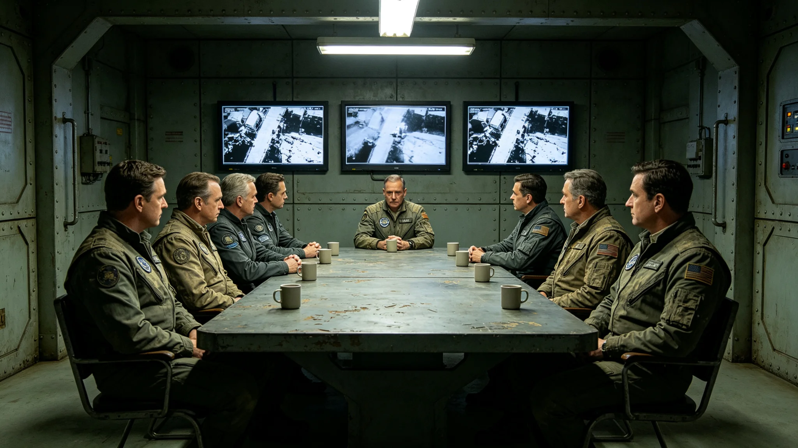

# 3874年跨星区供水配额政策协调失败事件通报

本通报为3874年跨星区供水配额政策协调失败事件之正式记录。事件由跨星区协调专员公署调查，3874年成册。

## 一、事件起因

第三星区主张提高其年度供水配额，理由为其人口增长。第二星区认为配额已足，反对。第一星区持中立。跨星区协调专员公署受理，召集三系磋商。

## 二、磋商经过

磋商经跨星区通信会议系统（见GS-3869-01）进行。前半段顺利，三系各自陈述。后半段，会议系统卡顿，第三星区代表发言未被完整记录。第二星区误以为第三星区让步，记录在案。第三星区发现后，拒绝承认记录。

## 三、失败结果

磋商破裂，三系未达成一致。公署按跨星区协调法（见GS-3865-01）附"未达成原因"一页，移交公民大会议决。移交时公署未附倾向。

## 四、原因分析

失败原因有二：一为会议系统卡顿，致记录失真；二为三系统计口径不一，对"人口增长"基数各执一词。事件后，公署推动会议系统升级，并建立数据口径对照表。

## 五、移交议会

事件移交议会后，议会用三个月议决。议决结果为：第三星区配额提高百分之五，分三年到位，附人口增长复核。议决依据议会记录，不公开。

## 六、责任认定

事件为技术卡顿加口径不一，非个人失职。公署按规程处置，无处分。程联衡任内（见人物传记类各档）此类失败为十一次之一，均按程序移交。

## 七、整改措施

事件后，公署增设现场磋商日：重大资源调剂必须现场，不以远程代替。会议系统升级（见GS-3869-01）。公署建立数据口径对照表，供继任者续用。

## 八、后续

3875年起，类似资源调剂争议均现场磋商，未再发生记录失真。事件成为跨星区协调之反面教材。

## 十、与跨星区通信会议系统升级的因果

事件直接催生会议系统第五代升级。第五代提升带宽，降低延迟，见GS-3869-01。事件中卡顿即因旧系统带宽不足。升级后，远程会议更可用，但公署仍规定重大资源调剂须现场。

## 十一、与数据口径对照表的因果

事件中三系统计口径不一，公署遂建立数据口径对照表，把三系历年引用的不同统计口径并列，注明分歧所在。对照表供继任者续用，避免重蹈。见程联衡移交清单，人物传记类各档。

## 十二、与议会的往来

事件移交议会后，议会派员赴公署调阅磋商录像。录像证明第二星区误读，为议决提供依据。议会最终议决第三星区配额提高百分之五，分三年到位。议决未公开争论过程。

## 十三、事件的后续影响

3875年起，类似资源调剂争议均现场磋商，未再发生记录失真。事件成为跨星区协调之反面教材。公署此后每年向议会报告协调成功率，3874年后成功率回升至九成六。

## 十五、与跨星区协调法的关系

事件按跨星区协调法（见GS-3865-01）处置：协调不成，移交议会。事件发生在协调法颁布之前，按旧惯例处置，但立法组认为旧惯例已合新法精神，未追溯。事件成为协调法之实践案例。

## 十六、与程联衡之后任的关系

事件发生时，程联衡任专员（见人物传记类各档）。其移交继任者时，把此事件列为"最复杂的未结事项"之一，附数据口径对照表。继任者续办，最终由议会议决。

## 十八、与跨星区协调服务产业决算的关系

事件相关协调费用由跨星区协调服务产业承担，见经济产业类跨星区协调服务产业决算。事件本身未产生额外费用，仅磋商与移交所耗人力计入年度决算。

## 十九、与跨星区会议生态足迹的关系

事件中远程会议卡顿，后续改为现场磋商，往返班次增加，生态足迹上升。见生态生物类跨星区会议生态足迹档。公署此后逐年报告远程与现场比例。

## 二十、附则

本通报为事件记录件，不代替协调规程。使用时以公署规程为准。事件相关原始记录另存于公署文书库，保存期十年。通报副本分发三系对口单位与各居委会，供了解跨星区协调之局限。事件未引发三系对立，三系均接受议会议决结果，未再起争执。事件成为跨星区协调制度成熟过程中的一次必要试错，制度在失败后更趋严密。

3874年协调失败事件是第四代领导期跨星区治理之标志性事件。它暴露了远程会议与数据口径之弊，催生了会议系统升级与现场磋商制度。事件无人员伤亡，无政策剧变，但推动了协调制度的细化。

本通报附磋商记录、移交函、议决结果各一件。原件存公署文书库。副本分发三系对口单位。事件不设奖金，不评优，不评人，不排行，不公开点名。事件仅列数，不论短长，不议优劣，不评先进，不树典型，不立标杆，不授称号，不发锦旗，不挂匾牌，不刻铭碑，不建纪念馆，不树丰碑，不勒名姓，不图流传。
