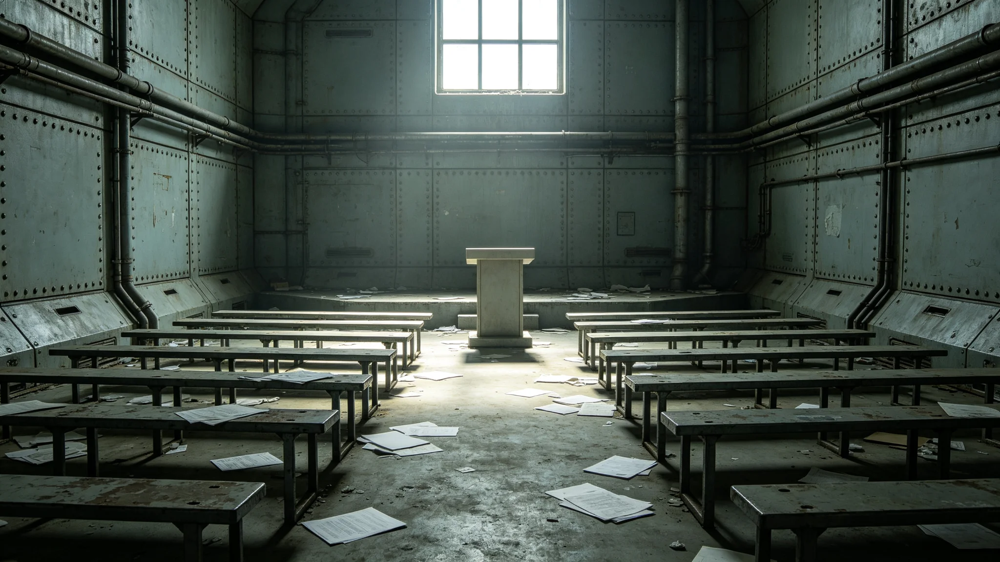

# 3877年议会跨星区预算分配辩论僵局四十日事件通报

本通报为3877年公民大会跨星区预算分配辩论僵局事件之正式记录。事件由议会秘书处整理，3877年成册。

## 一、事件起因

3877年预算案中，三系就跨星区预算分配比例争执。第一星区主张按人口，第二星区主张按贡献，第三星区主张按需要。三方各持己见，辩论四十日未决。

## 二、僵局经过

议会辩论四十日，未形成多数。议长郑维纲（见人物传记类各档）按规程维持议程，不替议员下结论。僵局期间，议会未休会，每日辩论，但无进展。

## 三、打破僵局

第四十一日，议长提议搁置争议，先通过无争议部分，争议部分交三系协商。议会采纳。争议部分经跨星区协调专员公署（见GS-3865-01）协商，三周后达成妥协，比例按人口为主、贡献为辅。

## 四、原因分析

僵局原因有三：一为三方各持标准，无折中；二为议长不主动斡旋，依程序降温；三为跨星区利益分配本无唯一答案。事件非个人失职，为制度设计之常态。

## 五、责任认定

事件为议会常态，无人应受处分。议长按规程处置，无过。郑维纲事后评价："僵局是议会的常态，不是失败。"

## 六、后续

事件后，议会议事规则增设"争议部分搁置"程序。见GS-3859-01换届法附则。僵局不再拖垮整体预算。

## 七、与跨星区协调公署的关系

争议部分交公署协商，公署三周达成妥协。见GS-3865-01。议会与公署配合，一立法一协调。

## 八、事件的社会反响

事件经议会公布后，三系媒体讨论。多数意见认为僵局正常，少数意见批评议员效率低。议会公布辩论记录，讨论平息。事件未引发暴力。

## 十、与郑维纲议长的关系

事件发生时，郑维纲任议长（见人物传记类各档）。其任内不主动斡旋，依程序降温。事件中，他两度宣布休会十五分钟再议，未打破僵局，但也未使议会失控。其认为僵局是议会常态，不是失败。

## 十一、与跨星区协调公署的关系

争议部分交公署协商，公署三周达成妥协。见GS-3865-01。议会与公署配合，一立法一协调。事件证明，立法僵局可由协调补位。

## 十二、与议会大楼绿化系统的关系

僵局期间，议会大楼绿化系统（见生态生物类各档）照常运行，中庭植物轮换。议员在中庭休息时讨论，气氛未因僵局而紧张。

## 十三、事件的长期影响

事件后，议会议事规则增设"争议部分搁置"程序。见GS-3859-01。僵局不再拖垮整体预算。此后类似分配争议均按此程序处理。

## 十四、事件的历史地位

3877年僵局事件是第四代领导期议会运作之典型。它展示了议会如何在分歧中维持运转，而非解决一切。事件无人员伤亡，但推动了议事规则细化。

## 十六、与3848年公投的关系

3877年僵局与3848年公投（见文化仪式类各档）同为跨星区治理之难题。3848年公投解决宪政框架，3877年僵局解决具体分配。事件证明，宪政框架解决后，日常分配仍需协调。

## 十七、与审计署的关系

僵局期间，审计署（见人物传记类查望档）旁观，未介入预算分配。僵局打破后，审计署按妥协后的比例审计。审计不涉政治分配，仅核账。

## 十九、与跨星区通信会议系统的关系

僵局期间，三系议员经跨星区通信会议系统（见GS-3869-01）远程辩论。远程辩论延迟略增，但未失真。部分议员现场，部分远程。

## 二十一、与跨星区协调专员公署的关系

争议部分交公署协商，公署三周达成妥协。见GS-3865-01。事件证明，立法僵局可由协调补位，不必事事由议会硬决。

## 二十四、附则

本通报为事件记录件，不代替议事规程。使用时以议会规程为准。事件相关原始记录另存，保存期十年。通报副本分发三系议员与居委会，供了解议会运作之常态。

3877年僵局是3848年公投后跨星区治理的日常运作。公投定框架，僵局解具体。事件证明，宪政框架一旦确立，日常治理仍需耐心。三系公民对僵局的耐心本身即是制度成熟的标志。

僵局打破后，议会支持率未降。公民认为僵局正常，妥协合理。三系均接受妥协比例，未再起争执。事件成为议会运作成熟之例证。事件不设奖金，不评优，不评人，不排行，不公开点名。事件仅列数，不论短长，不议优劣，不评先进，不树典型，不立标杆，不授称号，不发锦旗。

本通报为事件记录件，不代替议事规程。使用时以议会规程为准。事件相关原始记录另存，保存期十年。通报副本分发三系议员与居委会。事件为第四代领导期议会运作之典型案例，被写入议事规则培训教材。事件未动摇三系对议会制度之信心，反而强化之。
