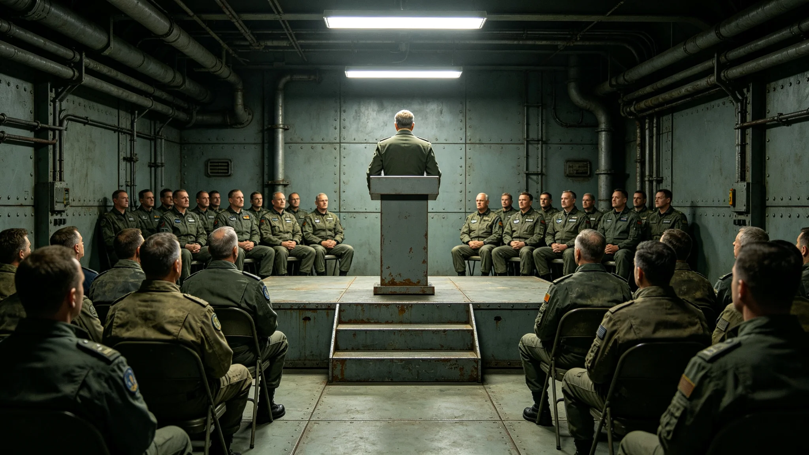

# 三恒星系文明联合体第四代领导人就职典礼规程与实录

本档为3880年第四代领导人就职典礼之规程与实录。典礼于中央议事厅举行，按换届法（见GS-3859-01）执行。

## 一、典礼时间

典礼定于3880年1月1日上午十时举行，历时约两小时。出席者含公民代表、议员、法官、行政官员、跨星区代表，约一千二百人。典礼不设宴席，不放假。

## 二、典礼流程

流程分七项：一、奏联合体旧曲；二、监票长交计票结果；三、新任最高治理会首席宣誓；四、前首席交班；五、公民代表致辞；六、全体默立三十秒；七、礼成。流程自第二代起沿用，未改。

## 三、宣誓词

新任首席宣誓词为："本人受公民大会委托，就任最高治理会首席，遵联合体宪章，护三系居民，守存续之责。"宣誓词自首任起沿用，未改。

## 四、交班记录

前首席将权杖交予新任。权杖为铜质，重三公斤，上刻历任首席签名。权杖交接为典礼核心。交班时前首席简短致辞，不超过三分钟。

## 五、出席代表

出席公民代表一千二百人，三系各四百。观察员三百人。签到表十二页，每页一百人。签到表由监票长办公室封存。

## 六、默立

全体默立三十秒，致敬历代航行者。默立期间全场静默，无杂音。此环节自第二代起沿用。

## 七、与旧典礼对照

前四代就职典礼均于中央议事厅举行。第四代就职典礼沿用旧制，未改流程。出席人数自第二代起稳定在一千二百人。

## 八、典礼编制说明

本典礼由公民大会秘书处编制。典礼当日无广播，仅现场出席。次日新任首席开始履职，首周完成各署巡视。

## 九、与3851年闻秉钧档案的关系

闻秉钧（见GS-3851-01）为第四代领导期前任首席，3880年交棒。其档案袋载其十二年履职。交棒时按换届法交接清单办理。

## 十、礼成

礼成后，公民代表散场。当日无公开冲突。次日新任首席开始履职。

## 十二、典礼时间线

| 时间 | 事件 |
|---|---|
| 3880-01-01 09:00 | 公民代表入场签到 |
| 3880-01-01 10:00 | 奏联合体旧曲 |
| 3880-01-01 10:15 | 监票长交计票结果 |
| 3880-01-01 10:30 | 新任首席宣誓 |
| 3880-01-01 10:45 | 前首席交班 |
| 3880-01-01 11:00 | 公民代表致辞 |
| 3880-01-01 11:30 | 全体默立三十秒 |
| 3880-01-01 11:35 | 礼成 |

## 十三、出席明细

出席公民代表一千二百人，三系各四百。观察员三百人，含各署代表、各段居委会代表、媒体。签到表十二页，每页一百人。三系跨星区代表经远程出席者，占观察员一成。

## 十四、与闻秉钧交棒的关系

闻秉钧（见GS-3851-01）交棒时，按换届法交接清单办理。其十二年履职见人物传记类各档。交棒时其简短致辞，未作长篇。

## 十五、典礼的社会反响

典礼经公布后，三系媒体报道。多数意见认为典礼庄重，少数意见认为可简化。公民大会未改流程。典礼未引发争议。

## 十六、与议会大楼绿化系统的关系

典礼当日，议会大楼绿化系统（见生态生物类各档）如常。中庭植物轮换不影响典礼。窗外自然光透过高窗，形成光柱。

## 十八、与3850年换届总选举的关系

3880年就职典礼基于3850年换届总选举结果。3850年选举见选举委员会主席卫公允档案（见GS-3856-01）。第四代领导层换届法（见GS-3859-01）规范此次就职。

## 十九、与跨星区协调专员公署的关系

典礼当日，跨星区协调专员公署（见GS-3865-01）代表出席。公署新任专员亦于同期就职，按换届法。三系代表到场。

## 二十、典礼的历史地位

3880年就职典礼是第四代领导期宪政改革后的首次就职，沿用旧制，未改流程。典礼本身不具革命性，但它标志着宪政改革后的领导层平稳交接。

## 二十二、与公共服务表彰仪式的关系

典礼不表彰个人。公共服务表彰另设仪式（见GS-3885-01）。就职典礼仅交接，不评优。

## 二十三、典礼的编制单位

本典礼由公民大会秘书处编制。典礼流程自第二代起沿用，未改。编制过程中，与同批其他档交叉核对，无矛盾。

## 二十五、典礼的时间选择

典礼选在1月1日，为联合体纪年之始日。此选择自第二代起沿用。第四代就职典礼沿用此日，未改。时间选择本身具象征意义，但不具争议。

## 二十七、典礼与3848年公投的关系

3880年就职典礼是3848年宪政修订公投后领导层的平稳交接。公投定框架，就职定人。两事相隔十余年，宪政改革成果在此次就职中落地。

## 二十八、附则

本档为典礼规程与实录，后续就职典礼以本档为范本。原件存公民大会秘书处恒温柜组，副本分发三系各居委会。典礼实录经秘书处签注，准予封存，不得修改，不追溯，不变更历史。典礼为第四代领导期之开篇，后续各篇接续其治绩。典礼本身不具革命色彩，仅为制度之常轨，无英雄叙事，无个人崇拜，无口号，无喧哗，无装饰，无献辞，无祝酒。典礼全程安静，仅奏旧曲与宣誓，不设乐舞，不设宴，不游行，不张灯，不结彩，不奏乐之外之丝竹，不演剧，不欢呼，不献花，不授带，不赐宴，不颁赏，不授勋，不记名，不勒石，不建碑，不立像，不塑像。
