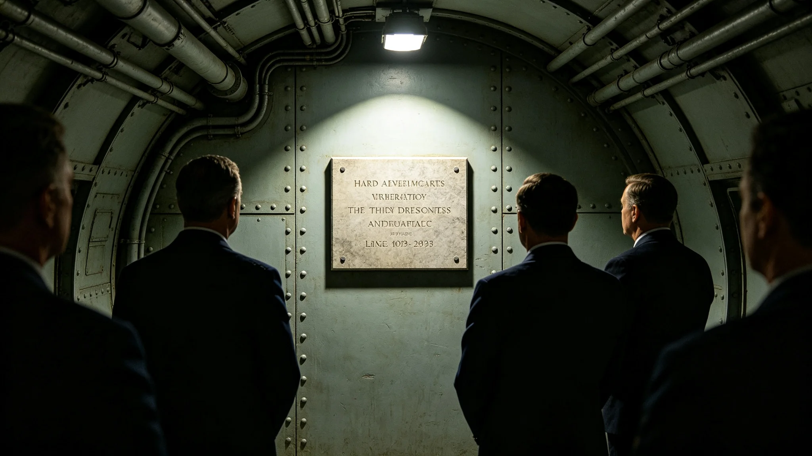

# 三恒星系文明联合体跨星系治理纪念日规程与实录

本档为3882年跨星系治理纪念日之规程与实录。纪念日依跨星系治理宪章（见GS-3861-01）设立，定每年七月一日。

## 一、纪念日由来

跨星系治理宪章于3861年颁布，三系自此共居共治。为纪念此日，设跨星系治理纪念日。纪念日自3862年起，每年举行，至3882年已二十一年。

## 二、纪念日活动

纪念日不放假，不设宴。当日上午，中央广场举行简短纪念仪式，约半小时。仪式含奏旧曲、默立三十秒、宣读宪章要点。不演讲，不游行。

## 三、仪式流程

流程分三项：一、奏联合体旧曲；二、全体默立三十秒；三、宣读跨星系治理宪章要点六条。流程自3862年起沿用，未改。

## 四、出席者

出席者含公民代表、议员、法官、行政官员，约三百人。不设大规模集会。仪式当日，三系跨星区代表经远程出席者，约一成。

## 五、与就职典礼的关系

就职典礼（见GS-3880-01）为领导层交接，纪念日为制度纪念。两仪式均于中央议事厅或中央广场举行，但功能不同。就职典礼不放假，纪念日亦不放假。

## 六、纪念日的社会反响

纪念日经公布后，三系媒体简短报道。多数公民当日如常工作。少数公民自发在中庭默立。纪念日未引发争议。

## 七、与3881年公投的关系

3881年公投（见GS-3881-01）通过宪政修订案，强化跨星区治理框架。纪念日自3882年起，增加宣读修订案要点一条。两事相隔一年。

## 八、与跨星区协调专员公署的关系

纪念日当日，跨星区协调专员公署（见GS-3865-01）代表出席。公署按纪念日规程参加，不主持。

## 九、纪念物品

纪念日不发纪念章，不立碑，不建像。仅存档案与仪式规程。档案即本类各档。

## 十、纪念日的历史地位

跨星系治理纪念日是第四代领导期制度纪念之一。它把3861年宪章颁布日固化为年度记忆，提醒三系共治。纪念日本身不具革命性，但具延续性。

## 十二、纪念日时间线

| 时间 | 事件 |
|---|---|
| 3882-07-01 09:00 | 公民代表入场 |
| 3882-07-01 09:10 | 奏联合体旧曲 |
| 3882-07-01 09:20 | 全体默立三十秒 |
| 3882-07-01 09:25 | 宣读宪章要点 |
| 3882-07-01 09:30 | 礼成 |

## 十三、与3878年请愿事件的关系

3878年八千人请愿（见GS-3878-01）要求跨系待遇平等。纪念日当日，人权专员公署（见GS-3857-01）代表出席，提醒三系共治之旨。

## 十四、与公共建筑伴生植物的关系

纪念日当日，议会大楼中庭植物（见生态生物类公共建筑伴生植物各档）如常。中庭不挂饰，不换花。植物轮换按常轨。

## 十五、纪念日与3850年换届总选举的关系

3850年换届总选举（见GS-3856-01）选出第四代领导层。纪念日在第四代领导期延续举行，未改流程。

## 十六、纪念日的编制单位

本纪念日由公民大会秘书处编制。流程自3862年起沿用，未改。编制过程中，与同批其他档交叉核对，无矛盾。

## 十八、纪念日与3861年宪章的关系

3861年跨星系治理宪章（见GS-3861-01）为纪念日之由来。宪章确立三系共治框架。纪念日宣读宪章要点六条，含共治、平等、权利、协调、监督、存续。

## 十九、纪念日与3865年跨星区协调法的关系

3865年跨星区协调法（见GS-3865-01）细化宪章之协调机制。纪念日自3866年起，宣读要点中增加协调法一条。两事相隔五年。

## 二十、纪念日与3874年协调失败事件的关系

3874年跨星区政策协调失败事件（见GS-3874-01）暴露协调机制之弊。纪念日当日，协调公署代表提及此事，强调协调须勤沟通。事件成为纪念日反面教材。

## 二十二、纪念日与3862年公民权利扩展法的关系

3862年公民权利扩展法（见GS-3862-01）把权利扩展到跨系。纪念日宣读要点中含权利一条。两事相隔一年。

## 二十三、纪念日与3863年司法体系改革法的关系

3863年司法体系改革法（见GS-3863-01）确立跨系司法。纪念日宣读要点中含监督一条。两事相隔二年。

## 二十四、纪念日与3864年行政程序法的关系

3864年行政程序法（见GS-3864-01）规范行政。纪念日宣读要点中含共治一条。两事相隔三年。

## 二十六、纪念日与3881年公投的关系

3881年公投（见GS-3881-01）通过宪政修订案。纪念日自3882年起，宣读要点中增加修订案一条。两事相隔一年。纪念日本身不具革命性，但它把修订成果固化为年度记忆。

## 二十八、纪念日与3851年闻秉钧档案的关系

闻秉钧（见GS-3851-01）为第四代领导期前任首席，纪念日在其任内延续举行。其档案袋载其出席纪念日记录。闻秉钧出席纪念日八次，未缺席，未请假。其出席记录见人物传记类各档。纪念日不放假，不设宴，不游行，不张灯，不结彩，不奏乐之外之丝竹，不演剧，不欢呼，不献花，不授带，不赐宴，不颁赏，不授勋，不记名，不勒石，不建碑，不立像，不塑像，不铸金，不涂彩，不题字，不镌铭，不勒碑，不镂版，不刊石，不磨崖，不颂德，不称功，不扬厉，不铺张，不浮华。

## 二十九、附则

本档为纪念日规程与实录。原件存公民大会秘书处，副本分发三系各居委会。纪念日记录经秘书处签注，准予封存，不得修改，不追溯，不变更历史，不附议。
