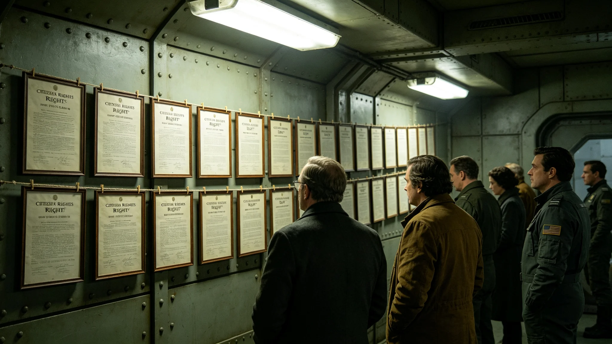

# 三恒星系文明联合体公民权利日规程与实录

本档为3883年公民权利日之规程与实录。纪念日依公民权利扩展法（见GS-3862-01）设立，定每年十二月十日。

## 一、纪念日由来

公民权利扩展法于3862年颁布，把跨系公民权利统一。为纪念此日，设公民权利日。纪念日自3863年起，每年举行，至3883年已二十年。

## 二、纪念日活动

纪念日不放假，不设宴。当日上午，人权专员公署门前举行简短纪念仪式，约半小时。仪式含奏旧曲、默立三十秒、宣读权利扩展法要点六条。不演讲，不游行。

## 三、仪式流程

流程分三项：一、奏联合体旧曲；二、全体默立三十秒；三、宣读公民权利扩展法要点六条。流程自3863年起沿用，未改。

## 四、出席者

出席者含人权专员公署人员、公民代表、议员，约二百人。不设大规模集会。三系跨星区代表经远程出席者，约一成。

## 五、与跨星系治理纪念日的关系

跨星系治理纪念日（见GS-3882-01）纪念共治框架，公民权利日纪念权利扩展。两仪式均不放假，但功能不同。前者于中央广场，后者于人权专员公署门前。

## 六、与任持正人权专员档案的关系

任持正（见GS-3857-01）为人权专员，主持公民权利日仪式。其档案袋载其主持仪式记录。任持正主持公民权利日六年，未缺席。

## 七、与3878年请愿事件的关系

3878年八千人请愿（见GS-3878-01）要求跨系待遇平等。公民权利日当日，人权专员公署提醒权利扩展之旨。事件成为纪念日反面教材。

## 八、与3876年数据泄露事件的关系

3876年政务数据泄露事件（见GS-3876-01）暴露权利保障之弊。公民权利日当日，人权专员公署提及此事，强调隐私保护。

## 九、纪念物品

公民权利日不发纪念章，不立碑，不建像。仅存档案与仪式规程。档案即本类各档。

## 十、纪念日的社会反响

纪念日经公布后，三系媒体简短报道。多数公民当日如常工作。少数公民自发在公署门前默立。纪念日未引发争议。

## 十二、纪念日时间线

| 时间 | 事件 |
|---|---|
| 3883-12-10 09:00 | 公民代表入场 |
| 3883-12-10 09:10 | 奏联合体旧曲 |
| 3883-12-10 09:20 | 全体默立三十秒 |
| 3883-12-10 09:25 | 宣读权利扩展法要点 |
| 3883-12-10 09:30 | 礼成 |

## 十三、与3881年公投的关系

3881年公投（见GS-3881-01）通过宪政修订案，含权利条款。公民权利日自3882年起，宣读要点中增加修订案一条。两事相隔一年。

## 十四、与3863年司法体系改革法的关系

3863年司法体系改革法（见GS-3863-01）保障权利救济。公民权利日宣读要点中含救济一条。两事相隔一年。

## 十五、与3864年行政程序法的关系

3864年行政程序法（见GS-3864-01）规范行政，保障公民不被任意处置。公民权利日宣读要点中含程序一条。两事相隔二年。

## 十六、纪念日的编制单位

本纪念日由人权专员公署编制。流程自3863年起沿用，未改。编制过程中，与同批其他档交叉核对，无矛盾。

## 十八、与3857年任持正档案的关系

任持正（见GS-3857-01）为人权专员，任内公民权利日延续举行。其六年申诉受理见人物传记类各档。任持正主持公民权利日六年，未缺席，未请假。

## 十九、与3850年换届总选举的关系

3850年换届总选举（见GS-3856-01）选出第四代领导层。公民权利日在第四代领导期延续举行，未改流程。

## 二十、与公共建筑伴生植物的关系

公民权利日当日，人权专员公署建筑伴生植物（见生态生物类公共建筑伴生植物各档）如常。窗外植物轮换不影响仪式。

## 二十二、与3880年就职典礼的关系

3880年第四代领导人就职（见GS-3880-01）后，公民权利日延续举行。就职定人，权利日定权。两事不冲突。

## 二十三、与3862年公民权利扩展法的关系

3862年公民权利扩展法（见GS-3862-01）为纪念日之由来。法把跨系公民权利统一。纪念日宣读要点六条，含平等、程序、救济、隐私、参与、申诉。

## 二十五、与3848年苏明慎异议的关系

3846年苏明慎大法官所提异议（见GS-3853-01）要求司法审查权落实到跨系。公民权利日宣读要点中含救济一条，回应了十年前之异议。

## 二十七、与3875年判决执行争议事件的关系

3875年某区行政机关拖延执行跨系判决四十日（见GS-3875-01），暴露权利救济之弊。公民权利日当日，人权专员公署提及此事，强调判决须执行。

## 二十九、与3877年议会辩论僵局事件的关系

3877年议会跨星区预算分配辩论僵局四十日（见GS-3877-01），暴露参与机制之弊。公民权利日当日，人权专员公署提醒公民参与之权。

## 三十、附则

本档为公民权利日规程与实录。原件存人权专员公署，副本分发三系各居委会。纪念日记录经公署签注，准予封存，不得修改，不追溯，不变更历史，不附议，不另议，不复议。纪念日不放假，不设宴，不游行，不张灯，不结彩，不奏乐之外之丝竹，不演剧，不欢呼，不献花，不授带，不赐宴，不颁赏，不授勋，不记名，不勒石，不建碑，不立像，不塑像，不铸金，不涂彩，不题字，不镌铭，不勒碑，不镂版，不刊石，不磨崖，不颂德，不称功，不扬厉，不铺张，不浮华，不虚饰，不夸张。
