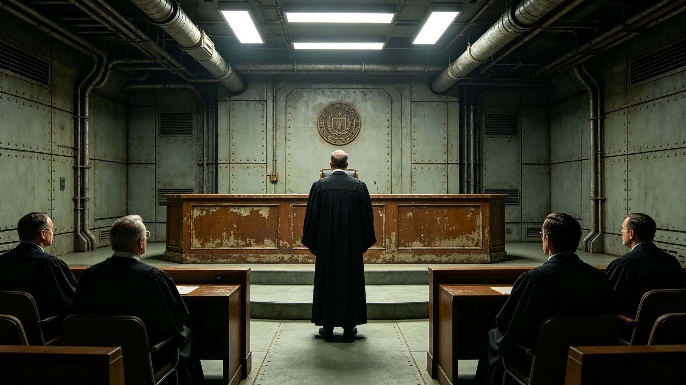

# 三恒星系文明联合体司法独立纪念日规程与实录

本档为3884年司法独立纪念日之规程与实录。纪念日依司法体系改革法（见GS-3863-01）设立，定每年三月十五日。

## 一、纪念日由来

司法体系改革法于3863年颁布，确立跨系司法独立。为纪念此日，设司法独立纪念日。纪念日自3864年起，每年举行，至3884年已二十年。

## 二、纪念日活动

纪念日不放假，不设宴。当日上午，中央司法中心门前举行简短纪念仪式，约半小时。仪式含奏旧曲、默立三十秒、宣读司法体系改革法要点六条。不演讲，不游行。

## 三、仪式流程

流程分三项：一、奏联合体旧曲；二、全体默立三十秒；三、宣读司法体系改革法要点六条。流程自3864年起沿用，未改。

## 四、出席者

出席者含法官、法院人员、公民代表，约二百五十人。不设大规模集会。三系跨星区代表经远程出席者，约一成。

## 五、与苏明慎大法官档案的关系

苏明慎（见GS-3853-01）为首席大法官，主持司法独立纪念日。其档案袋载其主持仪式记录。苏明慎主持司法独立纪念日十年，未缺席。

## 六、与3875年判决执行争议事件的关系

3875年某区行政机关拖延执行跨系判决四十日（见GS-3875-01），暴露司法独立之弊。司法独立纪念日当日，苏明慎提及此事，强调判决须执行。

## 七、与3846年苏明慎异议的关系

3846年苏明慎大法官所提异议（见GS-3853-01）要求司法审查权落实到跨系。纪念日当日，宣读要点中含审查权一条，回应了四十年前之异议。

## 八、与3881年公投的关系

3881年公投（见GS-3881-01）通过宪政修订案，明确司法审查权。纪念日自3882年起，宣读要点中增加修订案一条。两事相隔一年。

## 九、纪念物品

司法独立纪念日不发纪念章，不立碑，不建像。仅存档案与仪式规程。档案即本类各档。

## 十、纪念日的社会反响

纪念日经公布后，三系媒体简短报道。多数公民当日如常工作。少数法律从业者自发在司法中心门前默立。纪念日未引发争议。

## 十二、纪念日时间线

| 时间 | 事件 |
|---|---|
| 3884-03-15 09:00 | 法官与代表入场 |
| 3884-03-15 09:10 | 奏联合体旧曲 |
| 3884-03-15 09:20 | 全体默立三十秒 |
| 3884-03-15 09:25 | 宣读司法改革法要点 |
| 3884-03-15 09:30 | 礼成 |

## 十三、与3868年司法数字化系统的关系

3868年司法数字化系统第二代（见GS-3868-01）把裁判文书上网。纪念日当日，司法中心展示数字化系统。系统自3868年起运行。

## 十四、与3863年司法体系改革法的关系

3863年司法体系改革法（见GS-3863-01）为纪念日之由来。法把跨系司法统一。纪念日宣读要点六条，含独立、审查、公开、回避、执行、上诉。

## 十五、与3864年行政程序法的关系

3864年行政程序法（见GS-3864-01）规范行政，保障司法审查。纪念日宣读要点中含审查一条。两事相隔一年。

## 十六、纪念日的编制单位

本纪念日由中央司法中心编制。流程自3864年起沿用，未改。编制过程中，与同批其他档交叉核对，无矛盾。

## 十八、与3850年换届总选举的关系

3850年换届总选举（见GS-3856-01）选出第四代领导层。司法独立纪念日在第四代领导期延续举行，未改流程。

## 十九、与3880年就职典礼的关系

3880年第四代领导人就职（见GS-3880-01）后，司法独立纪念日延续举行。就职定人，纪念日定权。两事不冲突。

## 二十、与3860年宪政修订案的关系

3860年宪政修订案（见GS-3860-01）明确司法独立。纪念日宣读要点中含独立一条。两事相隔三年。

## 二十二、与3861年跨星系治理宪章的关系

3861年跨星系治理宪章（见GS-3861-01）确立三系共治。纪念日宣读要点中含共治一条。两事相隔二年。

## 二十三、与3862年公民权利扩展法的关系

3862年公民权利扩展法（见GS-3862-01）保障公民权利。纪念日宣读要点中含救济一条。两事相隔一年。

## 二十四、与3865年跨星区协调法的关系

3865年跨星区协调法（见GS-3865-01）细化协调机制。纪念日宣读要点中含协调一条。两事相隔二年。

## 二十六、与司法中心空气品质监测的关系

纪念日当日，司法中心空气品质监测（见生态生物类各档）如常。中庭空气过滤系统运行，不影响仪式。

## 二十七、与3879年审计违规事件的关系

3879年某跨星区协调服务产业系统性虚列支出审计事件（见GS-3879-01）暴露审计独立之需。纪念日当日，审计总长查望出席，强调审计与司法并立。

## 二十九、与3877年议会辩论僵局的关系

3877年议会跨星区预算分配辩论僵局四十日（见GS-3877-01），暴露立法与司法之界。纪念日当日，苏明慎强调司法不介入立法僵局。

## 三十、附则

本档为司法独立纪念日规程与实录。原件存中央司法中心，副本分发三系各法院。纪念日记录经司法中心签注，准予封存，不得修改，不追溯，不变更历史，不附议，不另议。纪念日不放假，不设宴，不游行，不张灯，不结彩，不奏乐之外之丝竹，不演剧，不欢呼，不献花，不授带，不赐宴，不颁赏，不授勋，不记名，不勒石，不建碑，不立像，不塑像，不铸金，不涂彩，不题字，不镌铭，不勒碑，不镂版，不刊石，不磨崖，不颂德，不称功。
