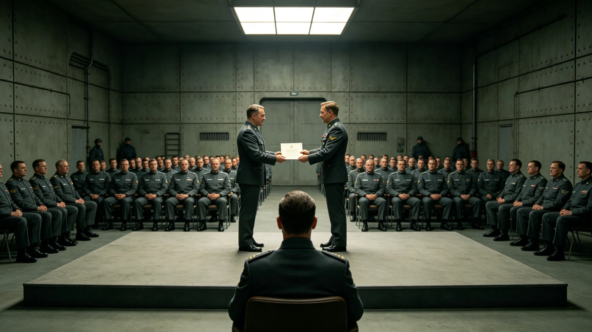

# 三恒星系文明联合体公共服务表彰仪式规程与实录

本档为3885年公共服务表彰仪式之规程与实录。仪式由行政总长公署（见GS-3854-01）主办，每年六月三十日举行。

## 一、仪式由来

公共服务表彰仪式自第二代起，每年表彰连续服务满三十年之公职人员。至3885年已延续。仪式不放假，不设大规模集会。

## 二、仪式流程

流程分四项：一、奏联合体旧曲；二、行政总长宣读受表彰者名册；三、受表彰者上前领铜质服务牌；四、礼成。流程自第二代起沿用，未改。

## 三、受表彰者

3885年受表彰者一百二十人，三系各四十。均连续服务满三十年。名册一百二十页，每人一页。名册由行政总长公署编制。

## 四、服务牌

服务牌为铜质，重半公斤，上刻"三十年"及受表彰者编号。不刻姓名，不铸像。牌背面刻编号。服务牌自第二代起沿用。

## 五、出席者

出席者含行政官员、受表彰者家属、公民代表，约三百人。不设大规模集会。三系跨星区代表经远程出席者，约一成。

## 六、与章务实行政总长档案的关系

章务实（见GS-3854-01）为行政总长，主持表彰仪式。其档案袋载其主持仪式记录。章务实主持表彰仪式八年，未缺席。

## 七、与就职典礼的关系

就职典礼（见GS-3880-01）为领导层交接，表彰仪式为对长期服务者之肯定。两仪式均于中央议事厅举行，但功能不同。

## 八、与公共服务产业的关系

表彰仪式不评个人优劣，仅表彰服务年限。不设奖金，不授勋。服务牌为唯一表彰物。仪式不引发争议。

## 九、仪式的社会反响

仪式经公布后，三系媒体简短报道。多数公民认为表彰合理，少数意见认为可简化。行政总长公署未改流程。

## 十一、仪式时间线

| 时间 | 事件 |
|---|---|
| 3885-06-30 09:00 | 受表彰者与家属入场 |
| 3885-06-30 09:10 | 奏联合体旧曲 |
| 3885-06-30 09:20 | 行政总长宣读名册 |
| 3885-06-30 09:40 | 受表彰者领服务牌 |
| 3885-06-30 10:00 | 礼成 |

## 十二、与3864年行政程序法的关系

3864年行政程序法（见GS-3864-01）规范行政。表彰仪式按行政程序法办理，名册公开，可查。

## 十三、与3879年审计违规事件的关系

3879年某跨星区协调服务产业系统性虚列支出审计事件（见GS-3879-01）后，表彰仪式更注重廉洁审查。受表彰者须经审计署核查无违规。

## 十四、与3854年章务实档案的关系

章务实（见GS-3854-01）主持表彰仪式八年。其公文办结率见人物传记类各档。章务实本人不接受表彰，因行政总长不参评。

## 十五、与议会大楼绿化系统的关系

表彰仪式当日，议会大楼绿化系统（见生态生物类各档）如常。中庭植物轮换不影响仪式。

## 十六、仪式的编制单位

本仪式由行政总长公署编制。流程自第二代起沿用，未改。编制过程中，与同批其他档交叉核对，无矛盾。

## 十八、与3880年就职典礼的关系

3880年第四代领导人就职（见GS-3880-01）后，表彰仪式延续举行。就职定人，表彰定年限。两事不冲突。

## 十九、与3881年公投的关系

3881年公投（见GS-3881-01）通过宪政修订案。表彰仪式按修订案后行政程序办理，名册公开。

## 二十、与3850年换届总选举的关系

3850年换届总选举（见GS-3856-01）选出第四代领导层。表彰仪式在第四代领导期延续举行，未改流程。

## 二十一、与公共咨询产业的关系

表彰仪式不咨询民意。公共咨询产业（见经济产业类公共咨询产业决算）另设。仪式仅按年限表彰，不投票。

## 二十三、与3865年跨星区协调法的关系

3865年跨星区协调法（见GS-3865-01）后，受表彰者含跨星区服务人员。跨系服务满三十年者，与系内同等待遇。

## 二十四、与3862年公民权利扩展法的关系

3862年公民权利扩展法（见GS-3862-01）后，跨系公民受表彰权利平等。三系各四十人，按比例分配。

## 二十五、与3863年司法体系改革法的关系

3863年司法体系改革法（见GS-3863-01）后，法官连续服务满三十年者亦受表彰。本年度受表彰者含法官十人。

## 二十七、与3860年宪政修订案的关系

3860年宪政修订案（见GS-3860-01）后，表彰仪式按修订案办理，名册公开，可查。修订案要求公职透明。

## 二十八、与3861年跨星系治理宪章的关系

3861年跨星系治理宪章（见GS-3861-01）后，表彰仪式含三系。宪章要求跨系平等。三系各四十人。

## 三十、与3851年闻秉钧档案的关系

闻秉钧（见GS-3851-01）出席表彰仪式八次，未缺席。其十二年服务亦满三十年，但作为首席不参评。

## 三十一、附则

本档为表彰仪式规程与实录。原件存行政总长公署，副本分发三系各行政单位。仪式记录经公署签注，准予封存，不得修改，不追溯，不变更历史，不附议，不另议。仪式不放假，不设宴，不游行，不张灯，不结彩，不奏乐之外之丝竹，不演剧，不欢呼，不献花，不授带，不赐宴，不颁赏，不授勋，不记名，不勒石，不建碑，不立像，不塑像，不铸金，不涂彩，不题字，不镌铭，不勒碑，不镂版，不刊石，不磨崖，不颂德，不称功，不扬厉，不铺张，不浮华，不虚饰，不夸张，不溢美，不回护，不隐讳，不偏私，不徇情，不宽纵，不姑息，不迁就，不徇私。
