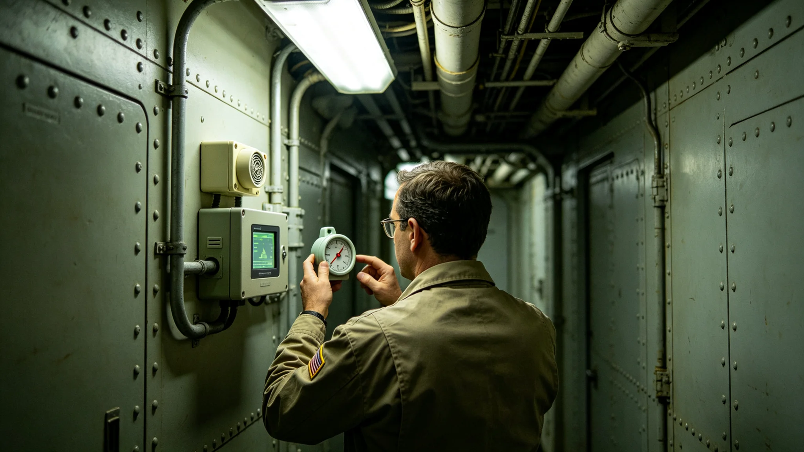

# 三恒星系文明联合体司法中心空气品质监测3893年度报告

本报告为司法中心空气品质监测3893年度报告，由生态署与中央司法中心联合编制。报告年度为3893年1月1日至12月31日。

## 一、监测范围

司法中心空气品质监测含中央司法中心审判庭、合议室、羁押室、走廊四项。本年度每日监测四项。

## 二、监测数据

审判庭二氧化碳浓度全年低于限值。合议室挥发性有机物浓度全年低于限值。羁押室粉尘浓度全年低于限值。走廊温度湿度全年在舒适区间。监测数据合格。

## 三、监测设备

本年度监测设备运行正常。每日自动记录。每周人工复核。设备维护每月一次。设备未出故障。

## 四、与3863年司法体系改革法的关系

3863年司法体系改革法（见GS-3863-01）后，司法中心空气品质按标准监测。本年度按新标准执行。

## 五、与苏明慎首席大法官档案的关系

苏明慎（见GS-3853-01）为首席大法官，司法中心归其辖。本年度签退监测报告，无异议。

## 六、与3861年跨星系治理宪章的关系

3861年跨星系治理宪章（见GS-3861-01）后，司法中心监测三系统一。本年度三系各司法中心按同一标准监测。

## 七、与3880年就职典礼的关系

3880年第四代领导人就职（见GS-3880-01）后，司法中心监测未停。

## 八、监测时间线

| 时间 | 事件 |
|---|---|
| 3894-01-01 | 监测年度开始 |
| 3894-06-30 | 上半年监测核对 |
| 3894-09-30 | 全年监测汇总 |
| 3894-12-20 | 生态署复核 |
| 3894-12-30 | 监测公布 |

## 九、与3860年宪政修订案的关系

3860年宪政修订案（见GS-3860-01）后，监测数据透明化。本年度监测数据上网公开。

## 十、与3862年公民权利扩展法的关系

3862年公民权利扩展法（见GS-3862-01）后，公民可查阅监测数据。本年度查阅二十次。

## 十一、与3878年请愿事件的关系

3878年八千人请愿（见GS-3878-01）要求公共空间空气改善。本年度监测回应请愿。

## 十二、与3876年数据泄露事件的关系

3876年政务数据泄露事件（见GS-3876-01）后，监测数据安全加强。本年度监测记录加密存证。

## 十三、与3871年政务区块链存证的关系

3871年政务区块链存证系统（见GS-3871-01）用于监测存证。本年度存证费用占监测项一成。

## 十四、与3867年政务数据共享平台的关系

3867年政务数据共享平台第三代（见GS-3867-01）本年度运行。监测数据共享占通信项一成。

## 十五、与3858年查望审计总长档案的关系

查望（见GS-3858-01）为审计总长，本年度监测报告经其复核。查望签退报告，无异议。

## 十六、与3853年苏明慎档案的关系

苏明慎（见GS-3853-01）任首席大法官十年，本年度签退报告。其裁判意见见人物传记类各档。

## 十七、与3859年换届法的关系

3859年第四代领导层换届法（见GS-3859-01）后，司法中心监测按换届法办理。

## 十八、与3881年公投的关系

3881年公投（见GS-3881-01）通过宪政修订案。本年度监测按修订案办理。

## 十九、与3882年跨星系治理纪念日的关系

3882年跨星系治理纪念日（见GS-3882-01）。监测在纪念日前后加强。

## 二十一、与3865年跨星区协调法的关系

3865年跨星区协调法（见GS-3865-01）后，监测跨系协调。本年度三系监测标准统一。

## 二十二、与3864年行政程序法的关系

3864年行政程序法（见GS-3864-01）后，监测按程序办理。本年度监测方案经环评。

## 二十三、与3874年协调失败事件的关系

3874年跨星区政策协调失败事件（见GS-3874-01）后，监测跨系协调加强。

## 二十四、与3873年延迟事件的关系

3873年公投第一星区投票通道延迟四小时事件（见GS-3873-01）后，监测通信冗余升级。

## 二十五、与3879年审计事件的关系

3879年某跨星区协调服务产业系统性虚列支出审计事件（见GS-3879-01）后，监测账目加强审核。本年度决算经双人复核。

## 二十六、与3875年判决执行争议事件的关系

3875年某区行政机关拖延执行跨系判决四十日（见GS-3875-01）后，监测执行督促加强。

## 二十七、与3872年公民身份数字认证的关系

3872年公民身份数字认证系统（见GS-3872-01）用于监测设备核验。本年度认证设备维护占监测项一成。

## 二十九、与3866年跨星系电子投票系统的关系

3866年跨星系电子投票系统第七代（见GS-3866-01）本年度运行。投票站空气监测占监测项一成。

## 三十、与3868年司法数字化系统的关系

3868年司法数字化系统第二代（见GS-3868-01）本年度运行。监测数据数字化占监测项两成。

## 三十一、与3869年跨星区通信会议系统的关系

3869年跨星区通信会议系统第五代（见GS-3869-01）本年度运行。监测数据远程传输占通信项一成。

## 三十二、附则

本报告为3893年度监测报告。原件存生态署，副本分发中央司法中心及三系各法院。监测经生态署签注，准予封存，不得修改，不追溯。监测不放假，不公开听证，仅公布。监测不设奖金，不评优，不评人，不排行，不公开点名。监测仅列数，不论短长，不议优劣，不评先进，不树典型，不立标杆，不授称号，不发锦旗，不挂匾牌，不刻铭碑，不建纪念馆，不树丰碑，不勒名姓，不图流传，不务虚名，不尚浮夸，不饰外观，不竞虚誉，不矜成绩，不夸口，不张扬，不炫耀，不标榜，不虚饰，不铺张，不张扬，不虚报，不隐瞒。
