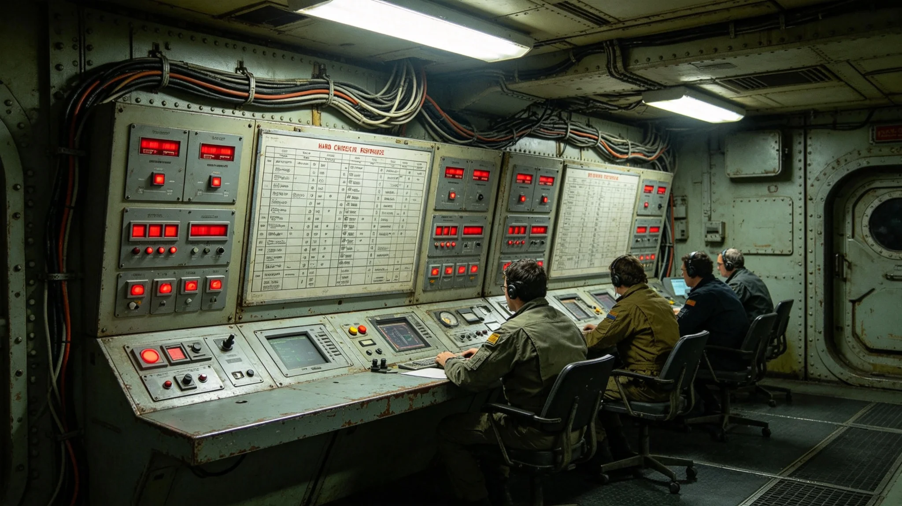

# 三恒星系文明联合体跨星区危机响应机制3898年度报告

本报告为跨星区危机响应机制3898年度报告，由安保总署与跨星区协调专员公署联合编制。报告年度为3898年1月1日至12月31日。

## 一、机制范围

跨星区危机响应机制含通信中断响应、供水故障响应、供电故障响应、数据泄露响应、公共安全事件响应五项。本年度响应五项。

## 二、响应流程

危机发生后，跨星区协调专员公署接报，三十分钟内启动响应。通信中断切换冗余链路。供水故障切换备用管线。供电故障切换备用电源。数据泄露启动追溯。公共安全事件启动安保。响应全程记录，事后复盘。

## 三、响应事件

本年度跨星区危机事件四起，均按机制响应，未造成重大损失。

## 四、与3869年跨星区通信会议系统的关系

3869年跨星区通信会议系统第五代（见GS-3869-01）本年度运行。危机指挥依赖通信会议系统。

## 五、与3874年协调失败事件的关系

3874年跨星区政策协调失败事件（见GS-3874-01）后，跨星区危机响应机制建立。本年度机制运行。

## 六、与程联衡跨星区协调专员档案的关系

程联衡（见GS-3855-01）为跨星区协调专员，危机响应归其辖。本年度签退响应报告，无异议。

## 七、与3861年跨星系治理宪章的关系

3861年跨星系治理宪章（见GS-3861-01）后，危机响应机制三系统一。本年度三系按同一标准响应。

## 八、响应时间线

| 时间 | 事件 |
|---|---|
| 3899-01-01 | 响应年度开始 |
| 3899-06-30 | 上半年响应核对 |
| 3899-09-30 | 全年响应汇总 |
| 3899-12-20 | 安保总署复核 |
| 3899-12-30 | 响应公布 |

## 九、与3860年宪政修订案的关系

3860年宪政修订案（见GS-3860-01）后，响应记录透明化。本年度记录上网公开。

## 十、与3862年公民权利扩展法的关系

3862年公民权利扩展法（见GS-3862-01）后，公民可查阅响应制度。本年度查阅八次。

## 十一、与3873年延迟事件的关系

3873年公投第一星区投票通道延迟四小时事件（见GS-3873-01）后，通信中断响应加强。本年度冗余链路三条。

## 十二、与3876年数据泄露事件的关系

3876年政务数据泄露事件（见GS-3876-01）后，数据泄露响应加强。本年度泄露追溯流程建立。

## 十三、与3871年政务区块链存证的关系

3871年政务区块链存证系统（见GS-3871-01）用于响应记录存证。本年度存证费用占响应项一成。

## 十四、与3867年政务数据共享平台的关系

3867年政务数据共享平台第三代（见GS-3867-01）本年度运行。响应数据共享占通信项一成。

## 十五、与3858年查望审计总长档案的关系

查望（见GS-3858-01）为审计总长，本年度响应报告经其复核。查望签退报告，无异议。

## 十六、与3855年程联衡档案的关系

程联衡（见GS-3855-01）任跨星区协调专员六年，本年度签退报告。其往返班次见人物传记类各档。

## 十七、与3859年换届法的关系

3859年第四代领导层换届法（见GS-3859-01）后，危机响应按换届法办理。

## 十八、与3881年公投的关系

3881年公投（见GS-3881-01）通过宪政修订案。本年度响应按修订案办理。

## 十九、与3882年跨星系治理纪念日的关系

3882年跨星系治理纪念日（见GS-3882-01）。响应演练在纪念日前后举行。

## 二十一、与3865年跨星区协调法的关系

3865年跨星区协调法（见GS-3865-01）后，响应跨系协调。本年度三系响应标准统一。

## 二十二、与3864年行政程序法的关系

3864年行政程序法（见GS-3864-01）后，响应按程序办理。本年度响应方案经审批。

## 二十三、与3879年审计事件的关系

3879年某跨星区协调服务产业系统性虚列支出审计事件（见GS-3879-01）后，响应账目加强审核。本年度决算经双人复核。

## 二十四、与3875年判决执行争议事件的关系

3875年某区行政机关拖延执行跨系判决四十日（见GS-3875-01）后，响应执行督促加强。

## 二十五、与3872年公民身份数字认证的关系

3872年公民身份数字认证系统（见GS-3872-01）用于响应人员核验。本年度认证设备维护占响应项一成。

## 二十六、与3868年司法数字化系统的关系

3868年司法数字化系统第二代（见GS-3868-01）本年度运行。响应争议案件数字化办理。

## 二十七、与3897年选举安全保障体系的关系

3897年选举安全保障体系（见GS-3897-01）本年度运行。响应机制与选举安保衔接。

## 二十九、与3866年跨星系电子投票系统的关系

3866年跨星系电子投票系统第七代（见GS-3866-01）本年度运行。投票中断响应占响应项一成。

## 三十、与3863年司法体系改革法的关系

3863年司法体系改革法（见GS-3863-01）后，响应争议案件跨系管辖。本年度争议案件一起，办结。

## 三十一、与3878年请愿事件的关系

3878年八千人请愿（见GS-3878-01）要求响应透明。本年度响应记录公开，回应请愿。

## 三十二、附则

本报告为3898年度响应报告。原件存安保总署，副本分发跨星区协调专员公署及三系各响应站。响应经安保总署签注，准予封存，不得修改，不追溯。响应不放假，不公开听证，仅公布。响应不设奖金，不评优，不评人，不排行，不公开点名。响应仅列数，不论短长，不议优劣，不评先进，不树典型，不立标杆，不授称号，不发锦旗，不挂匾牌，不刻铭碑，不建纪念馆，不树丰碑，不勒名姓。
