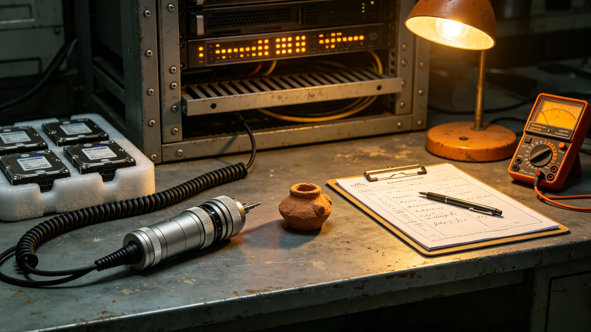

## 一、考绩编制说明

黎昭，文化遗产数字化工程首席专家，任职八年。本档案为公元3899年度考绩材料，由数字化工程人事组编制，含年度考绩表、设备巡检记录七册、体检报告一份、签认单四张。黎昭本人于3900年一月十日到人事组核对，签字确认。

## 二、年度工作概要

3899年度，黎昭主导完成文化遗产高精度三维扫描项目第三期，扫描藏品一千二百四十七件，入库数字副本一千二百四十七份。项目进度按计划完成，未延期。预算执行率为百分之九十八点三，结余款项已按规程退回财政专户。

考绩表上由考核小组评定为"优秀"，评语为："三期扫描按期完成，数据完整性核验通过率百分之九十九点七，无重大设备事故。"黎昭签认"无异议"。

本年度扫描对象包括：旧地球纸质文献三百一十二件，异星出土器物四百零三件，跨星系混合文化器物二百五十六件，口述录音转录件二百七十六份。扫描精度按藏品类别分级：纸质文献为每英寸一千二百点，器物为三角面片密度每立方毫米八个，录音转录件采样率为每秒九十六千次。

## 三、设备巡检记录

七册巡检记录覆盖全年十二个月中的七个月。黎昭本人每月至少现场巡检扫描设备两次，其余月份由副手代检。巡检记录摘录：

三月巡检：三号扫描舱激光校准偏差零点零二毫米，在允许范围内，未停机。五月巡检：一号舱温控传感器读数漂移，更换传感器后恢复正常，停机四小时。八月巡检：四号舱机械臂润滑油路轻微泄漏，通知维修组当日修复，未影响扫描任务。十月巡检：数据存储阵列扩容完成，新增容量五百TB，验收合格。

巡检记录每册均有黎昭本人签字。代检月份的记录由代检人签字，黎昭在月度汇总表上补签。十二月巡检额外增加了存储阵列冗余测试，结果为双副本校验一致，无数据丢失。

## 四、体检报告

年度体检显示，黎昭因长期在低照度扫描舱内工作，眼部适应力略有下降，但视力矫正后正常。颈肩肌肉紧张，理疗科建议每周至少两次拉伸。其余指标正常。人事组据此安排其参加理疗课程，费用由工程福利预算列支。

此外，黎昭的听力测试显示长期在静音扫描舱中工作导致其对环境噪音敏感度略升，耳鼻喉科认为无需治疗，属正常适应反应。

## 五、签认单

四张签认单分别为：第一期扫描数据入库签认，日期3897年；第二期扫描数据入库签认，日期3898年；第三期扫描数据入库签认，日期3899年十二月；设备采购合同验收签认，日期3899年七月。四张单据均为黎昭本人签名。

第三期入库签认单上附有数据完整性核验报告摘要：一千二百四十七份数字副本中，一千二百四十一份通过全量校验，六份需补扫，补扫工作于3900年一月完成。

## 六、差错与纠正

3899年六月，一批三十七件小型文物在扫描时因夹持力度偏大，其中三件表面出现可辨识压痕。事故发生后，黎昭立即暂停该舱扫描，组织技术人员调整夹持机构，并对三十七件文物逐一复检。三件有压痕的文物移交修复室处理，修复记录在案。黎昭在事故报告上签字，承担管理责任。考核小组认为其处置及时，未因此降低考绩评级。

事故调查结论：夹持机构弹簧批次更换时未做校准，导致压力上限偏移零点二毫米。黎昭据此修订了设备维护规程，要求每次更换弹簧后必须做压力校准测试。修订后的规程自3899年八月起执行。

## 七、跨部门协作

本年度，数字化工程与文化遗产管理处联合开展了一次藏品清点工作，黎昭负责数字副本与实物藏品的一一对应核对。清点结果显示，前两期扫描的藏品中，有十四件数字副本与实物编号对应错误，已在本年度更正。黎昭在清点报告上签字确认更正完成。

## 九、数据安全与备份

本年度，数字化工程执行了四次全量数据备份演练。备份采用三副本策略：主存储阵列一组，异地备份阵列一组，离线磁带库一组。四次演练均在计划时间内完成，恢复测试成功率百分之百。

此外，工程于3899年九月完成一次数据访问权限审计。审计结果显示，全部数字副本的访问权限配置符合规程，无越权访问记录。黎昭在审计报告上签字确认。

审计中发现一名已离职技术人员的访问账户未及时注销，黎昭当日注销该账户，并修订了人员离职流程，要求离职当日必须完成账户注销。

## 十、跨星区协作记录

本年度黎昭赴比邻星定居带出差三次，每次约五日，主要工作为指导当地文化遗产保管所的扫描设备安装与操作人员培训。三次出差共培训当地技术人员九名，培训内容包括设备操作、数据采集规范与初步质检流程。培训结束后进行书面考核，九名人员中七名合格，两名需补训，补训于次年完成。

出差期间，黎昭与当地保管所工作人员共同完成了首批五十件本地藏品的试扫描。试扫描数据经回传至主存储阵列核验，全部通过完整性检查。

## 八、考绩结论

本年度考绩评定为优秀。黎昭本人签字日期3900年一月十日。本档案移送数字化工程档案室存档。
