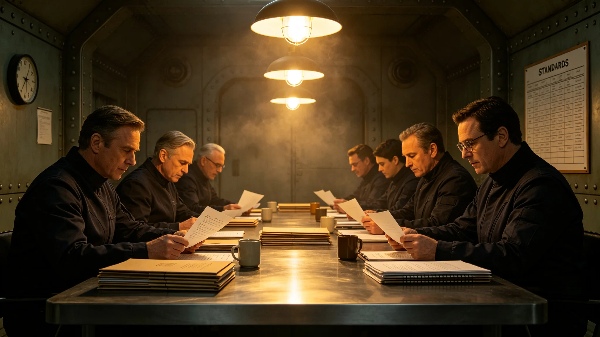

## 一、标准制定背景

融合艺术评审标准于公元3897年八月二十二日由三号环带艺术园区委员会颁布，适用于园区内所有融合艺术作品的评审入库工作。本通报为标准制定说明及首次评审结果摘要。

融合艺术指在创作中融合至少两种不同文化传统艺术形式的作品。自3889年以来，园区内融合艺术作品数量逐年增加，但评审标准长期沿用旧地球艺术评审框架，未能反映融合创作的特殊性。园区委员会于3895年启动标准修订工作，历时两年完成。

## 二、制定过程

标准起草工作由园区创作室三名资深创作者与一名外部评审专家组成起草小组承担。起草过程中召开座谈会四次，邀请创作室成员、艺术院校教师与观众代表共三十一人参加。座谈会收集意见七十二条，其中四十三条被采纳，十九条被部分采纳，十条未采纳。

未采纳意见包括：有代表建议设立"融合比例量化指标"，即两种文化元素在作品中的占比须各占百分之四十以上。起草小组认为该指标过于机械，不同艺术形式的融合方式各异，不宜用单一比例衡量，故未采纳。

## 三、标准主要内容

评审标准共分五个维度：第一，融合深度。考察两种文化元素是否在创作过程中真正融合，而非简单并置。第二，技术完成度。考察作品在技术层面的完成质量。第三，文化尊重。考察作品是否对所引用的文化传统保持恰当态度，不歪曲、不嘲弄。第四，原创性。考察作品是否提供了新的艺术表达，而非已有作品的拼贴。第五，观众沟通性。考察作品是否能被不同文化背景的观众理解。

每个维度按五分制评分，总分二十五分。入库标准为总分不低于十八分，且"文化尊重"一项不低于三分。首次评审中，总分低于十八分的作品不予入库，创作者可修改后重新提交。

## 四、首次评审结果

首次评审于3897年七月至八月进行，送审作品共四十七件。经评审委员会五人独立评分后取平均值，结果如下：入库三十二件，修改后再评九件，未入库六件。

入库作品平均分二十点四分，未入库作品平均分十四点七分。未入库原因分布：融合深度不足三件，文化尊重一项低于三分两件，技术完成度不足一件。

评审结果在园区公告栏公示七日，无创作者提出异议。

## 五、争议处理

评审过程中，一件送审作品因引用了某濒危语言的口述诗歌片段而引发讨论。评审委员会中两名成员认为该作品未获得口述诗歌传承者的明确授权，建议退回。另外三名成员认为作品已标注来源，且引用方式为致敬性使用。最终委员会以三比二投票决定修改后再评，要求创作者补充传承者授权文件。

## 六、评审委员会组成

评审委员会由五人组成：园区创作室主任一人，外部艺术评论家两人，社区代表一人，文化遗产数字化工程代表一人。评审委员任期两年，可连任一次。评审委员会主席由园区委员会指定。

评审过程中，如某件送审作品的创作者与评审委员存在师生关系或直接合作关系，该评审委员须回避。首次评审中有一名委员因与一件送审作品的创作者为同事关系而回避该作品评分。

## 七、标准修订机制

本标准施行后每三年修订一次，修订由园区委员会组织。修订建议可由任何创作者或观众代表以书面形式提交。修订过程须公开征求意见不少于三十日。

## 九、评审争议案例摘录

首次评审中另一件需说明的案例：一件使用了异星节奏型与旧地球弦乐旋律线结合的作品，评审委员会中两名成员认为融合深度足够，另两名认为仅为并置。委员会主席根据标准中"融合深度"维度的说明，要求创作者在答辩中解释两种元素的结合逻辑。创作者答辩后，委员会投票三比二通过入库。

此案例在评审档案中标记为"边界案例"，供后续评审参考。园区委员会在后续修订标准时，将此案例作为"融合深度"维度的补充说明材料。

园区委员会在首次评审结束后召开了一次总结会议，会议记录显示，委员们一致认为首次评审结果基本合理，但建议在下次评审前增加一轮创作者预沟通环节，帮助创作者在送审前自查融合深度。该建议被纳入标准修订计划。

评审标准的评分细则另附手册一份，手册中列出了每个维度的具体评分要点与扣分示例。该手册随标准一并下发，供评审委员与创作者参考。手册不对外公开，仅在园区内部使用。

## 八、附则

本标准自颁布之日起施行。此前已入库的作品不按新标准重新评审。本标准由园区委员会负责解释。首次评审结果通报经园区委员会签批后公布。
