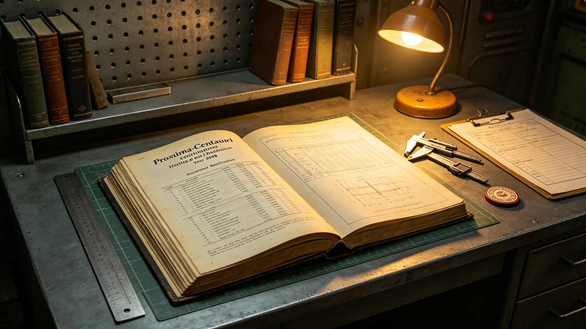

## 一、条例制定背景

文化遗产数字化条例于公元3898年四月三十日由文化遗产管理处颁布，适用于跨星系各星区所有文化遗产数字化记录工作。本通告为条例制定说明及验收标准摘要。

自3890年以来，各星区陆续开展文化遗产数字化工作，但记录标准不统一：有的星区使用高分辨率扫描，有的仅拍照存档；有的建立了数据目录，有的数据散落在个人设备中。文化遗产管理处于3896年对各星区数字化工作进行了一次普查，发现已记录的约八万件藏品中，约百分之三十的数据质量不达标，无法跨星区共享。

## 二、条例制定过程

条例起草由文化遗产管理处技术组承担，征求意见期间收到各星区文化保管所反馈意见五十八条。起草小组根据反馈对扫描精度标准、数据格式、备份要求等条款进行了调整。

条例草案曾在3897年举行三次公开听证会，听取创作者、保管所工作人员与数据工程师意见。听证会上有代表提出，高精度扫描设备成本高昂，小型保管所可能无力承担。条例据此增加了设备共享条款：各星区可共享大型扫描设备，由文化遗产管理处统筹调度。

## 三、主要内容

第一章总则，共四条。规定数字化对象包括：可移动文化遗产（器物、文献、音像）、不可移动文化遗产（建筑、遗址）、非物质文化遗产（口述、技艺、仪式）。

第二章记录标准，共十条。规定可移动文物扫描精度：纸质文献不低于每英寸一千二百点，器物三维扫描三角面片密度不低于每立方毫米六个，音像记录采样率不低于每秒九十六千次。不可移动文物须拍摄全景与局部细节，三维建模精度按规模分级。

第三章数据管理，共八条。规定所有数字副本须存入跨星系文化遗产数据中心，采用三副本备份策略。数据格式须为通用开放格式，不使用专有格式。每件藏品须附元数据卡，记录来源、年代、材质、保存状况。

第四章质量验收，共六条。规定数字化完成后须经过两级验收：保管所自验与管理处抽检。抽检比例不低于百分之十。验收不合格的批次须返工。

第五章经费，共三条。数字化经费从文化遗产预算中列支，各星区按申请项目审批。

## 四、验收标准摘要

本通告附表列出了数字化质量验收的具体指标。主要指标包括：扫描图像无明显畸变，色彩偏差在可接受范围内；三维模型无孔洞或漂移，面片数符合标准；音像记录信噪比不低于六十分贝；元数据卡填写完整率百分之百。

验收中发现常见问题包括：扫描光照不均导致局部过曝，三维扫描支架夹持痕迹未在后期处理中去除，元数据卡中"来源"一栏填写不完整。条例要求各保管所针对这些问题开展自查。

## 五、执行时间表

条例颁布后设两年过渡期（3898年至3899年）。过渡期内，各星区须完成存量藏品的质量普查，列出需返工的清单。3900年起，新完成的数字化项目须按本条例标准验收。过渡期结束后，管理处将对存量数据进行分批返工。

## 六、与既有项目关系

此前已完成的数字化项目不强制按本条例重新扫描，但管理处鼓励各保管所在条件允许时逐步提升数据质量。优先级排序：濒危语言与易损器物优先，保存状况稳定的藏品可延后。

## 七、监督与检查

管理处每年对各星区数字化工作进行一次抽查，抽查结果在年度报告中公布。连续两年抽查不合格的星区，管理处将暂停其新申请项目的审批，直至整改完成。

## 九、设备共享计划

条例颁布后，文化遗产管理处制定了设备共享计划。首批共享设备包括：高精度三维扫描仪两台，配备在跨星系走廊主中心；便携式扫描设备十台，分配给各星区保管所轮流使用。

共享设备的使用申请须提前两周提交管理处，由管理处根据项目优先级排期。使用完毕后，设备须经技术人员检查并填写维护记录。设备共享计划首年共安排使用项目三十七个。

设备共享计划执行首年中，便携式扫描设备有两次因运输过程中碰撞导致镜头偏移，经校准后恢复使用。管理处据此改进了设备运输包装，在设备箱内增加缓冲衬垫。

条例执行首年，管理处共受理数字化项目验收申请四十三件，其中三十七件一次通过验收，六件需返工后通过。返工原因主要为元数据卡填写不完整与扫描光照不均。

管理处建议各保管所在安排数字化项目时，优先处理保存状况正在恶化的藏品，如纸质文献酸化、器物表面氧化等。优先级评估由保管所技术人员与管理处专家组共同进行。

## 八、附则终稿

本条例自颁布之日起施行。本通告经文化遗产管理处签批后公布。条例解释权归文化遗产管理处技术组。
