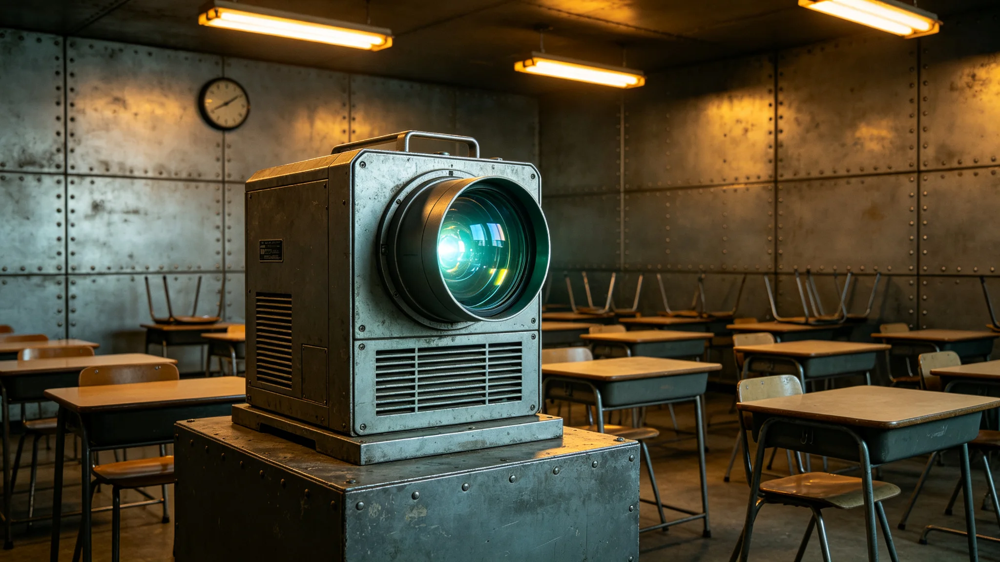

## 一、系统概述

远程教育全息课堂系统第三版（下称全息课堂）于公元3897年十二月在内太阳系带试点学校全面部署。本技术规格与故障记录由教育改革办公室技术组编制，公布系统参数、部署情况与运行首学期故障统计。

全息课堂的设计目标是让跨星区学生通过全息投影实时参与同一课堂，实现教师在中心星区授课、学生在各星区教室同步听讲与互动。

## 二、技术规格

全息课堂终端由三部分组成：全息投影单元、学生互动终端与教室环境传感器。投影单元可在教室中生成约三米高的授课者全息影像，影像分辨率为每英寸四百点，色彩还原经校准后色差小于百分之五。

学生互动终端为桌面平板设备，支持举手、答题、分组讨论等互动功能。教室环境传感器采集教室温度、光线、噪音等数据，用于自动调节投影亮度与音量。

系统通过跨星系流媒体传输协议传输音视频信号，端到端延迟设计目标为小于一点五秒。同星区内实际延迟约零点八秒，跨星区约一点二至二点零秒，取决于星区距离。

## 三、部署情况

截至3897年十二月，全息课堂已在十二个试点学校部署终端共四百八十台，其中教师端十二台，学生端四百六十八台。每间教室配备一台投影单元与约四十个学生互动终端。

部署过程中，三号环带与比邻星定居带各有一间教室因网络带宽不足，终端部署延迟两周。教育改革办公室协调通信部门扩容后完成部署。

## 四、首学期故障统计

3897年秋季学期（九月至十二月），全息课堂共记录故障事件六十三起。按类型分布：投影画面异常十九起，互动终端无响应十七起，音视频不同步十四起，网络连接中断九起，其他四起。

故障处理平均时间：互动终端无响应约十五分钟，投影画面异常约三十分钟，网络中断视原因约三十分钟至两小时。整学期因故障导致的课程中断累计约六小时，占总课时的百分之零点三。

## 五、典型故障案例

九月十二日，内太阳系带第三试点学校一间教室投影画面出现色彩偏移，技术人员远程排查后确认为投影单元色温传感器漂移，校准后恢复。

十一月三日，跨星系走廊第二试点学校在一次跨星区联合课堂中，比邻星端学生互动终端全部无响应，经查为网络路由器故障，更换路由器后恢复，课程中断约四十分钟。

## 六、学生使用反馈

学期末技术组发放了学生使用问卷，回收有效问卷八百七十三份。约百分之七十一的学生表示全息课堂体验"与面授接近"，约百分之二十二表示"有差距但可接受"，约百分之七表示"差距较大"。

主要不满集中在：跨星区延迟导致互动不及时（占反馈的百分之四十四），投影画面在强光下不够清晰（占百分之二十八）。技术组已将这些问题列入下一版改进计划。

## 七、维护安排

全息课堂终端每学期进行一次预防性维护，内容包括投影校准、终端电池检测、网络设备检查。维护由各学校技术人员在假期进行，不影响教学。

## 八、与教育体系改革法关系

全息课堂是教育体系改革法第二章远程教育规范的技术实施平台。系统技术规格须符合改革法第三章规定的远程课程录制标准与师生互动时长要求。技术组每学期向教育事务委员会提交系统运行报告。

## 十、教师使用培训

全息课堂部署前，试点学校教师共接受了四十小时的设备使用培训。培训内容包括：终端开关机、投影调节、互动答题操作、常见故障初步排查。培训在每所学校现场进行，由设备供应商工程师与教育改革办公室技术组联合授课。

培训结束后进行了书面考核，参加考核的教师共八十六人，通过八十一人，未通过的五人安排了补训。

## 十一、课程录制标准

全息课堂录制的课程视频须符合教育体系改革法第三章规定。录制分辨率不低于每英寸四百点，音频采样率不低于每秒四十四千次。录制后的课程存储在教育资源库中，供未能实时上课的学生回看。

教育改革办公室在学期末汇总了各试点学校的故障报告，发现故障发生率与学校所在地网络质量直接相关。网络条件差的学校故障次数约为网络条件好的学校的三倍。

试点学校在学期末提交了教学效果评估报告。报告显示，跨星区联合课堂的学生参与度略低于面授课堂，约为面授的百分之八十五。教育改革办公室认为这一差距在可接受范围内。

## 九、附则

本文档由教育改革办公室技术组编制，经教育事务委员会审核后公布。故障记录存技术组档案室。
