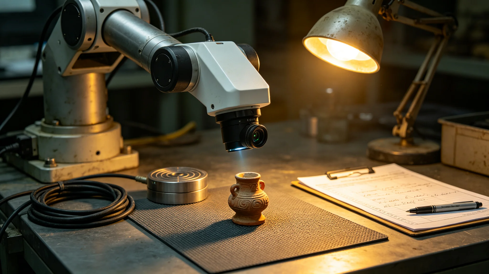

## 一、规程编制背景

本技术规程由文化遗产管理处技术组编制，于公元3898年六月二十五日发布，适用于文化遗产高精度三维扫描工作。规程依据文化遗产数字化条例第二章记录标准制定，细化设备操作流程与质量验收指标。

## 二、设备技术参数

规程规定使用的高精度三维扫描仪须满足以下参数：扫描精度不低于零点零五毫米，单次扫描范围不小于半米立方，数据采集速率不低于每秒一百万点。扫描仪须配备非接触式扫描头，避免对文物表面造成物理接触。

辅助设备包括：文物旋转台（承重不小于一百公斤，转速可调），照明系统（色温可调，照度不低于五百勒克斯），环境监测仪（温度、湿度、振动实时监测）。

## 三、扫描前准备

规程规定扫描前须完成以下步骤：第一，检查文物保存状况，如表面有浮尘须先用软毛刷清理。第二，根据文物材质选择扫描参数：纸质文献使用白光扫描，金属器物使用激光扫描，有机材质使用结构光扫描。第三，在文物周围放置标尺，用于后期数据校准。第四，记录扫描环境温湿度，确保在文物安全范围内。

扫描前准备时间通常为每件物品三十至六十分钟，大型器物可能需要两小时以上。

## 四、扫描操作流程

扫描过程分为粗扫与精扫两步。粗扫获取器物整体外形，精扫获取表面细节。粗扫分辨率较低，用于快速确定扫描方案；精扫分辨率较高，用于最终数据。

扫描中技术人员须持续监控扫描进度与设备状态。如发现扫描数据缺失或畸变，须暂停并重新扫描该区域。扫描过程中禁止用手直接接触文物，须使用夹具或手套操作。

## 五、数据后处理

扫描完成后，数据须经过后处理：点云配准、噪声去除、网格重建、纹理映射。后处理在专用工作站上进行，每件物品后处理时间约二至八小时。

后处理完成后须生成数据质量报告，包括：点云数量、网格面片数、模型尺寸误差、纹理分辨率。质量报告随数据一同存档。

## 六、验收记录

本规程发布后首批验收项目共十一件，均来自比邻星定居带文化保管所。验收结果：八件一次通过，三件需补扫。需补扫原因：两件因扫描环境振动导致数据漂移，一件因纹理映射时光照不均。

补扫完成后，三件均通过二次验收。验收记录由管理处技术组与保管所负责人双签。

## 七、设备维护

扫描仪每使用五十小时须进行一次例行维护，内容包括镜头清洁、机械校准、软件更新。维护记录存档。如发现扫描精度下降，须立即停用并联系设备供应商检修。

## 八、人员要求

操作扫描仪的技术人员须经过不少于四十小时的培训，内容包括设备操作、文物安全、数据后处理。培训由管理处组织，考核合格后颁发操作证书。证书有效期两年，到期须复训。

## 十、安全操作规程

规程另附文物扫描安全操作规程一份，共十二条。主要内容包括：扫描前须确认文物状态稳定，扫描中操作人员须穿戴无粉手套，扫描区域禁止饮食，扫描后文物须放回原位并登记。

操作规程还规定，如扫描过程中文物出现异常（如表面剥落、气味变化），须立即停止扫描并通知保管所负责人。3898年未发生此类事件。

## 十一、典型扫描案例

3898年五月，保管所对一件跨星期金属礼器进行了扫描。该器物表面有复杂纹饰，扫描耗时约六小时，生成三维模型约一千二百万面片。模型经后处理后存入数据中心，存档编号附在验收记录中。

保管所技术人员在实际操作中总结了三条经验：一是扫描前充分预热设备可减少数据漂移；二是复杂纹饰器物需多角度扫描并仔细配准；三是扫描环境湿度控制在百分之四十五至五十五之间最佳。

3898年全年，保管所共完成扫描项目二十三个，扫描藏品四百一十七件。其中一次通过验收三百八十九件，需补扫二十八件。补扫率约百分之六点七，较前一年下降约百分之三。

保管所计划在3899年增加扫描项目至四十个，重点覆盖此前未数字化的民间工艺藏品。

技术组在3898年完成了全部操作人员的年度考核，参加考核的技术人员共十五人，全部合格。考核内容为设备操作与安全规程笔试。

保管所技术组在3898年编写了一份内部操作手册，总结了全年扫描工作中的经验与教训，手册共约三十页，仅在所内分发。

操作手册中记录了一次因操作员手套残留灰尘导致扫描表面出现污点的事件，此后规程要求每次扫描前检查手套清洁度。

## 九、附则

本规程自发布之日起施行。此前已进行的扫描项目不强制按本规程返工。规程解释权归文化遗产管理处技术组。
