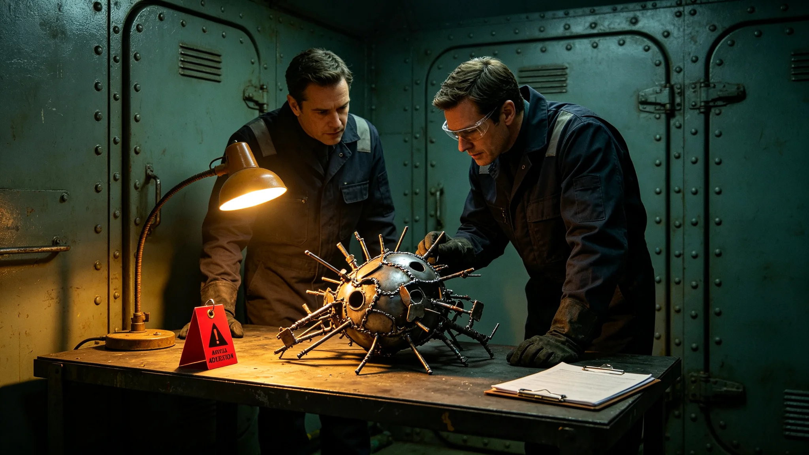

## 一、事件概述

公元3899年四月，三号环带艺术园区展出的一件融合艺术作品《星环对位》引发观众争议。本通报由园区委员会编制，公布事件经过、处理过程与结果。

作品《星环对位》由创作者沈若舟提交，展出时间为四月五日至四月二十日。作品形式为全息投影装置，内容将一种异星传统仪式中的节奏型与旧地球交响乐结构并置投影。

## 二、争议起因

展出第三日，四名来自该异星文化群体的观众向园区委员会提交书面意见，认为作品中对仪式节奏型的使用方式"简化且失真"，未尊重该仪式的原有语境。四名观众中两人为该文化群体的文化传承者，两人为普通观众。

园区委员会收到意见后，于四月十日组织创作者沈若舟与观众代表进行了一次面对面沟通。沟通中，观众代表指出作品将仪式节奏型从原有仪式语境中抽出，配合旧地球交响乐的乐章结构，可能误导观众对该仪式的理解。

## 三、处理过程

园区委员会根据融合艺术评审标准中"文化尊重"维度的规定，对作品进行了重新评审。评审委员会五人于四月十二日召开特别评审会议，创作者沈若舟到场答辩。

沈若舟在答辩中表示，创作意图为探索两种音乐传统的形式对话，并非歪曲该仪式。他同意作品未充分标注原仪式背景，可能导致观众误解。评审委员会讨论后认为，作品"文化尊重"维度评分应为二分，低于入库标准三分，建议撤展。

## 四、处理结果

四月十三日，园区委员会通知创作者沈若舟，作品《星环对位》将于四月十四日提前撤展。沈若舟签字接受，未提出异议。

撤展同时，沈若舟在作品原位置留下一份书面说明，说明创作意图与争议经过。说明文本经观众代表过目，双方均认可。作品后续修改方案待定。

## 五、后续改进

园区委员会在事件后修订了展出前审核流程，增加了"文化来源群体预审"环节：凡作品引用特定文化传统素材的，展出前须征求该文化群体代表的意见。预审不具有否决权，但意见须在展出说明中如实反映。

修订后的流程自四月二十日起执行。

## 六、创作者意见

沈若舟在处理过程中配合委员会工作，未发表公开声明。撤展后，他在园区创作室内部会议上表示，此次事件让他意识到融合创作中对文化来源的尊重不仅是态度问题，也是技术问题，需要在创作前做更多背景调研。

## 七、观众反馈

事件后，园区委员会收到观众来信十九封。其中十三封认为撤展处理得当，六封认为委员会过度反应、干预创作自由。委员会未公开回应来信，仅在内部记录中存档。

## 八、与评审标准关系

本事件后，园区委员会在评审标准修订中增加了"文化来源群体预审"条款。该条款在3899年八月的标准修订中正式纳入，作为第三章"文化尊重"维度的补充。

## 十、同类事件记录

园区档案中此前曾发生过两次类似争议事件。第一次在3894年，一件作品使用了某文化群体的编织纹样，经沟通后创作者补充了来源说明，未撤展。第二次在3896年，一件作品的音效设计被认为模仿了某仪式音乐，经创作者修改后重新展出。

三次事件对比显示，争议主要集中在"文化来源标注是否充分"这一问题。园区委员会据此在修订流程中重点强化了标注要求。

## 十一、创作者后续

沈若舟在撤展后两个月内完成了作品修改，修改版增加了原仪式背景的全息说明层。修改版于3899年六月重新送审，评审委员会评分二十一分，通过入库。修改版于七月在园区另一展区展出，未再引发争议。

园区委员会在事件后更新了展出指南，指南中增加了文化来源标注的具体要求，包括标注方式、字号、位置等细节。指南随展出申请单一并提供给创作者。

园区委员会在3899年八月的标准修订会议上，将本事件作为培训案例用于新评审委员的上岗培训，帮助新委员理解文化尊重维度的实际判断标准。

园区委员会在事件后将文化来源群体预审流程写入了展出申请单的必填项，创作者提交申请时须填写所引用文化传统的来源说明。

展出申请单修订后，创作者提交申请的平均时间增加了约十分钟，园区委员会认为这一增量可接受。

园区委员会在3899年年度总结中将本事件列为年度重要管理案例，在全体创作者大会上做了通报。

通报发布后，园区收到创作者反馈三十余条，多数认为文化来源标注要求合理，少数认为流程偏长。

园区委员会将创作者反馈汇总后，在3900年标准修订中适当简化了非争议性作品的标注流程。

## 九、附则终稿

本通报经园区委员会签批后公布。事件全部记录存园区档案室。
