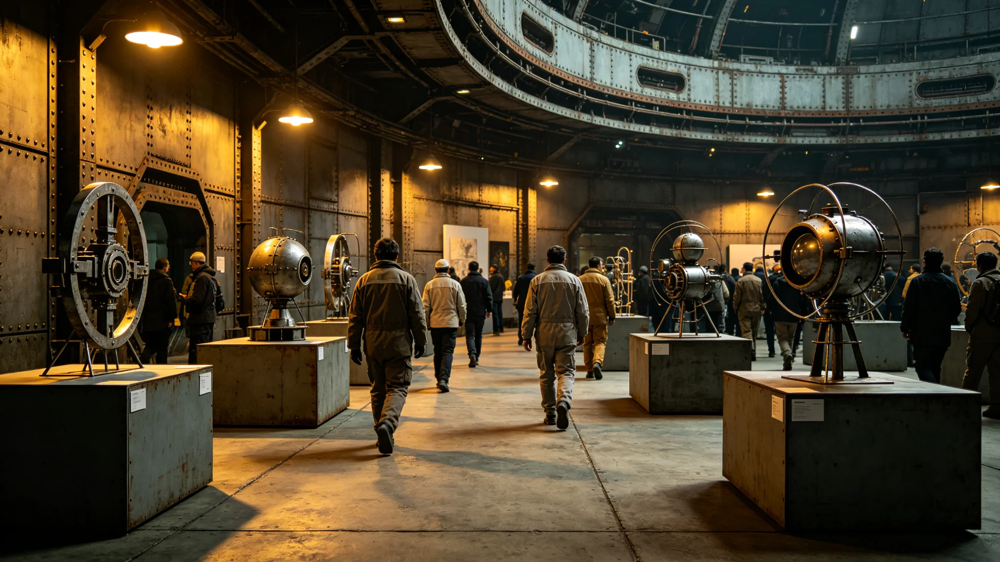

## 一、节日设立

融合艺术节定于每年十月第二个周末，由三号环带艺术园区委员会提议设立。首届融合艺术节于公元3898年十月十二日至十三日举行。本规程与参展记录由园区委员会编制。

设立艺术节的目的是为融合艺术创作者提供一个集中展示与交流的平台，同时让公众了解融合艺术的创作过程。艺术节不设评奖环节，所有符合展出条件的作品均可参展。

## 二、活动规程

艺术节活动包括：作品展映、创作者现场演示、跨文化音乐即兴演出、观众互动工坊。作品展映在园区展厅进行，约展出作品六十件。创作者现场演示在园区中庭进行，每日四场。跨文化音乐即兴演出在晚间举行，持续约两小时。

观众互动工坊面向公众开放，参与者可在创作者指导下尝试使用融合艺术创作工具，每场约二十人。

## 三、首届参展记录

首届艺术节参展创作者共四十七人，来自五个星区。展出作品六十件，其中全息投影类十八件，音乐类十六件，数字视觉类十四件，其他十二件。作品均经过融合艺术评审标准初步审核，未涉及文化尊重争议。

艺术节两天共接待观众约四千一百人次。观众互动工坊报名全部约满。跨文化音乐即兴演出两场，每场约三百人。

## 四、经费与组织

首届艺术节经费约二十八万信用点，其中园区委员会出资十二万，产业发展基金补贴十万，参展方自筹六万。组织工作由园区委员会创作室承担，志愿者二十一人协助。

## 五、参展方反馈

活动后向参展创作者发放反馈问卷，回收三十八份。约百分之八十九的参展者对活动组织满意。主要建议包括：增加展出面积，延长展期，增加跨星区远程参展渠道。园区委员会将建议纳入下一届方案。

## 六、观众反馈

现场观众反馈箱收集意见约一百三十条。正面意见集中在作品质量与现场氛围。改进建议集中在：展厅人流拥挤，互动工坊名额不足。委员会在下一届中计划增加展厅面积并增加工坊场次。

## 七、媒体报道

跨星系媒体集团对艺术节进行了报道，报道中展出了三件作品的图像。报道未使用夸张措辞，客观介绍了融合艺术的创作理念。

## 八、后续安排

第二届融合艺术节定于3899年十月举行。委员会计划在第二届中增加远程全息参展功能，让无法到场的创作者也能展示作品。展期从两天延长至三天。

## 十、作品分类统计

参展六十件作品按融合方式分类：两种文化元素直接融合的约百分之四十三，三种文化元素混合的约百分之三十一，探索性融合约百分之二十六。作品评审中，约百分之七十八的作品评分在十八分以上，符合展出标准。

## 十一、观众年龄分布

现场观众年龄统计：十八岁以下约百分之十二，十八至四十岁约百分之六十一，四十岁以上约百分之二十七。观众以年轻群体为主，委员会计划在下一届中增加面向中年群体的导览活动。

## 十二、艺术节收入与支出

首届艺术节收入约十万信用点（含展方自筹与赞助），支出约二十八万，缺口十八万由园区委员会与产业发展基金补贴。委员会计划在第二届中尝试部分收费，逐步减少补贴比例。

第二届艺术节计划展期三天，参展作品预计约八十件。委员会正在与更多星区的创作者联系，鼓励跨星区联合创作。

## 十三、现场安全

艺术节两天期间未发生安全事故。展厅人流高峰约每平方米两人，未出现拥挤。园区委员会在展厅各出入口安排了工作人员引导。

艺术节结束后，园区委员会收到了两件作品的购买咨询。委员会回复称艺术节作品仅供展示，不出售，创作者可自行联系买家。

艺术节期间共售出相关画册一百二十本，收入约三千信用点，全部用于下一届艺术节筹备。

画册内容为参展作品精选照片与创作者简介，共约四十页，定价约二十五信用点。

第二届艺术节计划在三号环带与跨星系走廊两个场地同时举办，通过全息投影联动。

双场联动方案正在与通信工程部协商带宽需求，预计3899年中确定技术方案。

带宽需求初步估算约为普通全息课堂的三倍，需通信工程部评估可行性。

通信工程部初步评估认为带宽可行，需在跨星区增加两条中继链路。

两条中继链路预计在3899年下半年建成。

中继链路建成后将使跨星区艺术节的全息传输质量提升约百分之三十。

传输质量提升主要体现在全息影像分辨率与色彩还原两个方面。

## 九、附则终稿

本规程与参展记录经园区委员会签批后公布。活动全部记录存园区档案室。
