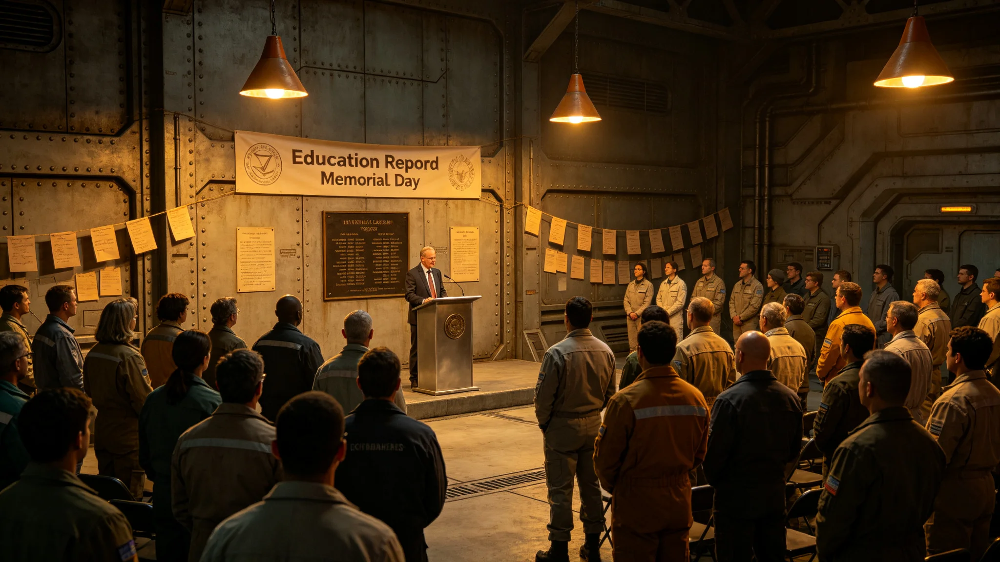

## 一、纪念日设立

教育改革纪念日定于每年九月十八日，即教育体系改革法表决通过日。首届纪念活动于公元3897年九月十八日举行，由教育事务委员会组织。本规程由教育事务委员会编制。

设立纪念日的目的是回顾教育改革进展，表彰在改革中做出贡献的教育工作者，同时让公众了解改革的实际效果。

## 二、活动规程

纪念活动包括：改革进展报告发布、教师表彰、试点学校开放日、改革经验交流会。改革进展报告由教育事务委员会在活动当日发布，内容包括过渡期进展、核心课程完成率、跨星区升学互认情况。

教师表彰环节表彰在试点学校工作中表现突出的教师十名，奖品为荣誉证书与书籍补贴。试点学校开放日安排在活动后一周内，各试点学校向公众展示全息课堂设施与学生作品。

## 三、首届举办记录

首届纪念活动在内太阳系带主公共大厅举行，参加人数约六百人。改革进展报告由教育事务委员会主任宣读，报告全文约三十分钟。

受表彰的十名教师中，六名来自内太阳系带试点学校，两名来自跨星系走廊，两名来自比邻星定居带。教师代表发言约五分钟，内容为教学工作中的实际体会，无溢美之词。

## 四、经费与组织

首届活动经费约八万信用点，从教育改革预算中列支。组织工作由教育事务委员会承担，试点学校教师协助。

## 五、试点学校开放日

活动后一周内，十二所试点学校陆续开放。开放日参观人数总计约两千三百人次，参观者以学生家长与社区居民为主。各学校在开放日中展示了全息课堂设备与学生跨星区联合课程成果。

## 六、经验交流会

经验交流会在纪念活动当日下午举行，参加者约八十人，包括试点学校教师、教育改革办公室工作人员与教育研究者。交流内容包括：跨星区课堂教学中的实际问题，教师培训需求，学生适应情况。

## 七、媒体报道

跨星系媒体集团对纪念活动进行了简短报道，报道时长约三分钟。报道重点为改革进展报告中的关键数据，未做评论性解读。

## 八、后续安排

第二届教育改革纪念日定于3898年九月十八日举行。届时改革过渡期将进入第三年，报告内容将包括更多运行数据。

## 十、表彰教师侧写

受表彰的十名教师中，七名教龄超过十年，三名教龄五至十年。受表彰原因分布：跨星区课堂教学创新四人，教师培训贡献两人，学生辅导三人，其他一人。表彰颁奖由教育事务委员会主任颁发，未安排长篇讲话。

## 十一、改革进展报告摘要

报告公布了过渡期第二年末的关键数据：核心课程完成率约百分之七十三，跨星区升学互认申请约一千二百件，教师证书持证率约百分之五十八。报告指出过渡期整体进展符合预期，偏远星区进度略慢。

## 十二、开放日安全

开放日期间各学校未发生安全事故。参观者遵守了学校安全规定，未进入教学核心区域。各学校在开放日后提交了简短的开放日总结，存档备查。

第二届教育改革纪念日将公布过渡期第三年末数据，届时核心课程完成率预计达到百分之八十五左右。

## 十三、受表彰教师名单

受表彰十名教师姓名不列入本公报，名单存教育事务委员会人事档案。教师代表发言中提到的主要困难为跨星区课堂延迟与学生参与度差异。

改革进展报告在活动后全文发布在教育事务委员会网站，公众可免费下载。报告约二十页，含数据表格五张。

报告发布后，教育事务委员会收到了三份关于报告数据的质询，均在五日内书面回复。

三份质询分别关于核心课程完成率统计口径、偏远星区进度数据、教师证书考试通过率。

教育事务委员会在回复质询时引用了原始统计数据，未做修饰。

三份质询的回复均在委员会网站公开，供公众查阅。

公开回复约每周收到少量公众点击，未引起广泛讨论。

回复页面未设评论区，公众无法留言。

公众如需进一步咨询可发邮件至委员会公开邮箱。

委员会公开邮箱地址在其网站底部公布。

邮箱地址为委员会公开信息，不涉及个人隐私。

委员会网站每月访问量约两千次，邮箱咨询量约每周十封。

咨询内容以课程安排与证书考试为主。

证书考试每年两次，分别在三月与九月举行。

考试报名在考前一个月开放。

每次考试报名人数约两百人，通过率约百分之七十。

考试内容包括教学法与跨星区教育知识两部分。

两部分各占约百分之五十。

## 九、附则终稿

本规程经教育事务委员会签批后公布。活动全部记录存委员会档案室。
