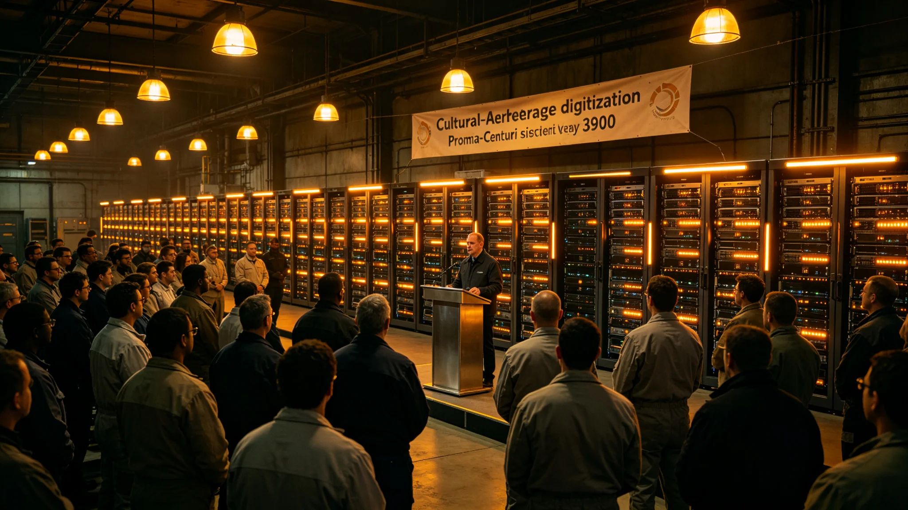

## 一、庆典缘由

公元3900年六月，跨星系主要文化遗产数字化记录工作基本完成。文化遗产管理处于六月二十日举办完成庆典。本规程由管理处编制，公布庆典活动安排与参加记录。

数字化工作自3890年启动，历时十年，共完成约十二万件文化遗产的数字化记录，包括可移动文物、不可移动建筑与非物质文化遗产口述记录。

## 二、庆典规程

庆典活动包括：数字化成果概览展示、技术人员代表发言、藏品入库确认仪式、公众开放日。成果概览展示在比邻星定居带文化中心举行，展出精选数字化藏品约一百件。

技术人员代表发言约十人，每人发言五分钟，内容为各自负责领域的技术工作总结。藏品入库确认仪式由管理处主任与各星区保管所负责人共同签字，确认全部数字副本正式入库。

公众开放日安排在庆典后两日内，公众可通过全息终端远程浏览部分数字化藏品。

## 三、参加记录

庆典参加人数约五百人，包括文化管理部门代表、各星区保管所工作人员、技术人员、学者与媒体记者。技术人员代表发言中未使用"伟大""卓越"等词，仅陈述技术参数与完成数据。

藏品入库确认仪式上签字的负责人共九人，代表九个星区保管所。签字后，管理处主任宣布全部数字副本正式纳入跨星系文化遗产数据中心。

## 四、经费与组织

庆典经费约十五万信用点，从文化遗产预算中列支。组织工作由管理处技术组与宣传组联合承担。

## 五、公众开放日

公众开放日期间，约三千人次通过全息终端访问了数字化藏品浏览页面。浏览量最高的藏品为一件跨星系金属礼器与一段濒危语言口述录音。开放日期间未收到系统故障报告。

## 六、媒体报道

跨星系媒体集团对庆典进行了报道，报道中展示了三件数字化藏品的图像。报道强调数字化工作的长期性与技术难度，未做煽情渲染。

## 七、后续维护

数字化完成后，数据中心进入日常维护阶段。维护工作包括：定期数据完整性校验、新增藏品持续记录、数字副本修复。管理处预计每年新增数字化藏品约一万件。

## 八、未完成部分

庆典同时公布了尚未完成的数字化清单：约两万件藏品因保存状况恶劣暂无法扫描，约五千件非物质文化遗产项目因传承者不足尚未完成记录。管理处计划在未来五年内逐步完成。

## 十、数字化总量统计

十年数字化工作累计完成：可移动文物约八万三千件，不可移动建筑约一千二百座，非物质文化遗产口述记录约两万一千条。数据总存储量约四千二百TB。数字副本跨星区备份完成率为百分之百。

## 十一、庆典安全

庆典期间文化中心未发生安全事故。公众开放日期间系统访问量在高峰时段约每秒八百次，未出现拥堵。技术组在开放日期间安排了二十四小时值班。

## 十二、未完成部分预算

未完成的两万件恶劣保存状况藏品数字化工作，预计需要额外经费约两百万信用点，计划在未来五年内分年度申请。非物质文化遗产记录需补充传承者约三百人，正在招募中。

数字化完成庆典的全部资料已归档，公众可通过文化遗产数据中心查询数字化成果目录。

## 十三、技术人员发言摘要

技术人员代表发言中重点提到：数字化过程中最大的技术挑战是小型器物的高精度扫描与口述录音的降噪处理。发言中未使用个人英雄叙事，仅陈述技术细节。

庆典结束后，文化遗产数据中心访问量在一周内增加了约三倍，主要来自公众对数字化成果的好奇访问。

数据中心访问量在一周后恢复正常，说明公众对数字化成果的好奇心已得到满足。

数据中心在访问量高峰期增加了两台临时服务器，确保浏览速度不受影响。

两台临时服务器在开放日结束后归还了原部门，未增加长期预算。

开放日期间数据中心技术组安排了两名工程师值班，处理浏览者的技术咨询。

值班工程师共处理技术咨询约四十次，主要为浏览操作问题。

咨询问题包括如何浏览高清模型、如何下载低分辨率预览图。

高清模型浏览需通过授权终端，普通公众可浏览低分辨率版本。

低分辨率版本可自由浏览，无需授权。

自由浏览版本分辨率约为原始数据的十分之一。

低分辨率版本仅供浏览参考，不用于学术研究。

学术研究需申请高清数据访问权限。

高清数据访问权限审批约需十个工作日。

审批结果以邮件方式通知申请人。

## 九、附则终稿

本规程经文化遗产管理处签批后公布。庆典全部记录存管理处档案室。
