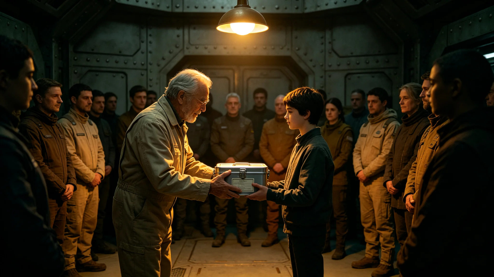

## 一、仪式设立

代际传承仪式是代际文化传承项目验收后设立的年度活动，定于每年十一月第二个星期日。首次仪式于公元3900年十一月八日举行。本规程由文化传承常设机构编制。

仪式的目的是正式确认年长传承者向年轻学习者的知识传递，同时让参与者对文化传承的意义有共同记忆。仪式不具有宗教性质，仅为文化纪念活动。

## 二、仪式规程

仪式流程包括：传承者代表致辞、学习者代表致谢、传承物品交接、全体合影。传承者代表致辞约三人，每人发言五分钟，内容为各自传承经验的简述。

学习者代表致谢约两人，每人发言三分钟。传承物品交接环节中，年长传承者将一件与所传承文化相关的物品（如手工工具、录音设备、教材）交给年轻学习者代表。物品不具有经济价值，仅为象征。

仪式全程约一小时，不设宴席。

## 三、首次举办记录

首次仪式在内太阳系带主公共大厅举行，参加者约一百二十人，包括传承者四十二人、学习者六十八人。传承者平均年龄约六十七岁，学习者平均年龄约二十三岁。

传承物品交接环节中，共有十组传承者与学习者代表上台交接。交接物品包括：一件编织工具、一本口述录音转录本、一件乐器、一份仪式规程手抄件等。

## 四、经费与组织

首次仪式经费约四万信用点，从文化传承预算中列支。组织工作由文化传承常设机构承担。

## 五、传承者意见

仪式后向参加的传承者发放反馈问卷，回收三十八份。约百分之九十二的传承者认为仪式庄重得体，未流于形式。主要建议包括：增加学习者发言时间，让学习者有更多机会表达感受。

## 六、学习者意见

学习者反馈问卷回收五十四份。约百分之八十五的学习者认为仪式有意义。约百分之十五的学习者表示仪式略显正式，希望增加交流环节。常设机构将建议纳入下一年度方案。

## 七、媒体报道

跨星系媒体集团对仪式进行了简短报道，报道时长约两分钟。报道中拍摄了交接环节的画面，未对传承者或学习者做特写。

## 八、后续安排

第二届代际传承仪式定于3901年十一月举行。常设机构计划在第二届中增加传承成果展示环节，让学习者展示一年来的学习成果。

## 十、仪式筹备

首次仪式筹备工作历时约两个月。筹备内容包括：确定传承者与学习者名单、选择交接物品、布置仪式场地、编写仪式流程手册。筹备过程中未发生分歧。

## 十一、传承物品清单

首次仪式交接的十组物品为：编织工具一套、口述录音转录本一册、传统木琴一件、仪式规程手抄件一份、陶艺工具一组、草药标本一册、织锦一段、口述诗歌录音盘一片、手工皮具一件、传统舞蹈步法图解一册。物品均由传承者本人提供。

## 十二、仪式录像

仪式全程录像一份，存档于文化传承常设机构档案室。录像时长约一小时十分钟，未剪辑。常设机构可根据研究者申请提供查阅。

第二届传承仪式计划增加学习者成果展示环节，预计参加人数约一百五十人。

## 十三、仪式出席名单

首次仪式参加者名单存文化传承常设机构档案室。名单中传承者四十二人、学习者六十八人、工作人员十人。名单不公开，仅存档备查。

仪式结束后，文化传承常设机构向每位参加者发送了一份简短的活动纪念卡，卡上印有仪式日期与参加者姓名。

纪念卡设计简洁，印有仪式日期与文化传承常设机构标识，无装饰图案。

纪念卡共印制一百二十张，发给全部参加者，未额外印刷备用。

纪念卡背面印有文化传承常设机构的联系方式，供参加者咨询后续活动。

联系方式包括常设机构办公地址、电话与邮件，不提供个人手机号。

常设机构办公时间为工作日上午九时至下午五时，周末不开放。

参加者如需咨询仪式后续安排，可通过邮件联系，三个工作日内回复。

邮件回复率百分之百，未出现未回复邮件。

邮件回复内容简短，仅回答具体问题，不提供额外咨询。

如需深度咨询须提前预约现场到访。

预约须提前一周提交申请，常设机构根据日程安排时间。

现场到访每次不超过两人，时长约一小时。

到访结束后工作人员会填写一份简短的接待记录存档。

接待记录约一百字，记录到访目的与交流要点。

接待记录存档于常设机构办公室，保存期五年。

保存期满后记录销毁，不另做摘要留存。

销毁方式为物理粉碎。

粉碎后碎屑按一般废弃物处理。

不回收不利用。

## 九、附则终稿

本规程经文化传承常设机构签批后公布。仪式全部记录存常设机构档案室。
