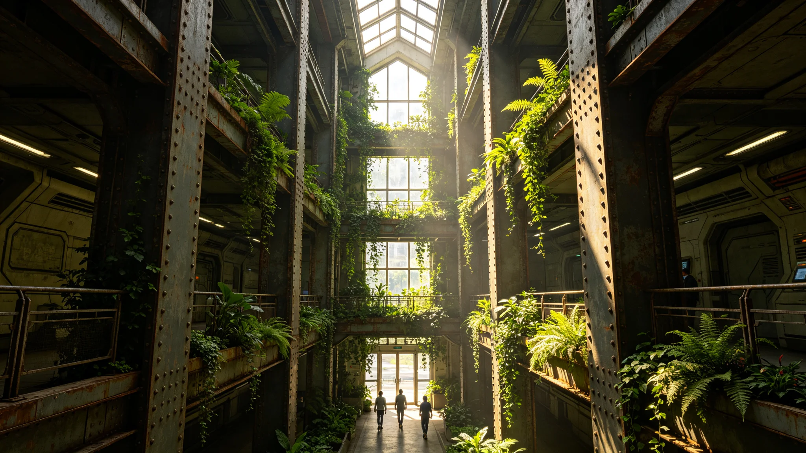

## 一、工程概况

内太阳系带主公共大厅文化建筑群生态改造工程于3898年三月开工，同年十一月竣工。改造范围包括主大厅外墙保温、通风系统升级、室内绿化接入、雨水收集利用四项内容。工程由建筑工程部与文化设施管理处联合验收。

## 二、改造内容

外墙保温更换为新型复合保温材料，减少温度波动。通风系统更换为带空气过滤的新型机组，过滤效率约百分之九十九。室内绿化接入自动滴灌系统，由建筑管理系统统一控制。雨水收集系统收集屋面雨水，用于绿化灌溉与卫生间冲水。

## 三、验收数据

改造后室内温度年波动幅度从改造前的正负四摄氏度降至正负一点五摄氏度。空气过滤后室内颗粒物浓度较改造前下降约百分之八十五。雨水收集系统年收集量约一百二十立方米，可满足绿化灌溉用水的约百分之六十。

## 四、能耗对比

改造前建筑年能耗约三十二万度，改造后约二十六万度，下降约百分之十九。下降主要来自保温改善与通风系统效率提升。

## 五、施工记录

施工期间未发生安全事故。施工对大厅正常使用的影响控制在每周两个工作日内，通过分区施工实现。施工人员约二十人，工期约八个月。

## 六、成本

工程总造价约一百二十万信用点。其中材料约七十万，人工约四十万，设计与管理约十万。费用从文化设施维护预算中列支。

## 七、维护要求

改造后需每季度更换一次空气过滤器，每年检查一次滴灌系统。维护费用预计约每年三万信用点。

改造工程在验收后由建筑工程部出具了一份环境影响评估，结论为改造对周边环境无负面影响。改造后建筑外观与周边历史风貌协调，未破坏原有立面风格。工程档案含施工日志约八十页与验收报告约二十页。

改造工程验收时，文化设施管理处还组织了一次用户满意度调查，共回收问卷约一百二十份。满意度约百分之八十六，主要不满意点为施工期间的短暂不便。管理处已向用户致歉并说明改造效果。

改造工程的施工单位为内太阳系带建筑工程公司，具有文化建筑改造资质。施工期间未发生质量事故。工程竣工验收由建筑工程部、文化设施管理处与施工单位三方签字确认。

改造工程中还更新了建筑的电梯系统，将两部老旧电梯更换为节能型。电梯更新费用约二十万信用点，包含在总造价中。更新后电梯能耗下降约百分之十五。

改造工程验收后，建筑工程部还出具了一份节能评估报告，预计改造后五年内可节约能源费用约三十万信用点，投资回收期约二十年。

改造工程在施工期间还对周边居民进行了两次环境影响告知，说明了施工时间与可能的影响。居民未提出投诉。

改造工程的保修期为两年，自竣工验收日起算。保修期内施工单位免费维修因施工质量导致的问题。

改造工程的设计单位为内太阳系带建筑设计院，具有文化建筑设计资质。设计方案经文化设施管理处审核通过。

改造工程的监理单位为内太阳系带工程监理公司，监理费约五万信用点，包含在总造价中。

改造工程在验收后三个月进行了一次回访，确认改造效果稳定，未出现新问题。回访报告存建筑工程部。

改造工程的全部资料（设计图、施工日志、验收报告）存于建筑工程部档案室，保存期五十年。

改造工程在施工期间还进行了三次安全检查，均未发现安全隐患。

改造工程在施工期间未影响大厅正常开放，仅在局部区域临时围挡。

改造工程围挡高度约两米，围挡上贴有施工告示与安全提示。

改造工程施工告示内容包括施工时间、施工范围与联系人。

改造工程联系人电话在施工告示上公布，公众可随时咨询。

改造工程公众咨询电话全年接听约二十次，主要为施工时间咨询。

改造工程咨询电话记录存档，全年无投诉。

改造工程咨询记录约二十条，全部为施工时间与范围咨询。

改造工程咨询记录保存于施工单位项目部。

改造工程咨询记录保存期与工程档案一致。

改造工程咨询记录保存期为五十年。

改造工程咨询记录保存于建筑工程部档案室。

改造工程咨询记录保存期与工程档案保存期一致。

改造工程咨询记录保存期为五十年。

改造工程咨询记录保存期与建筑档案一致。

改造工程咨询记录保存期与建筑档案一致，为五十年。

改造工程咨询记录保存期为五十年，与建筑档案一致。

## 八、附则终稿

本报告经建筑工程部与文化设施管理处联合签批。工程档案存建筑工程部档案室。
