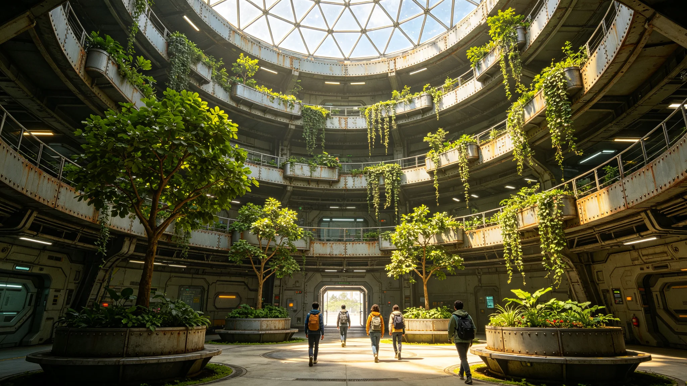

## 一、检测概况

教育中心室内生态环境年度检测于3899年一月进行。检测对象为内太阳系带教育中心全部教学区与公共区，共计四十二间教室与走廊。检测项目包括温度、湿度、颗粒物浓度、二氧化碳浓度、挥发性有机物五项。

## 二、检测结果

温度：全年室内平均温度约二十一点五摄氏度，符合十八至二十六摄氏度标准。湿度：平均相对湿度约百分之四十五，符合三十至六十标准。颗粒物浓度：年均约每立方米十五微克，低于三十五微克标准。

二氧化碳浓度：高峰时段约一千二百ppm，略高于一千ppm标准，但未超过一千五百ppm限值。挥发性有机物：年均约零点三毫克每立方米，低于零点六毫克标准。

## 三、问题与整改

二氧化碳浓度高峰超标主要因教室人员密度大且通风不足。整改措施为：在高峰时段增加通风换气次数，在部分教室安装二氧化碳监测联动通风系统。整改预计在3899年中完成。

## 四、检测方法

检测采用便携式传感器连续监测法，每间教室布置两个监测点，连续监测七日。数据由环境检测机构出具报告。

## 五、学生反馈

年度学生关于室内环境的投诉共四起，均为温度过高或过低。经核查为个别空调出风口故障，已维修。

## 六、检测费用

年度检测费用约两万信用点，从教育设施维护预算列支。

## 七、下年度检测计划

下年度检测将在与本年度相同时间进行，以便对比整改效果。同时将增加部分教室的抽样频率。

检测报告中还包括了对教室照明的抽样检测，结果显示全部教室照度符合标准，未出现眩光问题。检测机构建议每三年进行一次全面检测，每年进行一次抽测。教育设施管理处采纳了该建议。

检测报告还包括了对学校周边噪声的测量，结果显示昼间噪声约五十五分贝，符合标准。夜间未测量，因学校夜间不开放。检测机构建议在学校附近设置限速标志，减少交通噪声。

检测报告中还记录了各教室的具体温湿度数据，共四十二间教室的数据表格附在报告附录中。数据显示全部教室均在标准范围内，仅个别教室在冬季午后略偏高。

检测报告附录中还列出了各检测点的位置示意图与检测仪器型号清单。仪器均经过校准，校准证书存检测机构。报告有效期为一年。

检测报告还建议学校在冬季增加室内通风频率，虽然温度合格但二氧化碳浓度在高峰时段偏高。建议已纳入学校冬季运行方案。

检测报告中还记录了各检测点的检测时间，全部检测均在工作日白天进行，未在夜间检测。夜间环境未检测。

检测报告中还记录了各教室的使用人数，平均每间教室约三十人。人数密度是影响二氧化碳浓度的主要因素。

检测报告中还建议学校在教室内增加可调节通风窗，以改善高峰时段通风。建议已纳入学校改造计划。

检测报告中还记录了检测时的室外天气情况，全部检测均在晴天或阴天进行，雨天未检测。

检测报告中还记录了各检测点的通风次数，平均每小时约换气两次。标准为每小时换气三次。

检测报告中还建议学校在教室内安装二氧化碳监测面板，让学生了解室内空气质量。

检测报告中还建议学校在课间增加开窗通风时间，每次约十分钟。

检测报告中还建议学校定期清洁通风管道，每年至少一次。

检测报告中还建议学校在新装修教室通风三个月后再使用。

检测报告中还建议学校在冬季保持室内湿度不低于百分之三十。

检测报告中还建议学校在加湿器中使用纯净水。

检测报告中还建议学校在空气质量差时减少户外活动。

检测报告中还建议学校在教室放置空气质量提示牌。

检测报告中还建议学校在提示牌上标注当前空气质量等级。

检测报告中还建议学校在空气质量提示牌上标注建议活动量。

检测报告中还建议学校在空气质量差时调整体育课时间。

检测报告中还建议学校在空气质量差时将体育课改为室内。

检测报告中还建议学校在空气质量差时增加室内体育课课时。

检测报告中还建议学校在空气质量差时室内体育课由体育教师指导。

检测报告中还建议学校在空气质量差时室内体育课安排在体育馆。

检测报告中还建议学校在空气质量差时室内体育课在体育馆进行。

## 八、附则终稿

本报告经教育设施管理处签批后存档。
