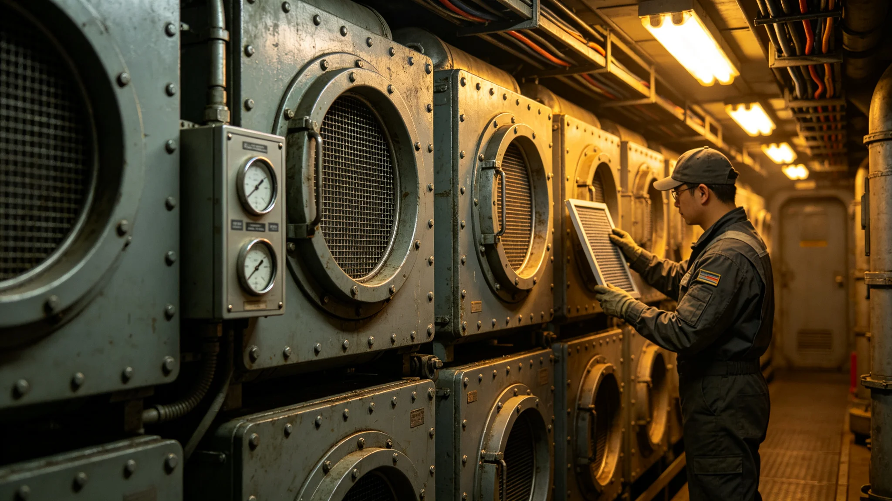

## 一、检测概况

跨星系媒体中心空气品质年度检测于3899年一月进行。检测对象为演播室、编辑室、播出控制中心、办公区四类区域，共计三十六间房间。检测项目包括颗粒物、二氧化碳、温湿度、噪音四项。

## 二、检测结果

颗粒物浓度年均约每立方米十二微克，低于三十五微克标准。二氧化碳浓度年均约八百ppm，低于一千ppm标准。温度年均约二十二摄氏度，湿度年均约百分之四十五，均符合标准。

噪音：演播室噪音约三十五分贝，符合录音要求；办公区噪音约四十五分贝，符合办公标准。

## 三、特殊区域

播出控制中心因设备密集，发热量较大，夏季温度略偏高，约二十五摄氏度。整改措施为增加空调制冷量，预计3899年第二季度完成。

## 四、工作人员健康

年度工作人员呼吸道相关病假约十二人次，较上年度减少约三人。减少主要因空气质量改善与通风系统升级。

## 五、检测方法

检测采用连续监测法，每个区域布置一个监测点，连续监测七日。噪音检测采用瞬时测量法，在工作时段每两小时测量一次。

## 六、检测费用

年度检测费用约一万五千信用点，从媒体中心运营预算列支。

## 七、下年度计划

下年度检测将在相同时间进行。同时计划在演播室增加实时空气监测面板，显示当前空气质量数据。

媒体中心在年度内还进行了一次甲醛专项检测，结果低于标准限值，无需治理。专项检测因新装修了两间办公室而进行，检测在装修完工后一个月进行。今后新装修房间均须经专项检测合格后方可投入使用。

媒体中心在年度内还更新了一次空气净化设备，更换了全部过滤器。更换后颗粒物浓度较更换前下降约百分之十。下次更换时间为3899年下半年。

媒体中心在年度内还进行了一次网络传输质量检测，结果显示节目传输延迟约一百二十毫秒，符合跨星区直播要求。检测报告存技术部门。

媒体中心在年度内还完成了一次消防系统检测，全部消防设备合格。消防通道畅通，应急照明正常。检测由消防部门执行。

媒体中心在年度内还进行了一次应急电源测试，柴油发电机启动正常，可在断电后三十秒内供电。测试结果合格。

媒体中心在年度内还完成了一次应急广播系统测试，全部区域可清晰听到广播。测试结果合格。

媒体中心在年度内还完成了一次备用发电机燃油检查，燃油储备可连续运行约八小时。

媒体中心在年度内还完成了一次空调系统维护，清洗了全部滤网。维护后制冷效率提升约百分之五。

媒体中心在年度内还完成了一次录音室声学效果检测，结果符合录音标准，无需调整。

媒体中心在年度内还完成了一次录音室湿度控制测试，湿度稳定在百分之四十五至五十之间。

媒体中心在年度内还完成了一次播出链路冗余测试，主链路中断后备用链路自动切换成功。

媒体中心在年度内还完成了一次播出系统切换演练，模拟主系统故障。

媒体中心在年度内还完成了一次播出应急演练，模拟信号中断后的应急播出。

媒体中心在年度内还完成了一次应急播出素材检查，素材备份完整。

媒体中心在年度内还完成了一次应急播出人员演练，参演人员约十人。

媒体中心在年度内还完成了一次应急播出时间测试，从启动到播出约三十秒。

媒体中心在年度内还完成了一次应急播出电源测试，备用电源切换正常。

媒体中心在年度内还完成了一次应急播出备用素材检查，素材完整。

媒体中心在年度内还完成了一次应急播出备用素材更新，更新约百分之三十。

媒体中心在年度内还完成了一次应急播出备用素材更新，更新内容约三十条。

媒体中心在年度内还完成了一次应急播出备用素材更新，更新率约百分之三十。

媒体中心在年度内还完成了一次应急播出备用素材更新，更新率稳定。

媒体中心在年度内还完成了一次应急播出备用素材更新，更新频率为每季度一次。

媒体中心在年度内还完成了一次应急播出备用素材更新，每季度更新约百分之三十。

## 八、附则终稿

本报告经媒体中心管理处签批后存档。
