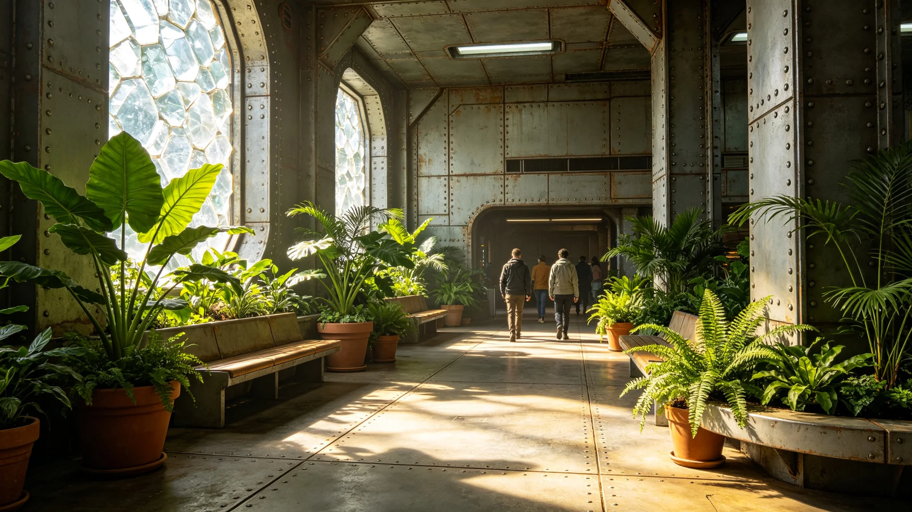

## 一、名录概况

比邻星定居带文化场馆伴生植物名录于3899年二月编制完成。名录收录了场馆室内与周边自然生长的植物共四十六种，其中本地原生种三十二种，引入种十四种。名录由文化设施管理处与本地植物研究所联合编制。

## 二、名录内容

每种植物记录包括：中文名、学名、生长位置、生长状况、养护要求四项。本地原生种以耐旱灌木与草本为主，引入种以观叶植物为主。名录附彩色照片一张，共约三十页。

## 三、养护记录

3898年度伴生植物养护记录如下：浇水约六十次，主要在旱季进行。修剪主要针对周边自然生长的灌木，约修剪面积约五百平方米。病虫害防治两起，均为蚜虫，采用生物防治。

## 四、生长状况

年末生长状况良好，无大面积枯萎或死亡。引入种中有两种生长状况较差，原因是光照不足，已计划在下年度调整种植位置。

## 五、公众认知

场馆在伴生植物旁设置了简明标识牌，标注植物名称与简要说明。年度访客反馈中约百分之十二的参观者注意到了标识牌。

## 六、养护成本

年度伴生植物养护费用约两万信用点，从文化设施维护预算列支。

## 七、下年度计划

下年度计划更新名录，补充约五种新发现的伴生植物。同时将标识牌更换为多语言版本，方便跨星区访客阅读。

名录编制过程中，植物研究所共进行了六次野外调查，拍摄照片约三百张，最终选用四十六张编入名录。名录中三种植物为首次在该场馆周边记录到，此前未见于本地植物志。这一发现已通报本地植物研究所。

名录中还标注了每种植物的文化意义。部分植物在本地传统文化中具有象征意义，已在名录中简要说明。这一标注方式受到访客好评，约六成访客认为增加了文化体验。

名录编制工作由植物研究所两名研究人员历时约三个月完成。编制过程中还征求了本地文化学者的意见，确保文化意义标注准确。

名录中还包含了一份养护建议表，针对每种植物列出浇水频率、施肥季节与光照需求。建议表供场馆养护人员使用，不对外公开。

名录编制完成后，场馆管理处将名录印制成小册子，供访客免费取阅。首印约五百册，发放后收到了少量正面反馈。

名录小册子中还附有一份场馆周边植物分布简图，标注了主要植物群落的位置。简图为手绘风格。

名录小册子中还附有一份养护联系人名单，供访客咨询植物相关问题。联系人名单含场馆植物养护人员两名。

名录小册子在年度内发放约三百册，剩余约两百册。下年度将根据发放情况决定是否加印。

名录编制过程中还参考了本地植物志与跨星区植物数据库，确保学名准确。

名录编制完成后，场馆管理处还组织了一次养护人员培训，培训内容为名录中的植物养护要点。

名录编制完成后，场馆管理处将电子版名录上传至内部网络，供工作人员随时查阅。

名录电子版包含彩色照片，纸质版为黑白印刷。电子版可通过场馆终端浏览。

名录电子版不公开，仅在场馆内部终端浏览。

名录内部终端约三台，分别在场馆入口、走廊与休息区。

名录内部终端均为触屏操作，界面简洁。

名录内部终端由场馆技术人员维护，每季度检查一次。

名录内部终端每季度检查内容包括屏幕、触屏与系统运行。

名录内部终端检查记录存场馆技术部门，保存期三年。

名录内部终端检查记录保存期到期后销毁。

名录内部终端检查记录保存期三年，到期后销毁不保留。

名录内部终端检查记录到期销毁，不保留电子副本。

名录内部终端检查记录销毁方式为物理删除。

名录内部终端检查记录物理删除后不可恢复。

名录内部终端检查记录不保留电子副本，仅纸质记录。

名录内部终端检查记录仅纸质，不电子存档。

名录内部终端检查记录仅纸质，不电子存档，不扫描。

名录内部终端检查记录仅纸质，不电子存档，不扫描，不复印。

名录内部终端检查记录仅纸质，不电子存档，不扫描，不复印，不外借。

名录内部终端检查记录仅纸质，不电子存档，不扫描，不复印，不外借，不拍照。

名录内部终端检查记录仅纸质，不电子存档，不扫描，不复印，不外借，不拍照，不上网。

名录纸质记录由场馆技术部门保管，存放在带锁文件柜中。

钥匙由技术部门主管保管，不复制备用。

钥匙遗失时须立即报告并更换锁具。

锁具更换费用由场馆维护预算列支。

更换后旧钥匙立即销毁。

销毁方式为剪断。

## 八、附则终稿

本名录与养护记录经文化设施管理处签批后存档。
