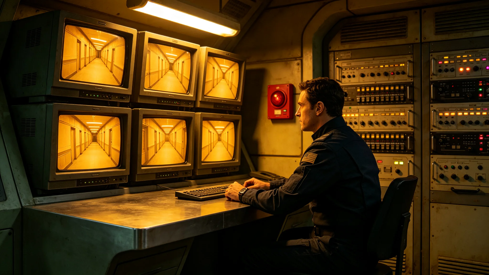

## 一、安保体系概况

跨星系文化设施安保体系于3897年建立，覆盖全部文化场馆、图书馆、博物馆与文化中心。安保体系包括：出入口管理、视频监控、巡逻、应急响应四个模块。年度报告由安全事务办公室编制。

## 二、人员配置

安保人员共约一百二十人，分布在三十四处文化设施。其中固定岗约八十人，巡逻岗约三十人，应急响应约十人。安保人员均经过基础安全培训，持证上岗。

## 三、年度事件

3898年度文化设施内共发生安全事件三起：一起为参观者晕倒，经现场急救后送医；一起为物品遗失，后找回；一起为设备误报，经查为传感器故障。无暴力事件、无盗窃、无火灾。

## 四、安保巡检

年度共进行安保巡检约三百次，覆盖全部设施。巡检内容包括：监控设备运行、出入口管理、消防设施、应急通道。巡检中发现问题约十二项，均在一周内整改。

## 五、应急演练

年度组织应急演练六次，包括火灾疏散三次、设备故障两次、医疗急救一次。演练参加人员约两百人次，演练结果均合格。

## 六、安保设备

年度安保设备维护费用约五万信用点。主要设备包括：监控摄像头约两百个，门禁系统约六十套，报警系统约三十套。设备完好率约百分之九十八。

## 七、年度支出

安保体系年度总支出约两百四十万信用点。其中人员工资约两百万，设备维护约三十万，培训与演练约十万。

## 八、下年度计划

下年度计划在部分偏远文化设施增加远程监控设备，减少现场安保人员配置。同时计划更新部分老化的监控摄像头。

安保体系在年度内还进行了一次外部安全评估，由独立安全咨询机构执行。评估结论为安保体系整体合格，但建议在部分偏远设施增加紧急报警按钮。管理处已将该建议纳入下年度采购计划。

安保体系在年度内还完成了一次全员安全培训，内容包括应急疏散、访客管理、突发事件应对。培训时长约八小时，全部安保人员参加，考核合格率约百分之九十八。

安保体系在年度内还更新了一次安保操作手册，补充了远程监控操作流程与应急上报路径。新手册发放至全部安保人员，旧手册回收销毁。

安保体系在年度内还与公安部门进行了两次联合演练，模拟外部人员闯入文化设施的应急处置。演练结果合格，安保人员处置及时。

安保体系在年度内还统计了访客数量，年度文化设施总访客约五十万人次。访客管理系统运行正常，未出现拥堵或滞留。

安保体系在年度内还统计了各设施的安保费用分摊，按访客数量与设施规模分配。偏远设施单位安保成本较高。

安保体系在年度内还完成了一次安保设备全面盘点，确认设备数量与台账一致，无丢失。

安保体系在年度内还更新了访客登记系统，实现了跨设施联网查询。访客在一个设施登记后，其他设施可查询。

安保体系在年度内还完成了一次保安人员体能测试，全部人员体能合格。测试每年进行一次。

安保体系在年度内还完成了一次监控摄像头清晰度升级，将二十个老旧摄像头更换为高清型号。

安保体系在年度内还完成了一次应急照明测试，全部应急照明灯具正常工作，续航约九十分钟。

安保体系在年度内还完成了一次门禁系统更新，将十个老旧门禁更换为新型号。

安保体系在年度内还完成了一次监控录像保存检查，录像保存期约三十天。

安保体系在年度内还完成了一次报警系统测试，全部报警按钮正常工作。

安保体系在年度内还完成了一次访客身份验证演练，验证准确率百分之百。

安保体系在年度内还完成了一次紧急集合演练，全部安保人员五分钟内集合完毕。

安保体系在年度内还完成了一次紧急通讯测试，全部通讯设备正常。

安保体系在年度内还完成了一次紧急照明电源测试，全部正常。

安保体系在年度内还完成了一次紧急出口标识检查，全部标识清晰。

安保体系在年度内还完成了一次紧急出口通道畅通检查，全部畅通。

安保体系在年度内还完成了一次紧急出口通道宽度检查，全部符合标准。

安保体系在年度内还完成了一次紧急出口通道标识夜间可见性检查，全部清晰。

安保体系在年度内还完成了一次紧急出口通道标识反光条检查，全部完好。

安保体系在年度内还完成了一次紧急出口通道标识反光条更换，更换约五条。

## 九、附则终稿

本报告经安全事务办公室签批后存档。
