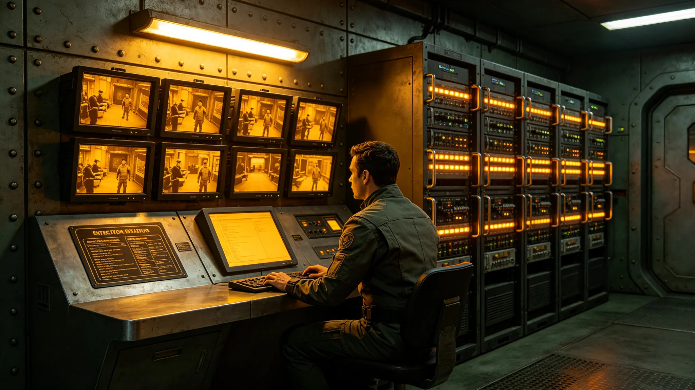

## 一、安全体系概况

跨星系媒体安全保障体系覆盖全部备案媒体机构的播出系统、传输网络与数据存储。安全体系包括：网络安全监测、播出冗余备份、数据加密、内容审查四个模块。年度报告由安全事务办公室与文化事务委员会联合编制。

## 二、年度安全事件

3898年度媒体安全事件共四起：一起为播出信号短暂中断约三秒，自动切换至备用链路；一起为数据传输延迟约两秒，原因是中继节点维护；一起为非授权访问尝试，被防火墙拦截；一起为软件漏洞被修复，未造成影响。

## 三、网络安全

年度网络安全监测共拦截非授权访问尝试约一百二十次，主要来自外部扫描。所有尝试均被防火墙与入侵检测系统拦截，未造成数据泄露。

## 四、播出冗余

全部备案媒体机构均配置了双链路播出系统，主链路故障时自动切换至备用链路，切换时间小于五秒。年度内主链路故障共三次，均成功切换。

## 五、数据加密

媒体数据传输采用端到端加密，数据存储采用加密磁盘。年度内未发生加密失效事件。

## 六、内容安全

年度内容审查发现违规内容约五件，均为轻微问题，已要求相关机构更正。无严重违规事件。

## 七、年度支出

媒体安全保障年度总支出约一百八十万信用点。其中技术维护约一百万，人员约五十万，培训与演练约三十万。

## 八、下年度计划

下年度计划升级部分老旧的防火墙设备，增加对新型攻击方式的检测能力。同时计划组织一次跨星区媒体安全联合演练。

媒体安全体系在年度内通过了一次外部审计，审计范围包括网络安全制度、应急响应流程与数据加密实现。审计结论为制度完善、执行到位，未发现重大问题。审计报告全文存安全事务办公室档案室。

媒体安全体系在年度内还进行了三次渗透测试，由外部安全团队执行。测试发现两个低危漏洞，均已修复。未发现高危漏洞。测试报告存安全事务办公室。

媒体安全体系在年度内还组织了一次安全意识培训，覆盖全部媒体从业人员约五百人。培训内容包括钓鱼邮件识别、密码安全、数据保护。培训考核合格率约百分之九十五。

媒体安全体系在年度内还更新了一次应急响应预案，补充了新型网络攻击的处置流程。预案更新后组织了一次桌面推演，参演人员约二十人。

媒体安全体系在年度内还完成了一次数据备份演练，模拟数据中心故障后从备份恢复。恢复时间约四小时，符合预案要求。

媒体安全体系在年度内还完成了一次员工设备安全检查，全部员工设备均安装了安全软件并及时更新。

媒体安全体系在年度内还完成了一次访问权限审计，全部员工访问权限与岗位匹配，未发现越权访问。

媒体安全体系在年度内还完成了一次跨星区媒体联合应急演练，模拟跨星区传输中断的应急处置。

媒体安全体系在年度内还完成了一次内容审核流程审计，全部审核流程符合规定。

媒体安全体系在年度内还完成了一次数据加密算法升级，将部分旧算法替换为新算法。

媒体安全体系在年度内还完成了一次员工密码更换，全部员工更换了新密码，密码强度合格。

媒体安全体系在年度内还完成了一次员工网络安全意识测评，平均分约八十五分。

媒体安全体系在年度内还完成了一次员工设备外设管理检查，全部设备外设均登记。

媒体安全体系在年度内还完成了一次员工设备软件版本检查，全部版本为最新。

媒体安全体系在年度内还完成了一次员工设备外接存储管控检查，全部管控到位。

媒体安全体系在年度内还完成了一次员工设备屏幕锁定检查，全部设备均自动锁定。

媒体安全体系在年度内还完成了一次员工设备加密检查，全部设备已加密。

媒体安全体系在年度内还完成了一次员工设备自动锁屏时间检查，全部为五分钟内。

媒体安全体系在年度内还完成了一次员工设备自动锁屏违规检查，无违规。

媒体安全体系在年度内还完成了一次员工设备自动锁屏时间设置检查，全部为五分钟。

媒体安全体系在年度内还完成了一次员工设备自动锁屏违规次数统计，全年零次。

媒体安全体系在年度内还完成了一次员工设备自动锁屏违规统计，全年零违规。

媒体安全体系在年度内还完成了一次员工设备自动锁屏设置抽查，全部合规。

媒体安全体系在年度内还完成了一次员工设备自动锁屏设置抽查，抽查约五十台。

## 九、附则终稿

本报告经安全事务办公室与文化事务委员会联合签批后存档。
