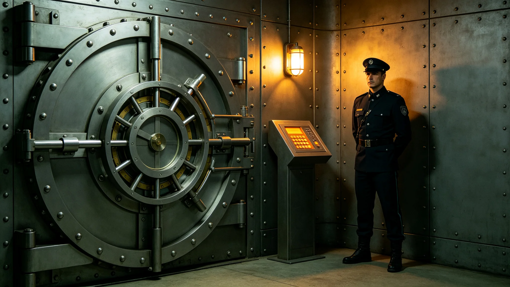

## 一、安保体系概况

文化遗产保护安全体系覆盖全部文物保管所、博物馆与数字化数据中心。安全体系包括：库房安保、展厅安保、数据中心安全、运输安保四个模块。年度报告由文化遗产管理处与安全事务办公室联合编制。

## 二、年度安全事件

3898年度文化遗产保护安全事件共两起：一起为库房温湿度短暂超标约两小时，经通风调节后恢复；一起为数据中心备份硬盘损坏一块，已从其他副本恢复。无文物失窃、无文物损坏、无数据丢失。

## 三、库房安保

全部文物库房均配置温湿度自动监控与报警系统。年度内温湿度超标事件两起，均在两小时内恢复正常。库房出入实行登记制度，年度出入约一千二百人次，均符合规定。

## 四、展厅安保

展厅内文物均安装震动与位移传感器。年度内未触发报警。展厅客流量年均约五万人次，未发生拥挤或损坏事件。

## 五、数据中心安全

数字化数据中心配置了双路供电、UPS不间断电源、消防灭火系统。年度内供电中断一次约五分钟，UPS自动切换，未影响数据。备份硬盘损坏一块，已从其他副本恢复，数据完整。

## 六、运输安保

年度内文物运输共十二次，均采用专用运输车辆与安保人员押运。运输距离最长约三百公里，均在当天往返。未发生运输事故。

## 七、年度支出

文化遗产保护安全年度总支出约一百二十万信用点。其中安保人员约七十万，设备维护约三十万，保险约二十万。

## 八、下年度计划

下年度计划更新部分老旧的库房温湿度监控设备，增加远程报警功能。同时计划对文物运输路线进行一次全面评估。

文化遗产保护安全在年度末进行了一次全面风险评估，评估了火灾、水患、盗窃、数据丢失四类风险。评估结论为整体风险可控，但建议在两个库房增加火灾烟雾探测器。管理处已将该建议纳入下年度预算。

文化遗产保护安全在年度内还对全部运输包装箱进行了一次检查，更换了三个老化包装箱。包装箱更换后重新进行了防震测试，结果合格。运输包装箱平均使用年限约五年。

文化遗产保护安全在年度内还进行了一次保险评估，确认全部文物均已投保。年度保险理赔零次，未发生文物损失。保险费用约占安保总支出的百分之十七。

文化遗产保护安全在年度内还对库房进行了一次全面盘点，确认全部文物数量与登记台账一致，无遗失。盘点由两名保管人员交叉执行。

文化遗产保护安全在年度内还完成了一次库房温湿度长期趋势分析，年度数据显示温湿度波动在可控范围内，无需额外改造。

文化遗产保护安全在年度内还完成了一次运输路线风险评估，确认全部运输路线安全，无需调整。

文化遗产保护安全在年度内还完成了一次文物保存状况抽查，抽查约一百件文物，保存状况均良好。

文化遗产保护安全在年度内还完成了一次数字化数据完整性校验，全部数据校验通过，无损坏。

文化遗产保护安全在年度内还完成了一次文物库房防虫处理，全部库房投放了防虫剂。

文化遗产保护安全在年度内还完成了一次文物保存环境模拟测试，确认库房环境适宜长期保存。

文化遗产保护安全在年度内还完成了一次文物影像档案核对，确认影像档案与实物一致。

文化遗产保护安全在年度内还完成了一次文物库房门密封检查，全部密封良好。

文化遗产保护安全在年度内还完成了一次文物库房消防器材检查，全部器材有效。

文化遗产保护安全在年度内还完成了一次文物库房温湿度记录检查，记录完整。

文化遗产保护安全在年度内还完成了一次文物库房防虫剂更换，全部更换。

文化遗产保护安全在年度内还完成了一次文物库房温湿度自动记录设备校准，全部校准合格。

文化遗产保护安全在年度内还完成了一次文物库房温湿度自动记录设备电池更换，全部更换。

文化遗产保护安全在年度内还完成了一次文物库房温湿度自动记录设备传感器校准，全部校准。

文化遗产保护安全在年度内还完成了一次文物库房温湿度自动记录设备网络连接检查，全部连接正常。

文化遗产保护安全在年度内还完成了一次文物库房温湿度自动记录设备数据上传检查，全部上传正常。

文化遗产保护安全在年度内还完成了一次文物库房温湿度自动记录设备数据上传成功率统计，约百分之九十九点九。

## 九、附则终稿

本报告经文化遗产管理处与安全事务办公室联合签批后存档。
