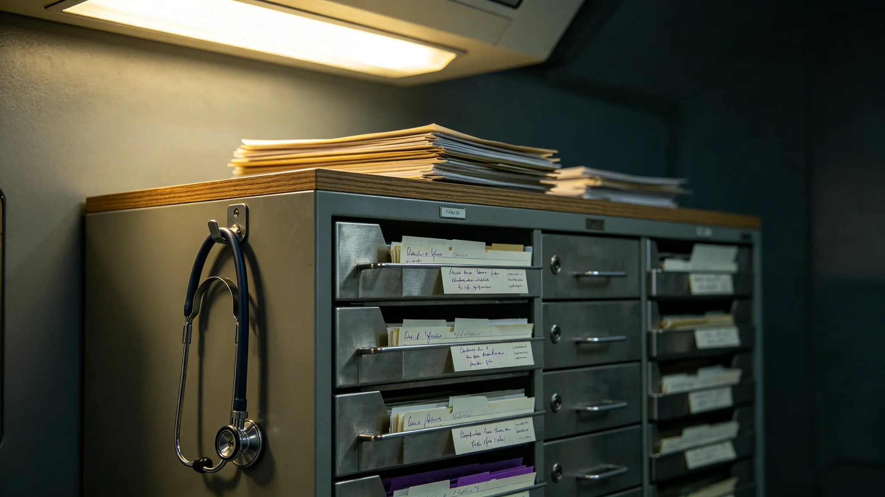

## 一、建档缘由

席照，世代心理健康保障局首席医师，任职满十一年，按局章第十章第三款办理任满档案归档。本档案由人事科会同临床中心整理，含考勤卡三十七张、年度考绩表十一份、体检记录十份、临床签认单七张及任满述职摘要一份。席照本人于3950年一月初十在人事科当面核对全部档案，签字确认，无补正意见。

## 二、考勤摘录

席照到局报到日期为3938年三月初一。至3950年一月归档，累计应到工作日二千九百八十六日，实到二千八百零九日，缺勤一百七十七日。缺勤事由分类：本人病假十九日，家属陪护假十四日，赴轨道居住环带巡诊出差未计入考勤一百三十一日，其他事假十三日。迟到记录九次，均发生在冬季轨道通勤班车延误期间，人事科认定不计考绩。早退记录两次，均为急会诊后补签离岗手续，已由护士长书面说明。

考勤卡原件存人事科恒温柜丙字第四格。3944年世代心理健康群体性事件（详见 GS-3974-01）期间，席照连续值守二十八日，每日门诊量从常规十八人次增至四十二人次，人事科后补记调休七日，席照本人于3945年分两次休完。

## 三、年度考绩

十一个年度考绩中，八年评定甲等，三年乙等。乙等年份为3940、3945、3948年。3940年乙等理由：首批远程心理监测设备上线后，席照负责的临床数据标注工作延迟二十日，影响设备验收进度。3945年乙等理由：群体性事件后随访方案执行率未达考核指标，差百分之十一。3948年乙等理由：与教育部门协作的学校心理筛查项目中期报告延迟九日。席照在三份乙等考绩表上均签认"无异议"，未申诉。

甲等评语由历任考绩组长手写。3942年评语摘编："门诊记录完整，随访率达标，未发生医患投诉。"3946年评语摘编："世代心理干预技术二期临床数据通过伦理审查，按时结题。"

## 四、体检记录

十份体检显示，席照入职时血压略偏高，经饮食调整后恢复正常，此后每年复查均稳定。3943年体检发现轻度听力下降，与长期在诊疗室使用头戴式通讯设备有关，耳鼻喉科建议轮换使用桌面扬声器，人事科已为其诊室加装。3947年体检发现睡眠障碍指数偏高，心理咨询科建议减少夜班频次，人事科自3948年起将其夜班从每月八次减至四次。3949年复查睡眠指数回落至正常区间。骨密度百分位五十五，较入职时下降四个百分点，符合长期居住医学常规范围。

## 五、临床签认单

七张签认单均为临床责任认定级。第一张，3939年五月，一名青年居民主诉持续失眠，席照初诊建议观察两周后复诊，患者未按时复诊，三个月后因中度抑郁再次就诊，席照签认随访提醒不足责任。第二张，3941年九月，一份心理评估报告格式不合规范，被质控科退回修改。第三张，3944年群体性事件期间，一份紧急干预记录时间戳与实际处置时间差六分钟，席照签认补录延迟。第四至第七张分别为3945、3946、3948、3949年的常规临床差错认定，均为记录笔误或量表填写不完整，不涉及诊疗方案错误。

## 六、任满述职摘要

述职正文约四千五百字，摘编与本档相关者。席照自述：十一年间累计门诊一万一千四百余人次，其中青年居民占百分之四十二，中老年居民占百分之三十八，未成年占百分之二十。他列举了三类最常见主诉：封闭环境焦虑、代际沟通困难、长期居住孤独感。述职未使用"治愈""拯救"等词，仅陈述门诊量与随访数据。

述职另载：十一年间参与编制世代心理干预技术临床操作规范三版，带教住院医师十九人，其中十五人已独立出诊。席照在述职中建议继任者关注第四代在出生居民的心理筛查年龄下限，认为当前三岁起筛的方案可能偏晚。签字日期3950年一月初十。

## 七、交接事项

归档当日交接清单共列项目六十四项，包括门诊病历电子档案十二万三千条、临床操作规范三版定稿、住院医师带教记录十九卷、与教育部门协作项目档案十一卷。交接双方签字：交出人席照，接收人由局务委员会指定。清单副本存档案科。交接中发现2944年群体性事件的部分随访记录缺编号，席照说明该批记录在事件后集中补录时编号顺延，三日内补齐编号索引。

## 七·补、历年门诊量与随访率摘录

本档案另附席照任内十一年间季度门诊量与随访率统计表。摘编其中与本档案相关者：3938年开诊首季门诊量四百一十二人次，随访率百分之八十一；3944年群体性事件后当季门诊量骤增至九百八十七人次，随访率降至百分之六十九，经三个月调整后回升至百分之八十二；3949年归档前一季门诊量六百零三人次，随访率百分之八十八。统计表由护士长每月汇总，席照在每季末签字确认。

## 八、附则

本档案经人事科密封后移送档案科永久保存。调阅须经局务委员会批准。档案封面编号XL-3950-008，与本局其他人事档案同序列。
