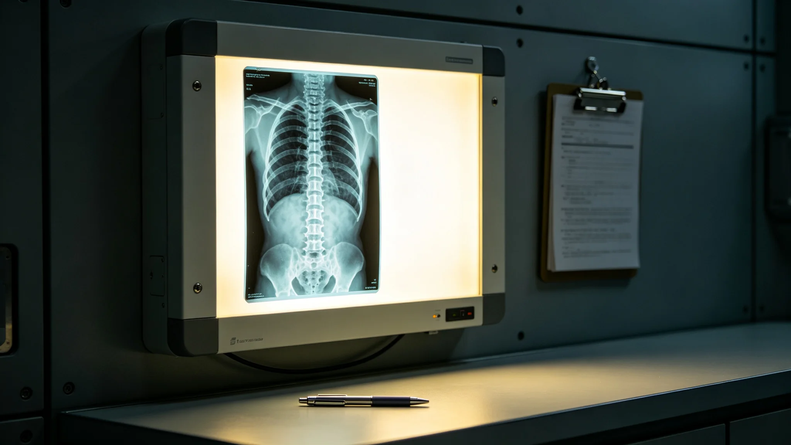

## 一、建档缘由

竺慎，长期居住医学奠基人，长期居住医疗局首席医师，任职满二十三年，按局章第十一章第一款办理退休归档。本档案由人事科会同临床中心整理，含考勤卡七十八张、年度考绩表二十三份、体检记录二十一份、临床事故签认单六张及退休述职摘要一份。竺慎本人于3947年八月十六日在人事科当面核对全部档案，签字确认，无补正意见。

## 二、考勤摘录

竺慎到局报到日期为3924年三月初九。至3947年八月退休，累计应到工作日五千八百九十二日，实到五千六百零一日，缺勤二百九十一日。缺勤事由分类：本人病假四十二日，家属陪护假二十七日，赴各居住环带巡诊出差未计入考勤一百八十六日，其他事假三十六日。迟到记录十四次，其中十一次发生在冬季轨道通勤班车延误期间，人事科认定不计考绩。早退记录四次，均为急会诊后补签离岗手续。

考勤卡原件存人事科恒温柜甲字第三格。3939年长期居住罕见病爆发事件（详见 GS-3976-01）期间，竺慎连续值守三十五日，每日会诊量从常规二十人次增至五十六人次，人事科后补记调休十日，竺慎于3940年分三次休完。

## 三、年度考绩

二十三个年度考绩中，十八年评定甲等，四年乙等，一年丙等。乙等年份为3927、3933、3940、3945年。3927年乙等理由：长期居住医学诊疗系统初版上线后临床数据录入延迟三十日。3933年乙等理由：首次骨密度筛查方案在二号居住环带试点时依从率未达指标，差百分之八。3940年乙等理由：罕见病爆发事件中早期诊断延误三日。3945年乙等理由：与生态局协作的伴生微生物研究项目结题延迟十一日。丙等年份为3931年，理由：一份长期居住医疗保险理赔审核中漏查一项病史，导致理赔金额偏差，竺慎作为审核医师签认更正单。竺慎在丙等考绩表上签认"无异议"，未申诉。

## 四、体检记录

二十一份体检显示，竺慎入职时骨密度百分位六十四，退休时降至四十七。三十余年间骨密度累计下降十七个百分点，与长期在轨道微重力环带巡诊有关。心血管指标始终在正常区间，但3942年起出现轻度心律不齐，心内科建议减少夜班频次，人事科自3943年起将其夜班从每月十次减至六次。3946年体检发现轻度白内障，眼科建议手术，竺慎在退休前完成手术，术后视力恢复至零点九。3947年退休体检骨密度百分位四十六，较上年未继续下降。

## 五、临床事故签认单

六张签认单均为临床责任认定级。第一张，3926年十一月，一名中老年居民主诉关节疼痛，竺慎初诊诊断为退行性病变，三个月后复查发现早期骨质疏松，竺慎签认早期筛查不足责任。第二张，3929年四月，一份病历记录中用药剂量抄录错误，经药房核对发现后更正，未造成给药差错。第三张，3931年，即前述丙等考绩对应的理赔审核漏查事件，竺慎签认更正单。第四张，3939年罕见病爆发事件，竺慎签认早期诊断延误责任。第五张，3942年七月，一次会诊记录时间戳与实际处置时间差九分钟，签认补录延迟。第六张，3944年二月，一份长期居住医学年度诊疗报告数据引用错误，被质控科退回更正。

## 六、退休述职摘要

述职正文约六千字，摘编与本档相关者。竺慎自述：二十三年间累计门诊一万八千六百余人次，参与编制长期居住医学临床操作规范五版，带教住院医师三十七人。他列举了长期居住医学领域三类最主要的慢性问题：骨密度逐年下降、心血管适应不良、代谢综合征发生率上升。述职未使用"开创""奠基"等词，仅陈述门诊数据与规范修订记录。

述职另载：二十三年间长期居住医疗保险覆盖人口从建局初年的百分之六十二提升至百分之九十七。竺慎在述职中建议继任者关注第四代出生居民的骨密度基线，认为在轨道环带出生的人群可能与在行星表面出生人群存在系统差异，需单独建立基线数据库。签字日期3947年八月十六日。

## 七、交接事项

退休当日交接清单共列项目一百二十一项，包括门诊病历电子档案十八万六千条、临床操作规范五版定稿、住院医师带教记录三十七卷、长期居住医疗保险理赔审核档案四百余卷。交接双方签字：交出人竺慎，接收人由局务委员会指定。清单副本存档案科。交接中发现3939年罕见病事件的部分会诊记录缺页码，竺慎说明该批记录在事件后集中整理时页码顺延，三日内补齐索引。

## 七·补、历年骨密度筛查数据摘录

本档案另附竺慎任内二十三年间骨密度筛查覆盖率与异常率统计表。摘编与本档案相关者：3924年建局初年骨密度筛查覆盖率为百分之四十一，异常率百分之十七；3939年罕见病爆发事件当年覆盖率提升至百分之七十八，异常率升至百分之二十三；3947年退休前最后一次统计覆盖率百分之九十六，异常率百分之十九。统计表由临床中心每年汇总，竺慎在每年终审核报告上签字。

## 八、附则

本档案经人事科密封后移送档案科永久保存。调阅须经局务委员会批准。档案封面编号YL-3947-003，与本局其他人事档案同序列。
