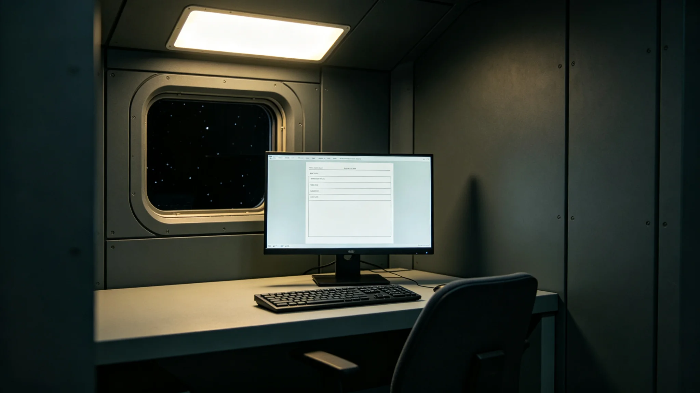

## 一、建档缘由

童川，世代心理学研究所创始人、首席研究员，任职满十九年，按所章第十章第二款办理任满归档。本档案由人事室会同研究室整理，含考勤卡六十一张、年度考绩表十九份、体检记录十八份、学术差错签认单三张及任满述职摘要一份。童川本人于3950年三月二十四日在人事室当面核对全部档案，签字确认，无补正意见。

## 二、考勤摘录

童川到所报到日期为3931年八月初五。至3950年三月归档，累计应到工作日四千八百二十三日，实到四千六百零七日，缺勤二百一十六日。缺勤事由分类：本人病假二十八日，家属陪护假十五日，赴各居住环带调研出差未计入考勤一百五十九日，其他事假十四日。迟到记录十一次，均发生在通勤班车改道期间，人事室认定不计考绩。早退记录三次，均为参加跨学科研讨会后提前离岗，已由办公室书面说明。

考勤卡原件存人事室恒温柜己字第八格。3944年世代心理健康群体性事件期间，童川作为学术顾问连续参与分析会议二十二日，每日会议时长超过十小时，人事室后补记调休四日，童川于3945年休完。

## 三、年度考绩

十九个年度考绩中，十五年评定甲等，四年乙等。乙等年份为3934、3939、3943、3947年。3934年乙等理由：首批世代心理量表编制进度延迟十八日。3939年乙等理由：量表常模修订版样本量不足，需补充采样。3943年乙等理由：与教育局协作的学校心理筛查项目中期报告延迟九日。3947年乙等理由：世代心理干预技术学术论文审稿意见回复延迟十二日。童川在四份乙等考绩表上均签认"无异议"，未申诉。

## 四、体检记录

十八份体检显示，童川入职时视力良好，3938年起出现轻度近视加深，与长期面对量表分析屏幕有关，眼科建议每连续工作两小时休息十五分钟。3943年体检发现轻度颈椎问题，理疗科建议每周至少两次颈部拉伸。骨密度百分位五十九，较入职时下降六个百分点，在长期居住医学常规范围内。3948年体检发现血压略偏高，经饮食调整后次年复查恢复正常。3949年复查各项指标稳定。

## 五、学术差错签认单

三张签认单均为学术责任认定级。第一张，3936年五月，首批世代心理量表中一道题目的计分方向标注错误，经同行评审发现后更正，未用于临床。第二张，3940年十一月，量表常模修订版中一个样本环带的人口学特征描述与实际数据不符，被数据科退回核实。第三张，3946年七月，一篇学术论文中引用的既往研究数据页码标注错误，经编辑部要求更正后重新发表。

## 六、任满述职摘要

述职正文约五千二百字，摘编与本档相关者。童川自述：十九年间累计编制世代心理量表七版，建立样本数据库三个，覆盖定居带各居住环带居民四万二千余人次。他列举了三类主要研究发现：第一，在轨道环带出生的居民与在行星表面出生的居民在空间感知量表上存在系统性差异；第二，代际沟通困难的主诉在第三代居民中发生率显著高于前两代；第三，长期居住孤独感与居住环带的绿化面积呈负相关。述职未使用"开创""奠基"等词，仅陈述数据与样本量。

述职另载：十九年间累计培养研究助理二十六人，其中二十一人仍在从事相关研究。童川在述职中建议继任者关注第四代出生居民的长期追踪数据，认为当前样本中第四代人数偏少，结论可能不稳定。签字日期3950年三月二十四日。

## 七、交接事项

归档当日交接清单共列项目八十一页项，包括量表数据库主文件五组、量表七版定稿及修订记录、样本采集记录四百零七册、学术论文档案三十八卷。交接双方签字：交出人童川，接收人由所务委员会指定。清单副本存档案科。交接中发现3944年群体性事件的部分调研记录缺编号，童川说明该批记录在事件后集中整理时编号顺延，三日内补齐索引。

## 七·补、历年量表常模样本量摘录

本档案另附童川任内十九年间各版世代心理量表常模样本量统计表。摘编与本档案相关者：3932年首版量表常模样本量为一千零二十七人，覆盖两个居住环带；3939年修订版常模样本量增至四千五百一十二人，覆盖五个居住环带；3944年群体性事件后修订版常模样本量六千零八十三人，覆盖全部八个居住环带；3949年归档前最后一版常模样本量七千四百二十一人。各版量表均由童川主笔编制，经同行评审后发布。统计表由研究室每年汇总，童川在每年终审报告上签字。

本档案另附童川任内代表性学术论文目录索引，共列论文三十一篇。索引按年份编排，标注每篇论文的发表期刊与合作者人数。摘录其中与本档案相关者：3936年首篇论文论述在轨道环带出生居民空间感知特征，合作者三人；3943年论文论述代际沟通困难主诉的代际差异，合作者五人；3948年论文论述长期居住孤独感与居住环境绿化面积的相关性，合作者四人。以上论文均经童川本人确认目录无误。

## 八、附则

本档案经人事室密封后移送档案科永久保存。调阅须经所务委员会批准。档案封面编号XL-3950-014，与本所其他人事档案同序列。
