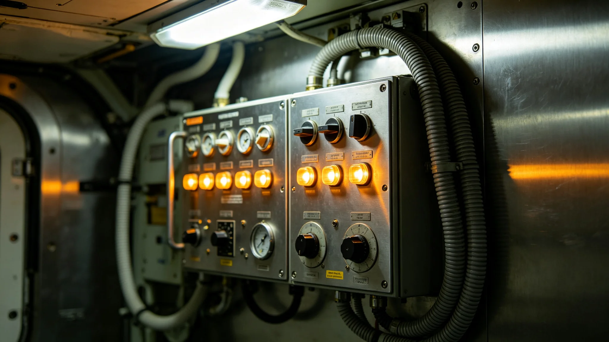

## 一、建档缘由

陆迟，居住环境优化局总设计师，任职满十六年，按局章第十一章第一款办理任满归档。本档案由人事科会同设计中心整理，含考勤卡五十一张、年度考绩表十六份、体检记录十五份、设计事故签认单五张及任满述职摘要一份。陆迟本人于3949年九月十一日在人事科当面核对全部档案，签字确认，无补正意见。

## 二、考勤摘录

陆迟到局报到日期为3933年十月初一。至3949年九月归档，累计应到工作日三千八百零九日，实到三千六百四十四日，缺勤一百六十五日。缺勤事由分类：本人病假十九日，家属陪护假十二日，赴各居住环带现场勘测出差未计入考勤一百一十七日，其他事假十七日。迟到记录九次，均发生在通勤班车改道期间，人事科认定不计考绩。早退记录三次，均为陪同外部评审组现场查看后提前离岗。

考勤卡原件存人事科恒温柜丁字第十格。3947年居住环境系统性故障事件（详见 GS-3979-01）期间，陆迟连续在现场值守二十六日，每日协调会时长超过十二小时，人事科后补记调休五日，陆迟于3948年分两次休完。

## 三、年度考绩

十六个年度考绩中，十二年评定甲等，四年乙等。乙等年份为3936、3940、3944、3948年。3936年乙等理由：首批居住环境标准草案延迟十四日提交。3940年乙等理由：二号居住环带环境优化改造方案超期十九日。3944年乙等理由：与生态局协作的居住环境绿化方案中期报告延迟八日。3948年乙等理由：居住环境智能调节系统二期升级验收延迟十一日。陆迟在四份乙等考绩表上均签认"无异议"，未申诉。

## 四、体检记录

十五份体检显示，陆迟入职时骨密度百分位六十一，归档时降至五十二。因长期在轨道居住环带现场勘测，3942年起每年骨密度下降约一个百分点，医学局建议现场连续作业不超过三十日。3945年体检发现轻度腱鞘炎，与长期绘制设计图纸有关，骨科建议更换绘图工具并增加休息频次，已采纳。心血管指标始终正常。3947年体检发现视力轻度下降，与长期审阅高密度设计图纸有关，眼科建议减少连续图纸审阅时间，已为其工位加装大屏幕显示器。3948年复查腱鞘炎好转，视力未继续下降。

## 五、设计事故签认单

五张签认单均为设计责任认定级。第一张，3935年三月，一号居住环带环境优化方案中一处通风管道截面计算错误，经施工方审核发现后更正，未造成返工。第二张，3938年七月，二号居住环带照明系统设计中灯具间距偏差零点三米，经现场勘测发现后调整。第三张，3942年十二月，居住环境标准法草案中一项温湿度指标与实际运行数据不符，被法规科退回修改。第四张，3947年居住环境系统性故障事件，陆迟作为总设计师签认系统设计缺陷责任。第五张，3948年六月，智能调节系统二期升级中一个控制参数设定错误，经测试发现后更正，未上线运行。

## 六、任满述职摘要

述职正文约五千字，摘编与本档相关者。陆迟自述：十六年间累计主持居住环境优化设计项目二十三个，其中十一个已竣工投用，五个在建，七个处于方案阶段。他列举了三次主要设计偏差事件，其中两次由现场勘测数据不足引起，一次由系统参数设定错误引起。述职未使用"卓越""开创"等词，仅陈述项目数量与偏差记录。

述职另载：十六年间累计培训居住环境设计师二十二人，其中十八人仍在岗。陆迟在述职中建议继任者关注长期居住居民对环境调节系统的接受度数据，认为当前设计方案偏重技术指标，对居民主观舒适度的调研频次可能不足。签字日期3949年九月十一日。

## 七、交接事项

归档当日交接清单共列项目一百零二页项，包括设计项目档案二十三卷、居住环境标准法草案各版本定稿、智能调节系统设计文档十二册、现场勘测记录三百零九册。交接双方签字：交出人陆迟，接收人由局务委员会指定。清单副本存档案科。交接中发现3947年故障事件的部分现场勘测记录缺页码，陆迟说明该批记录在事件后集中整理时页码顺延，三日内补齐索引。

## 七·补、历年环境优化项目竣工数据摘录

本档案另附陆迟任内十六年间主持设计项目的竣工验收数据统计表。摘编与本档案相关者：3935年首个竣工项目为一号居住环带照明系统改造，验收时照度偏差在容许范围内，居民满意度百分之八十二；3940年二号居住环带通风系统改造竣工，验收时通风量达标，居民满意度百分之七十八；3945年三号居住环带绿化扩容项目竣工，验收时植被覆盖率达标，居民满意度百分之八十六；3948年智能调节系统二期升级通过验收，居民满意度百分之八十一。各项目验收报告均由陆迟签字确认。

## 八、附则

本档案经人事科密封后移送档案科永久保存。调阅须经局务委员会批准。档案封面编号HJ-3949-019，与本局其他人事档案同序列。
