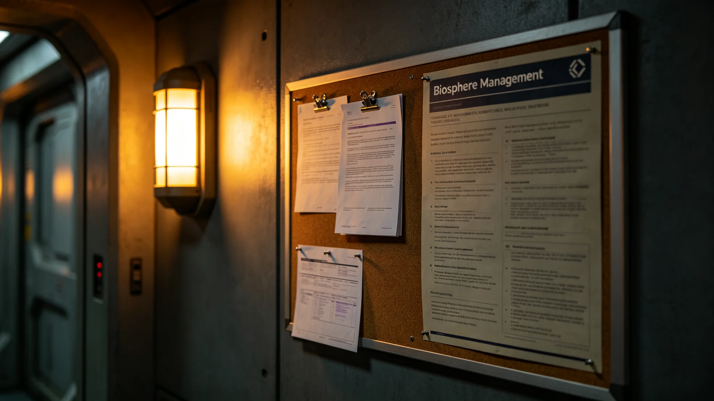

## 一、立法缘由

人工生物圈管理法（以下简称本法）于3945年七月由定居带立法委员会三读通过，同年八月初一施行。立法缘由如下：其一，定居带现有八座人工生物圈运行已超过六十年，三代菌群更替完毕，既往管理依据散见于各环带运行规程，缺乏统一上位法；其二，3941年三号环带菌群崩溃事件（详见 GS-3973-01）暴露出跨环带协调机制不健全，事件处置中责任划分与信息上报时限无统一规定；其三，跨星区接驳航班数量逐年增加，外来微生物入侵风险上升，既往检疫流程仅适用于常规补给舱，未覆盖高频客运航班。

本法共七章四十二条，覆盖生物圈运行管理、菌群监测、外来生物检疫、事故应急处置、跨环带协调、违规处罚与附则七部分。

## 二、立法过程

本法草案由生态局牵头起草，3944年九月完成初稿，征求各居住环带运行单位意见后修订三稿。3945年三月提交立法委员会一读，收到修订意见四十七条，其中三十一条采纳。同年六月二读，补充外来生物检疫条款三条。七月三读通过，八月初一施行。立法过程中未出现重大分歧条款，争议集中在检疫抽检比例一项，最终采纳折中方案：常规补给舱抽检百分之五，客运航班抽检百分之十五。

## 三、首年执行概况

本法施行首年（3945年八月至3946年二月），生态局共受理生物圈运行报告四百一十二份，其中跨环带协调事项十七件，外来生物检疫异常事件三件，均在规定时限内处置完毕。

跨环带协调事项十七件中，十一件为水培液循环调度协商，四件为土壤改良物料跨环带调拨，两件为监测人员跨环带支援。十七件均按本法规定的跨环带协调程序办理，平均办结时间五日，较本法施行前的同类事项平均办结时间九日缩短四日。

外来生物检疫异常事件三件中，两件为客运航班携带的植物种子检出外来真菌，一件为补给舱密封失效导致微生物污染。三件事件均按本法规定的检疫与应急处置条款处理，未造成生物圈内部生态波动。

## 四、首年违规处罚记录

首年内共记录违规行为九起。其中六起为生物圈运行值班人员未按规定频次提交监测数据，处罚为书面警告；两起为跨环带物料调拨未按规定办理审批手续，处罚为通报批评；一起为客运航班检疫抽检配合不力，处罚为罚款。九起违规均已按本法规定程序处理，当事人均签认处罚决定，未提出申诉。

## 五、首年数据统计

首年内八座人工生物圈各项运行指标统计如下：碳氧循环稳定率平均百分之九十九点二，较上年同期上升零点三个百分点；土壤微生物群落多样性指数平均变化率在容许范围内；水培系统年产量稳定在设计值的百分之九十四至九十八之间；跨环带生态监测数据上传及时率百分之九十八点七，较上年同期上升二个百分点。

## 六、首年存在问题

首年执行中发现以下问题：其一，部分基层运行单位对本法跨环带协调条款理解不一致，导致三起协调事项初次提交材料不全，退回补办；其二，外来生物检疫抽检设备在客运航班高峰期出现排队等待现象，平均等待时间四十分钟，需在3946年内增配检测设备；其三，本法附则中关于违规处罚的量化标准偏粗，基层执行中存在自由裁量空间，需在修订时细化。

## 七、下一步工作

3946年计划完成以下工作：其一，对各居住环带基层运行单位开展本法培训两轮，覆盖全部值班人员；其二，增配客运航班检疫检测设备四台，将高峰期平均等待时间降至二十分钟以内；其三，启动本法实施细则起草工作，重点细化违规处罚量化标准与跨环带协调材料清单。

## 七·补、首年与历年运行数据对比

本报告附表列示本法施行首年与上一个五年期（3940至3944年）生物圈运行核心指标对比。碳氧循环稳定率：首年百分之九十九点二，上一个五年期平均百分之九十八点七，提升零点五个百分点。土壤微生物群落多样性指数年际变化率：首年百分之零点八，上一个五年期平均百分之一点三，下降零点五个百分点，表明菌群稳定性提升。水培系统年产量波动幅度：首年在设计值百分之九十四至九十八之间，上一个五年期在百分之九十一至一百零三之间，收窄幅度表明管理精度提高。跨环带协调事项平均办结时间：首年五日，上一个五年期九日，缩短四日。外来生物检疫异常事件年度发生数：首年三件，上一个五年期平均每年二点四件，略有上升，与客运航班数量增长有关。

## 八、附则

本报告由生态局政策法规科起草，经局务委员会审议后发布。抄送立法委员会、各居住环带运行单位。报告封面编号FJ-3946-003。
