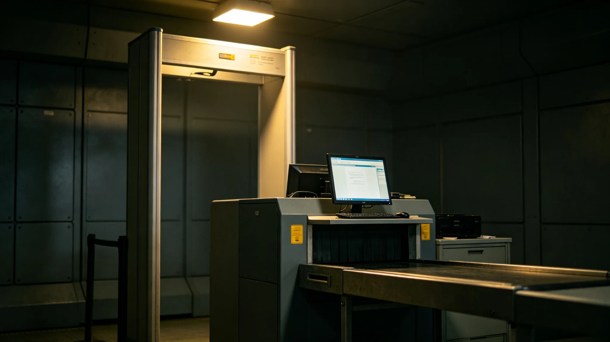

## 一、事件概况

3941年五月初七凌晨四时十二分，三号环带水培区第三藻池在线监测仪报警，显示池水溶解氧浓度在三十分钟内从设计值的百分之九十六骤降至百分之六十一。值班生态监测员立即赶赴现场，发现藻池液面出现异常灰褐色悬浮物，水质浑浊。经初步判断为藻池内菌群异常增殖导致溶解氧消耗过快。

事件发生后，值班人员立即按应急预案向生态局值班室报告。局值班室于四时二十三分收到报告，四时三十分通知首席生态学家温屿（见 GS-3951-01）。温屿于四时四十八分到达现场，四时五十六分启动三号环带水培系统局部隔离程序，将第三藻池与主循环管路断开。

## 二、事件经过

四时十二分，监测仪首次报警。四时十五分，值班人员首次现场查看，发现水面异常。四时二十二分，值班人员向环带值班室电话报告。四时三十分，环带值班室向生态局值班室报告。四时四十八分，温屿到达现场。四时五十六分，第三藻池与主循环管路断开。

五时零五分，温屿现场取样，送生态中心实验室检测。五时四十分，实验室初步反馈：池水中检出两种非本地微生物，其中一种为异养型细菌，异常增殖消耗溶解氧。六时十分，温屿下令将三号环带全部六个藻池逐一检测，发现其余五个藻池均已检出同种细菌，浓度从第三藻池向四周递减。

六时三十五分，温屿决定对全部六个藻池执行循环液更换，同时暂停三号环带水培区对外输出营养液。八时二十分，首批循环液更换完成，溶解氧浓度开始回升。至十二时整，六个藻池溶解氧浓度全部恢复至设计值百分之九十以上。

## 三、事件原因

经生态中心实验室后续检测与流行病学调查，事件原因为：上月二十八日，一艘跨星区补给航班抵达三号环带水培区补给舱，补给舱密封垫存在微小裂缝，导致舱外空气中的两种外来微生物随补给舱通风系统进入水培区空气管路，最终进入藻池。其中异养型细菌在水培液营养盐环境中快速繁殖，消耗溶解氧，抑制了本地藻类的正常光合作用。

补给舱密封垫裂缝经检查为长期磨损所致，该补给舱上次密封检查日期为上月初十，检查记录合格，但裂缝在检查后至航班到达之间约二十日内形成。

## 四、事件影响

事件直接影响：三号环带水培区全部六个藻池暂停对外输出营养液共计十八小时，导致三号环带土壤改良区当季施肥量减少约百分之十二。三号环带水培系统当季总产量较设计值下降百分之八，未影响其他环带。

事件间接影响：生态局在事件后对全部八座人工生物圈的补给舱密封检查流程进行了全面复查，检查周期从原来的三十日缩短至十五日。跨星区补给航班在三号环带的抽检比例从百分之五提高至百分之十，持续至3941年底。

## 五、事件处置责任认定

事件处置中，温屿作为首席生态学家在收到报告后十八分钟到达现场，从报警到启动隔离程序用时四十四分钟。事后调查认定，从报警到首次现场查看用时三分钟，从现场查看到向环带值班室报告用时七分钟，均在应急预案规定时限内。但从环带值班室收到报告到启动隔离程序用时二十六分钟，其中温屿到达现场后判断并决策用时八分钟，未超出应急预案规定的十五分钟决策时限。

事件责任认定：补给舱密封检查流程存在漏洞，检查周期过长为根本原因。现场处置中，值班人员首次现场查看后未立即暂停第三藻池对外输出，而是先向值班室报告，延误约七分钟。该延误被认定为次要责任。

## 六、整改措施

事件后采取以下整改措施：其一，将全部人工生物圈补给舱密封检查周期从三十日缩短至十五日；其二，在水培区空气管路上加装微生物在线监测仪，发现异常可在十五分钟内报警；其三，修订应急预案，明确值班人员在确认水质异常后可立即暂停单池对外输出，无需先请示；其四，对全部值班生态监测员开展一次应急处置流程复训。

## 六·补、事件后长期随访数据

事件后三年（3941年至3944年），生态局对三号环带水培系统进行了持续随访监测。随访数据显示：3941年事件后，三号环带水培系统当季总产量恢复至设计值的百分之九十一，3942年恢复至百分之九十四，3943年恢复至百分之九十六，3944年恢复至设计值的百分之九十八。土壤微生物群落多样性指数在事件后第一年下降百分之四点二，第二年回升至事件前水平的百分之九十六，第三年完全恢复。

事件后，生态局对全部八座人工生物圈的补给舱密封检查流程完成了全面复查，共发现并更换磨损密封垫十七处，其中四处位于三号环带。整改后，3942年至3944年三年间，八座人工生物圈未再发生同类菌群崩溃事件。本报告附事件后三年随访数据统计表一张，由生态局监测科绘制。

## 七、附则

本报告由生态局事件调查科起草，经局务委员会审议后发布。抄送生态局、各人工生物圈运行单位、跨星系生态保护局。报告封面号ST-3941-009。
