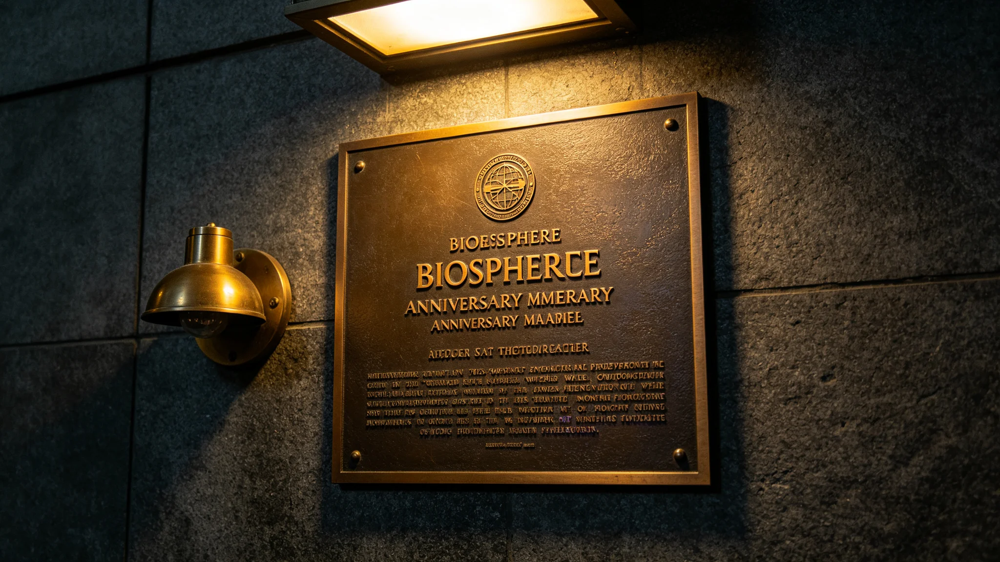

# 跨星系生态入侵事件通报与处置报告

**起草**：跨星系生态保护局事件调查科　**封面号**：ST-3946-022
**告警**：3946年六月初十 二时十五分　**清除完成**：同年六月二十日
**感染面**：二号环带六个水培池中的三个

## 一、事发物证登记

> **件一**·跨星系生态监测卫星网（见 GS-3970-01）三号卫星例行扫描原行：
> 　六月初九　二号环带 水培系统附近大气 藻类孢子浓度 异常升高　较历史平均值高约四倍
> 扫描原行无批注。卫星网系统本体见 GS-3970-01。
>
> **件二**·卫星地面接收站推送存根一张。六月初十凌晨二时十五分，异常信号推送至跨星系生态保护局值班室。存根编号在册，值班室签收。
>
> **件三**·现场采样送检单一张。三时三十分开单，采样点二号环带水培区，样品送生态中心实验室。送检单三联，实验室留存根一联。

## 二、处置时刻表（原始登记）

| 时刻 | 事项 | 经手 |
|---|---|---|
| 六月初九 | 三号卫星例行扫描，孢子浓度较历史平均值高约四倍 | 监测卫星网 |
| 六月初十 二时十五分 | 地面接收站推送异常信号至保护局值班室 | 地面接收站 |
| 六月初十 二时四十分 | 值班专员收到信号 | 贺川（见 GS-3955-01） |
| 六月初十 三时零五分 | 到达二号环带水培区现场 | 贺川 |
| 六月初十 三时三十分 | 现场采样送生态中心实验室检测 | 贺川 |
| 六月初十 十八时 | 实验室初步反馈；决定局部隔离，暂停水培液对外输出 | 实验室 / 贺川 |
| 六月初十至十二日 | 二号环带全部水培池逐一检测 | 贺川 |
| 六月十二日至二十日 | 已感染三池清除作业 | 贺川 |
| 六月二十日 | 三池全部完成清除，检测未再检出外来藻类 | 贺川 |

## 三、实验室化验单与鉴定

> 六月初十 十八时 初步反馈：检出一种外来藻类孢子。该藻类此前未在定居带人工生物圈中记录。
> 逐池检测：六个水培池，感染三个。检测记录六行，三行勾选"检出"，三行空白。
> 鉴定：该藻类为一种半人马座α星B轨道生态带特有的浮游藻类，经跨星区货运航班补给舱密封失效进入二号环带。

化验单三张，编号并列，鉴定人签字。

## 四、清除作业工单（三池 · 四道工序）

| 工序 | 内容 |
|---|---|
| 一 | 排空池水 |
| 二 | 清洗池壁 |
| 三 | 更换循环液 |
| 四 | 重新接种本地藻类 |

三池各开工单一张，作业起止逐日记，经手人逐日签字。至六月二十日，三个水培池全部完成清除作业，检测未再检出外来藻类。复验单三张，存根留局。

## 五、入侵路径认定（调查科）

六月初五，一艘跨星区货运航班抵达二号环带补给舱。该航班补给舱密封垫在飞行途中因微流星体轻微撞击出现裂缝，舱外空气中的外来藻类孢子随通风系统进入补给舱，再随补给作业进入二号环带水培区空气管路。

> 检疫抽检记录一页：该货运航班在二号环带降落前，经跨星系生态保护法（见 GS-3963-01）规定的常规检疫抽检，抽检比例为百分之十。该航班未被抽中。
> 记录页"抽中"一栏，空白。

## 六、影响登记与调拨单

二号环带水培区三个水培池暂停作业共计十日，二号环带水培系统当季营养液产量下降约百分之十五。未影响其他环带。二号环带水培区对外输出暂停十日，三号、四号环带的土壤改良用营养液临时从一号环带调拨。调拨单若干张，编号在册，收发两端签认。

间接影响两项：检疫抽检比例调整、空气管路加装在线监测仪，俱见第八节整改第一、二项。事件后跨星系生态保护局启动的随访监测，见第九节。

## 七、时限核对与责任认定

| 环节 | 用时 | 规定 | 判定 |
|---|---|---|---|
| 卫星监测发现异常信号 → 贺川到达现场 | 约三小时四十五分钟 | 六小时内 | 合 |
| 其中：信号推送 → 值班专员 | 二十五分钟 | — | — |
| 其中：值班专员 → 现场 | 二十五分钟 | — | — |
| 其余 | 信号确认与通知流程 | — | — |

责任认定：货运航班补给舱密封垫因微流星体撞击出现裂缝，属于不可预见的意外因素。该航班在常规检疫抽检中未被抽中，为入侵事件未被提前拦截的原因。抽检比例不足被认定为制度层面的改进方向。贺川处置记录原样入档。

## 八、整改四项（附执行凭证）

1. 跨星区货运航班检疫抽检比例自百分之十提高至百分之十五，客运航班自百分之十五提高至百分之二十——新比例公告一件，签收回执在册；
2. 二号环带水培区空气管路加装外来藻类在线监测仪——安装验收单一张，报警时限十小时；
3. 对全部跨星区货运航班的补给舱密封垫开展一次全面检查，更换已接近磨损周期的密封垫——检查台账逐船开列，磨损读数抄录，更换件编号登记；
4. 修订跨星系生态保护法实施细则，补充微流星体撞击导致密封失效的应急检测条款。

## 九、事件后两年复验（3946年至3948年）

跨星系生态保护局对二号环带水培区持续随访监测。

| 期 | 二号环带水培区产量 |
|---|---|
| 3946年（清除后当季剩余时间） | 恢复至设计值的百分之九十 |
| 3947年全年 | 恢复至设计值的百分之九十六 |
| 3948年上半年 | 与其他环带持平 |

3946年下半年至3948年上半年，跨星区航班检疫检出率为百分之一点三，与事件前的百分之一点二基本持平。抽检比例提高未显著增加检出量，外来微生物入侵风险总体可控。二号环带水培区空气管路加装在线监测仪后，3947年至3948年上半年未再检出外来藻类。监测仪逐时读数存档，无一行报警。

本报告附事件后两年监测数据统计表一张，由跨星系生态保护局监测科绘制。

## 十、签批与存档

本报告由跨星系生态保护局事件调查科起草，经局务委员会审议后发布。抄送跨星系生态保护局、生态局、交通局。报告封面号ST-3946-022。

> 调查科注：一颗微流星体，一道裂缝，六个池子中的三个。检疫抽检记录那一页，"抽中"栏空着——百分之十抽不中它，就让它进了水培管路。十日停摆，当季少收约百分之十五。两年后监测仪读数逐时归档，无一行报警。档案记到此为止。
